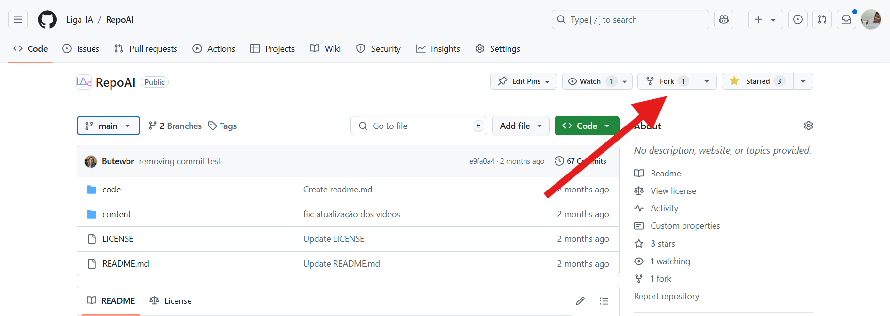
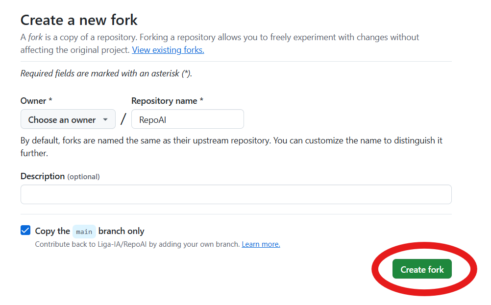
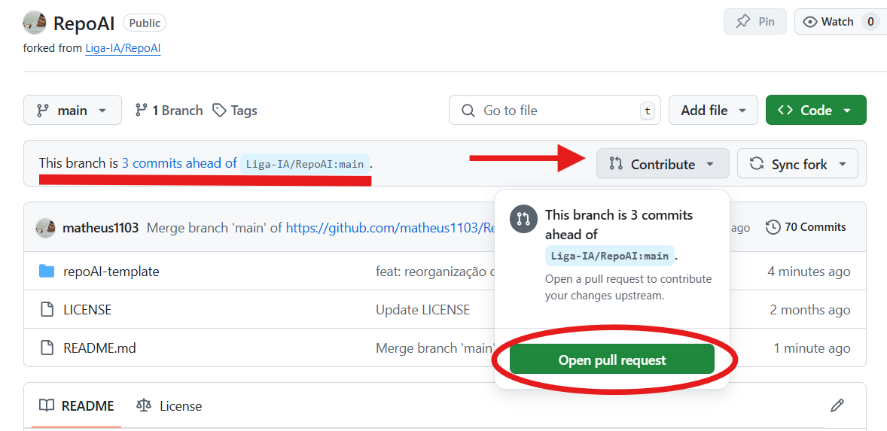
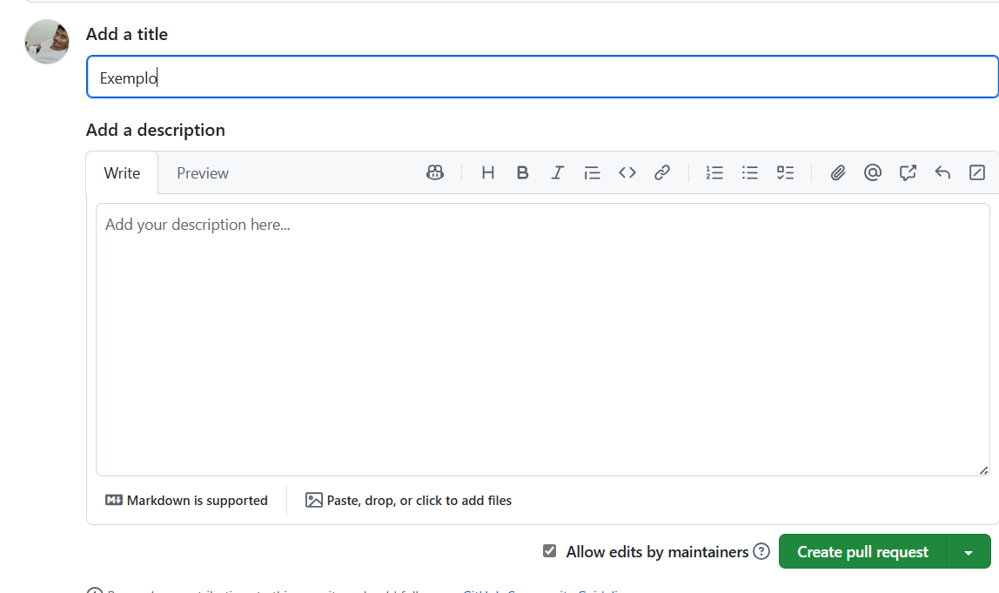
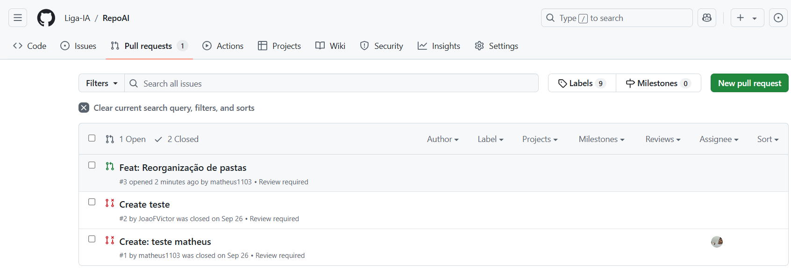

# Tutorial: Participação do RepoAI

## Como conseguir acesso ao repositório?

- Preencha o formulário - [Formulário de participação RepoAI](https://docs.google.com/forms/d/1hncyEsmRBqeYctbW2eGtkHaUFTZhZSvo8pAAXShCxz4/viewform?pli=1&edit_requested=true&edit_requested=true)
- acesse o link do repositório no GitHub - [Liga-IA/RepoAI](https://github.com/Liga-IA/RepoAI)

## Como contribuir?

- Após acessar o repositório, clique em **Fork** para gerar uma cópia do repositório em seu perfil do GitHub:

- Escolha o nome e clique em **Create Fork:**

Dessa forma, será criada uma uma cópia do RepoAI dentro do seu perfil do Github, possibilitando que você realize suas contribuições de acordo com nosso [template](https://github.com/Liga-IA/RepoAI/tree/main/repoAI-template)!

Assim que realizar contribuições, em seu perfil você poderá seguir esses passos:

- Clique em **Contribute → Open pull request**

- Adicione um título e uma descrição e clique em **Create pull request**:

Tudo Pronto! Logo após você conseguirá acompanhar seu pull request na aba [Pull requests · Liga-IA/RepoAI](https://github.com/Liga-IA/RepoAI/pulls?q=), em que nossa equipe da LIA irá revisar seu código e se tudo estiver de acordo irá subir para o RepoAI de forma oficial!

