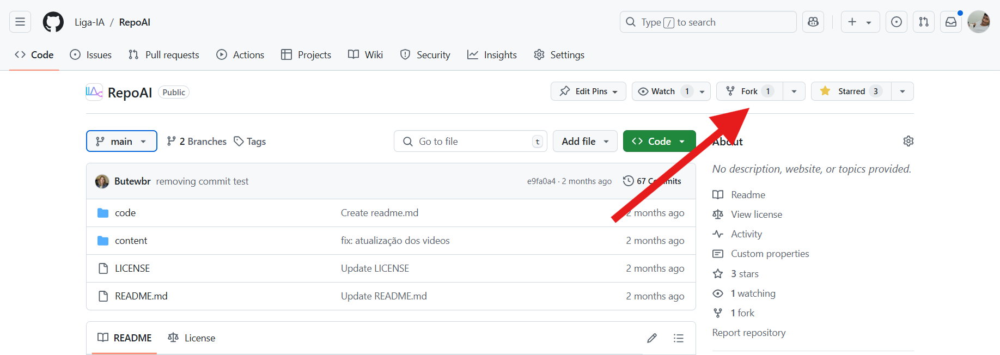
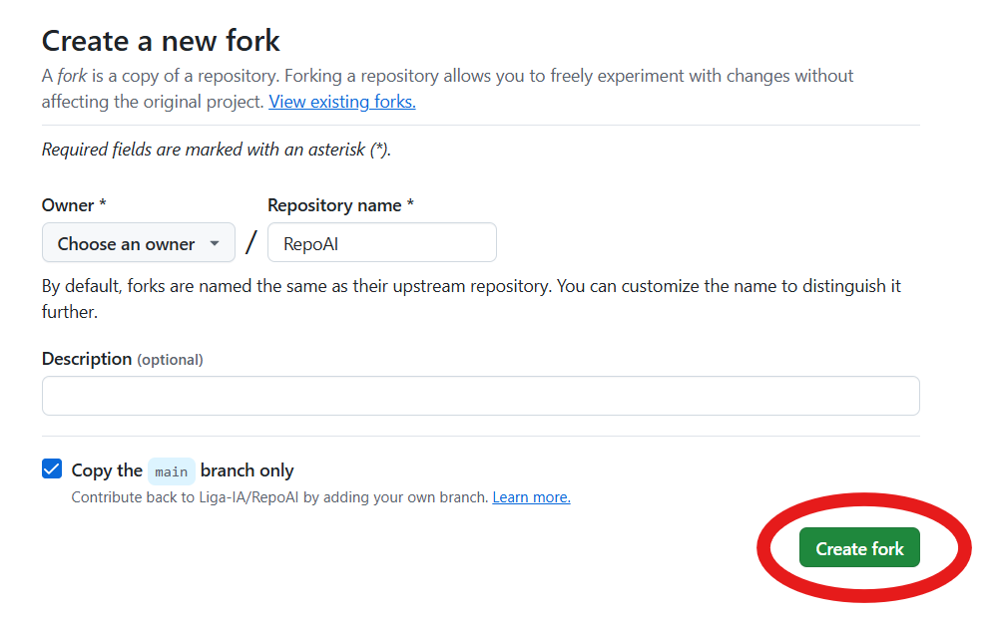
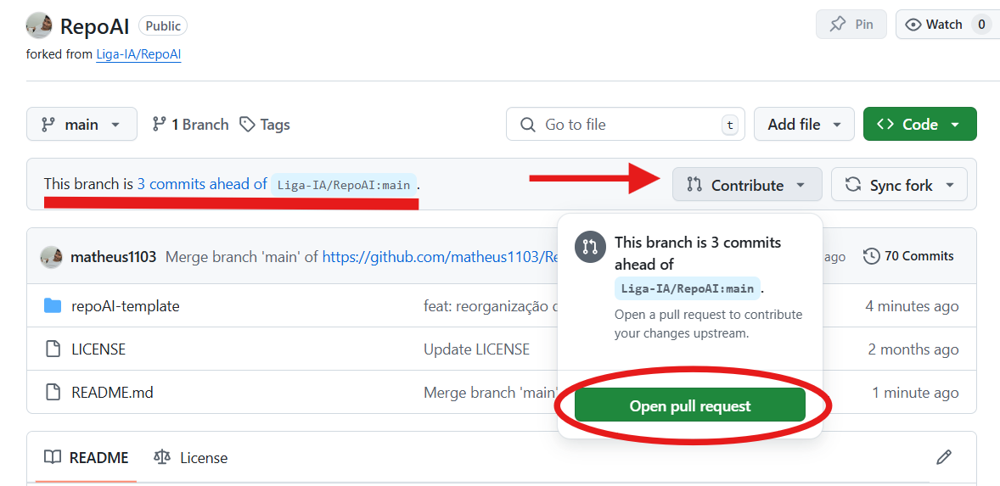
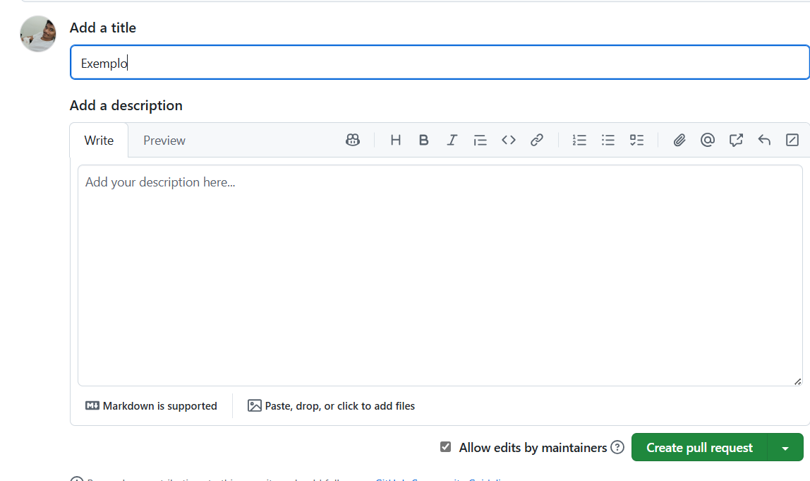
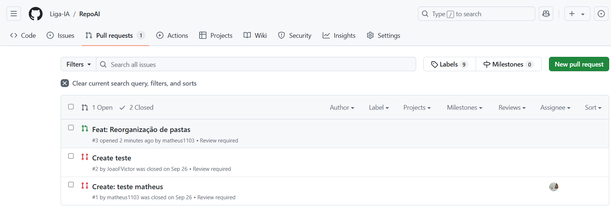

# Tutorial: Participação do RepoAI

## Como conseguir acesso ao repositório?

- Preencha o formulário - [Formulário de participação RepoAI](https://docs.google.com/forms/d/1hncyEsmRBqeYctbW2eGtkHaUFTZhZSvo8pAAXShCxz4/viewform?pli=1&edit_requested=true&edit_requested=true)
- acesse o link do repositório no GitHub - [Liga-IA/RepoAI](https://github.com/Liga-IA/RepoAI)
  
---

## 📛 Como nomear seu repositório

Todos os projetos devem seguir o padrão: 'codigo_categoria' _ 'tema'

| Código | Área |
|--------|------|
| `ml` | Machine Learning |
| `dl` | Deep Learning |
| `cv` | Computer Vision |
| `nlp` | Processamento de Linguagem Natural |
| `rl` | Reinforcement Learning |
| `opt` | Otimização |
| `sys` | Sistemas / Embarcados |
| `res` | Pesquisa / Experimentos |
| `util` | Utilidades / Templates |

### ⚠️ Regras importantes

- Use apenas **inglês**
- Use **snake_case** (com `_`)
- Não use espaços ou hífens (`-`)
- Escolha nomes **curtos e descritivos**
- O nome deve indicar claramente o conteúdo do projeto

## Como contribuir?

- Após acessar o repositório, clique em **Fork** para gerar uma cópia do repositório em seu perfil do GitHub:

- Defina o nome do repositório seguindo o padrão apresentado acima ('codigo_categoria'_'tema') e clique em Create Fork.

Dessa forma, será criada uma uma cópia do RepoAI dentro do seu perfil do Github, possibilitando que você realize suas contribuições de acordo com nosso [template](https://github.com/Liga-IA/RepoAI/tree/main/repoAI_template)!

Assim que realizar contribuições, em seu perfil você poderá seguir esses passos:

- Clique em **Contribute → Open pull request**

- Adicione um título, com o mesmo nome do projeto, e uma descrição e clique em **Create pull request**:

Tudo Pronto! Logo após você conseguirá acompanhar seu pull request na aba [Pull requests · Liga-IA/RepoAI](https://github.com/Liga-IA/RepoAI/pulls?q=), em que nossa equipe da LIA irá revisar seu código e se tudo estiver de acordo irá subir para o RepoAI de forma oficial!

