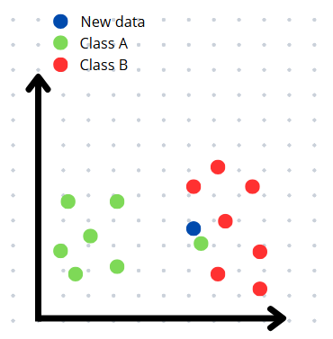
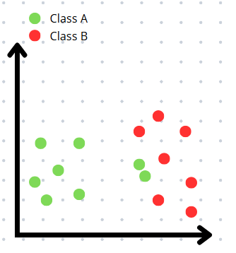
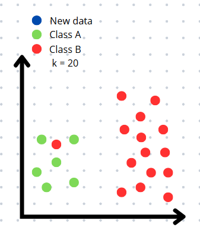
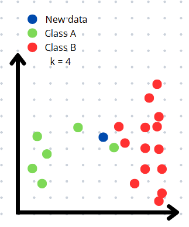
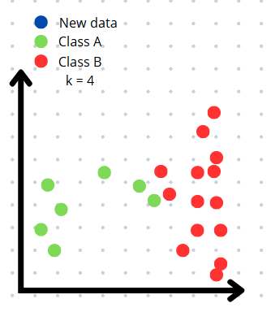

# English version

## How to define the value of k?
The choice of k directly impacts the accuracy of the k-NN algorithm, but this decision is not straightforward. Selecting the right value of k requires balance: very low values only consider extremely close neighbors, resulting in poor generalization, while very high values can oversimplify the model, ignoring important patterns in the data. Therefore, it is essential to consider common errors associated with different k values, as discussed below.

### Overfitting and low values of k
**Overfitting** occurs when a model fits the training data too closely, capturing even noise and specific variations that do not generalize well. This leads to inaccurate predictions on new data, as the model becomes overly sensitive to atypical points, known as outliers.

In the k-NN algorithm, choosing a very low value for k can lead to overfitting, since the model will only consider the nearest neighbors, which may include outliers. As a result, the algorithm's accuracy may be negatively affected.

> For example, imagine a dataset with two separated classes, A and B, but with a point from class A inserted into class B — in other words, an outlier. If a new point is added to class B, but extremely close to the outlier, then with k=1, it will be incorrectly classified as belonging to class A due to the sensitivity to the nearest neighbor. This example is illustrated in the figures below: the first shows the location of the new data point (in blue), and the second shows its incorrect classification when using k=1.

**Figure 1: Insertion of a new data point**



**Figure 2: Classification of the new data point**



### Underfitting and high values of k
**Underfitting** occurs when a model is too simple and becomes overly generalized, losing the ability to identify specific and relevant features of the data. As a result, its predictions are also inaccurate.

In this way, in the k-NN algorithm, a very high number for k can lead to underfitting, because too many neighbors are considered, losing the specifics of the new data.

> As another example, consider again two well-defined classes, A and B, with a total of 20 training data points, where class B contains 14 points. If a new point is inserted in the center of class A’s region and `k=20`, the model will consider many neighbors, most of which will likely belong to class B, since it represents the majority of the dataset. This results in the incorrect classification of the new point as a member of class B, illustrating the model's excessive triviality. This example is shown in a simplified form in the figures below.

**Figure 3: Insertion of a new data point**  


**Figure 4: Classification of the new data point**  



### Even Values of k
Consider a dataset with two distinct classes, A and B. Also, assume that the value of k is practically ideal, meaning it is balanced enough to avoid both overfitting and underfitting. However, suppose that k is an even number. In the case of a tie when analyzing the majority of neighbors near a new data point, the model is forced to arbitrarily choose a class for the point. This makes the result inaccurate, even if tie-breaking criteria are implemented, because the choice will not always truly reflect the reality of the data. Therefore, it is recommended to set an odd value for k to avoid this situation.

> Imagine that in this dataset, `k=4` and the tie-breaking criterion is to classify the new data point based on the class of its nearest neighbor. If a new point is added such that half of its closest neighbors belong to class A and the other half to class B, a tie will occur. In that case, the class of the new point will be determined by its nearest neighbor. However, if that neighbor is an outlier from class A located within class B's region, the point will be incorrectly classified as a member of class A, even though it is closer to class B’s region. This can be seen in the figures below.

**Figure 5: Insertion of a new data point**  



**Figure 6: Classification of the new data point**  



### The best value of k
Given the potential issues arising from the choice of k, it is essential to define a value that is not so sensitive to its neighbors that it fails to generalize, but also not so broad that it ignores relevant patterns. Additionally, choosing an odd value for k is equally essential to avoid possible ties when analyzing the majority of the nearest neighbors.

A common strategy for selecting k is to use the square root of the total number of data points in the dataset, as this value will not be too small to cause overfitting, nor too large to cause underfitting. If the resulting value is even, it is recommended to adjust it to the nearest odd number in order to avoid ties. Furthermore, the use of cross-validation is recommended to help in selecting the ideal value for k, as it allows for a preemptive evaluation of the worst k values, thus preventing both overfitting and underfitting.

<details>
  <summary><strong>What are cross-validation techniques?</strong></summary>
  Cross-validation techniques involve dividing the data into N smaller parts, with a specific value of k. The model is trained on N-1 parts and tested on the remaining part, repeating this process N times, using each part as the test set once. The model's efficiency is then calculated based on the average performance across all runs. The same procedure is repeated for different values of k. The value of k that shows the best average performance is chosen
</details>

## References
**IBM.** _K-nearest neighbors (KNN)_. Disponível em: https://www.ibm.com/think/topics/knn. Acesso em: 21 de abril de 2025.
**FERREIRA, E.** _Cross-Validation_. Universidade Federal do Paraná. Disponível em: http://www.leg.ufpr.br/~eferreira/CE064/ency-cross-validation.pdf. Acesso em: 27 de abril de 2025.
**MARIZ, Filipe Mendes.** _Avaliação e comparação de versões modificadas do algoritmo KNN_. 2017. [s.l.], Universidade Federal de Pernambuco, Centro de Informática, 2017. Disponível em: https://www.cin.ufpe.br/~tg/2017-2/fmm4-tg.pdf. Acesso em: 23 de abril de 2025.
**SINGH, Manjeet; SINGH, Gurpreet.** _A Survey of kNN Algorithm_. 2018. Disponível em: https://www.researchgate.net/publication/348305327_A_Survey_of_kNN_Algorithm. Acesso em: 23 de abril de 2025.

## 👾 **Contributors**  
| [<br><sub>Rafaela Savaris</sub>](https://github.com/rafasavaris) |
| :---: |

## **License**  
[](https://pt.wikipedia.org/wiki/Licen%C3%A7a_MIT)  
**Traslation:** Use, modify, and share at will! ✌️

****

# Portuguese version

## Como definir o valor de k?
A escolha do valor de k afeta diretamente a precisão do algoritmo k-NN, mas essa decisão não é tão simples. Para definir o valor de k, é preciso equilíbrio: valores muito baixos analisam apenas os vizinhos extremamente próximos, perdendo generalização, enquanto valores muito altos podem trivializar o modelo, causando perda de caracteristicas importantes dos dados. Portanto, ao escolher k, é essencial considerar erros comuns relacionados a cada escolha de valor de k, conforme apresentado a baixo.

### Overfitting e valores baixos de k
O **overfitting** ocorre quando um modelo se ajusta demais aos dados de treino, capturando até mesmo os ruídos e variações específicas deles. Isso resulta em previsões imprecisas para novos dados, pois o modelo se torna extrememante sensível a pontos fora do padrão, chamados de outliers.

No algoritmo k-NN, a escolha de um valor muito baixo de k, pode levar ao overfitting, pois o modelo irá considerar apenas os vizinhos mais próximos, que podem incluir outliers. Assim, a precisão do algoritmo pode ser afetada.

> Por exemplo, imagine um conjunto de dados com duas classes separadas, A e B, mas Vcom um ponto da classe A inserido na classe B, isto é, um outlier. Se for adicionado um novo ponto à classe B, porém, extremamente próximo do outlier, com ```k=1```, ele será incorretamente classificado como A, devido à sensibilidade ao vizinho mais próximo. Este exemplo é mostrado nas figuras abaixo, em que a primeira mostra a localização do novo dado (azul) e a segunda, a classificação incorreta dele, para k=1.

**Figura 1: Inserção de um novo dado.**        


**Figura 2: Classificação do novo dado**


### Underfitting e valores altos de k
Já o **underfitting** ocorre quando um modelo é tão simples que se torna excessivamente generalizado, perdendo a capacidade de identificar caracteristicas especificas e relevantes dos dados. Como resultado, suas previsões também são imprecisas.

Dessa maneira, no algoritmo k-NN, um número muito alto para k, pode gerar underfitting, pois um número muito alto de vizinhos é considerado, perdendo especificidades dos novos dados. 

> Exemplificando, considere novamente duas classes bem definidas, A e B, com 20 dados de treinamento no total, sendo que a classe B possui 14 dados. Se um novo ponto for inserido no centro da região da classe A e ```k=20```, o modelo irá considerar muitos vizinhos, os quais, a maioria, provavelmente será da classe B uma vez que esta classe representa quase todo o conjunto. Isso resulta na classificação incorreta do novo dado como membro da classe B, o que demonstra a trivialidade excessiva do modelo. Este exemplo é mostrado de forma reduzida nas figuras abaixo.

**Figura 3: Inserção de um novo dado.**      


**Figura 4: Classificação do novo dado.**          


### Valores pares de k
Considere um conjunto de dados com duas classes distintas, A e B. Considere, também, que o valor de k seja praticamente ideal, ou seja, equilibrado ao ponto de não causar overfitting ou underfitting. Contudo, suponha que k é um valor par. Caso haja empate ao analisar a maioria dos vizinhos próximos à um novo dado, o modelo é forçado a escolher arbitrariamente uma classe para o ponto. Isso torna o resultado impreciso, mesmo que seja implementado critérios para a decisão de empates, pois a escolha nem sempre representará verdadeiramente a realidade dos dados. Dessa forma, é recomendado definir um valor ímpar de k para evitar esta situação.

> Imagine que neste conjunto, ```k=4``` e que o critério de desempate é classificar o novo dado com base na classe de seu vizinho mais próximo. Se um novo ponto for adicionado de forma que metade de seus vizinhos mais próximos sejam da classe A e a outra metade da classe B, será gerado um empate. Então, a classe do novo dado será definiada pelo seu vizinho mais próximo. Entretanto, se esse vizinho for um outlier da classe A, localizado na região da classe B, o dado será classificado incorretamente como membro da classe A, mesmo estando mais próximo da região da classe B. Isso é visto nas figuras abaixos.


**Figura 5: Inserção de um novo dado.**       


**Figura 6: Classificação do novo dado.**     


## Melhor valor de k
Tendo em vista os possíveis problemas decorrentes da escolha de k, é essencial definir um valor em que ele que não seja tão sensível aos seus vizinhos ao ponto de não conseguir generalizar, mas também não seja extremamente abrangente ao ponto de ignorar padrões relevantes. Além disso, optar por um valor ímpar de k é igualmente essencial, a fim de evitar possíveis empates ao analisar a maioria dos vizinhos mais próximos.

Uma estratégia comum para a escolha de k é utilizar a raiz quadrada do número total de dados do conjunto, pois não será um valor tão pequeno para ocasionar overfitting, mas nem tão grande para gerar underfitting. Caso o valor obtido seja par, é indicado ajustá-lo para o valor ímpar próximo, a fim de evitar empates. Além disso, o uso de validação cruzada é recomendado para auxiliar na escolha do valor ideal de k, pois permite avaliar previamente os piores valores de k, evitando overfitting e underfitting.

<details>
  <summary><strong>O que são técnicas de validação de cruzada?</strong></summary>
  Técnicas de validação cruzadas consistem em dividir os dados em N partes menores, com um valor específico de k. O modelo é treinado em N-1 partes e testado na parte restante, repetindo esse processo N vezes, utilizando cada parte como conjunto de teste uma vez. A eficiência do modelo é, então, calculada com base na média de desempenho de todas as execuções. O mesmo procedimento é refeito para diferentes valores de k. O valor de k que apresentar a melhor média de desempenho é o escolhido.
</details>

### Referências
**IBM.** _K-nearest neighbors (KNN)_. Disponível em: https://www.ibm.com/think/topics/knn. Acesso em: 21 de abril de 2025.
**FERREIRA, E.** _Cross-Validation_. Universidade Federal do Paraná. Disponível em: http://www.leg.ufpr.br/~eferreira/CE064/ency-cross-validation.pdf. Acesso em: 27 de abril de 2025.
**MARIZ, Filipe Mendes.** _Avaliação e comparação de versões modificadas do algoritmo KNN_. 2017. [s.l.], Universidade Federal de Pernambuco, Centro de Informática, 2017. Disponível em: https://www.cin.ufpe.br/~tg/2017-2/fmm4-tg.pdf. Acesso em: 23 de abril de 2025.
**SINGH, Manjeet; SINGH, Gurpreet.** _A Survey of kNN Algorithm_. 2018. Disponível em: https://www.researchgate.net/publication/348305327_A_Survey_of_kNN_Algorithm. Acesso em: 23 de abril de 2025.

## 👾 **Contribuidores**  
| [<br><sub>Rafaela Savaris</sub>](https://github.com/rafasavaris) | 
| :---: |

## **Licença**  
[](https://pt.wikipedia.org/wiki/Licen%C3%A7a_MIT)  
**Traslation:** Use, modifique e compartilhe à vontade! ✌️
