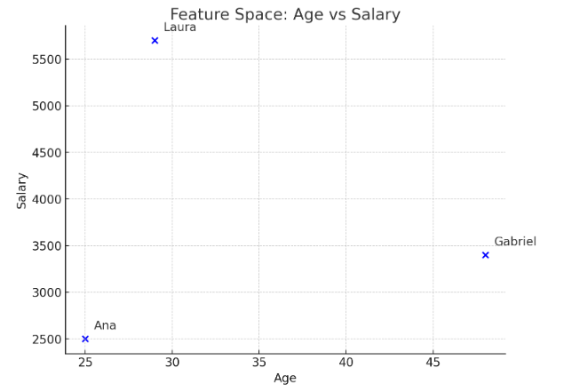
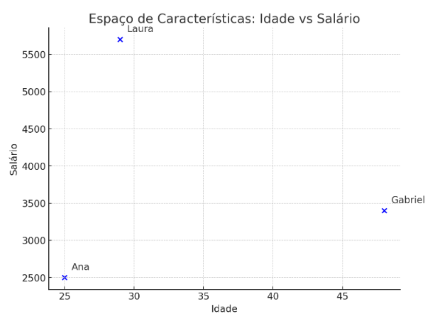

# English Version

## General Ideas About KNN
KNN is a **supervised** machine learning model, used for both **regression** and **classification**.

> [!NOTE]
> Supervised learning learns from data that already include the correct answers (also called labeled examples). From these, it makes predictions on new data.

> [!IMPORTANT]
> Regression problems predict numerical values, such as the price of a house. Classification problems predict labels or categories, such as whether an email is classified as “spam” or “not spam.”

In the KNN model, similar data points tend to be close to each other in what we call the “feature space.” To understand this concept, we can imagine a table whose columns are the features of a data point, as shown below:

|  Name   | Age | Salary |
|:-------|-------:|:---------:|
| Ana   | 25    | 2500|
| Gabriel  | 48    | 3400    |
| Laura  | 29    | 5700 |

**Think about the following before continuing with the reading:**
How could we represent this feature space graphically?

> [!TIP]
> The number of features is equal to the number of dimensions in the space.

We can represent it as shown below:

Therefore, since we have two features (age and salary), the feature space is represented in two dimensions.

## References
Müller, A. C., & Guido, S. (2016). Introduction to Machine Learning with Python: A guide for data scientists. O’Reilly Media.

MIT OpenCourseWare. (2010). 6.034 Artificial Intelligence – Fall 2010: Tutorial 3: K-nearest neighbors, decision trees, neural nets [PDF]. Retrieved April 25, 2025, from https://ocw.mit.edu/courses/6-034-artificial-intelligence-fall-2010/4efa5e563ccb9d54fdd72068a8dda879_MIT6_034F10_tutor03.pdf

## Where am I? 

## Colaborators
| [ Maria Eduarda Vianna](https://github.com/mevianna) | 
| :---: | 

# Portuguese Version

## Ideias Gerais Sobre KNN
KNN é um modelo de machine learning **supervisionado**, usado tanto para **regressão** quanto para **classificação**.

> [!NOTE]
> O aprendizado supervisionado aprende a partir de dados que já incluem as respostas corretas (também chamados de exemplos rotulados). Com base nesses, ele faz previsões sobre novos dados.

> [!IMPORTANT]
> Os problemas de regressão preveem números, como o preço de uma casa. Os de classificação são aqueles que preveem “rótulos” ou “categorias”, como se um email se encaixa na categoria “spam” ou “não spam”.

No modelo KNN, dados semelhantes tendem a estar próximos no que chamamos de **“espaço de características”**. Para entendermos este conceito, podemos pensar em uma tabela cujas colunas são características de um dado, como mostrado a seguir:

| Nome   | Idade | Salário |
|:-------|-------:|:---------:|
| Ana   | 25    | 2500|
| Gabriel  | 48    | 3400    |
| Laura  | 29    | 5700 |

**Pense sobre o seguinte antes de prosseguir com a leitura:**
como será que poderíamos representar este espaço de características de forma gráfica?

> [!TIP]
> O número de características é igual ao número de dimensões do espaço.

Podemos representar conforme abaixo:

Isto é, como temos duas características (idade e salário), temos a representação do espaço de características em duas dimensões.

## Referências
Müller, A. C., & Guido, S. (2016). Introduction to Machine Learning with Python: A guide for data scientists. O’Reilly Media.

MIT OPEN COURSEWARE. 6.034 Artificial Intelligence – Fall 2010: Tutorial 3: K-nearest neighbors, decision trees, neural nets. 2010. PDF. Disponível em: https://ocw.mit.edu/courses/6-034-artificial-intelligence-fall-2010/4efa5e563ccb9d54fdd72068a8dda879_MIT6_034F10_tutor03.pdf. Acesso em: 25 abr. 2025.

## Onde Estou?

## Contribuidores
| [ Maria Eduarda Vianna](https://github.com/mevianna) | 
| :---: | 
