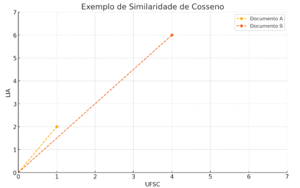

# English Version

## Distances

As explained in [1.generalIdeas.md](./1.generalIdeas.md), we will make predictions based on the proximity of data in the feature space. Therefore, we need to calculate distances.

The most common way to do this is by using the concept of Euclidean distance.

### Euclidean Distance

Euclidean distance calculates a straight line between two points $(x_1, x_2, \dots, x_n)$ and $(y_1, y_2, \dots, y_n)$.
It can be represented as follows:

$$
d = \sqrt{\sum_{i=1}^{n} (x_i - y_i)^2}
$$

In the particular case of two dimensions, this can be expressed as:

$$
d = \sqrt{(x_2 - x_1)^2 + (y_2 - y_1)^2}
$$

#### Example:

For A = (1, 2) and B = (4, 6):

$$
d_{\text{euclid}} = \sqrt{(4 - 1)^2 + (6 - 2)^2} \\
= \sqrt{3^2 + 4^2} \\
= \sqrt{9 + 16} \\
= \sqrt{25} \\
= 5
$$

Graphically, we are calculating the dashed line.

### Manhattan Distance

It considers the sum of the absolute differences between the coordinates of the points.

The Manhattan Distance between two points $(x_1, x_2, \dots, x_n)$ e $(y_1, y_2, \dots, y_n)$ is:

$$
d = \sum_{i=1}^{n} |x_i - y_i|
$$

#### Example:

For A = (1, 2) and B = (4, 6) (which are the same values from the previous example):

$$
d_{\text{manhattan}} = |4 - 1| + |6 - 2| \\
= 3 + 4 \\
= 7
$$

Graphically, we are calculating the dashed line:

#### When to use Euclidean or Manhattan Distance in the context of KNN?
Manhattan Distance gives less weight to large differences between points. Therefore, when we have extreme values ("outliers"), it may be more appropriate to use it. On the other hand, Euclidean Distance is more suitable for data with features that have a more direct and continuous relationship.

### Minkowski Distance

Generalizes the Euclidean and Manhattan distances. For the Euclidean distance, we use p=2, and for the Manhattan distance, we use p=1.

The Minkowski distance between two points $(x_1, x_2, \dots, x_n)$ and $(y_1, y_2, \dots, y_n)$ with parameter \(p\) is:

$$
d = \left( \sum_{i=1}^{n} |x_i - y_i|^p \right)^{1/p}
$$

### Cosine Similarity

It is widely used in text classification. Words are the dimensions, and documents are vectors of words.

$$
\cos(\theta) = \frac{\vec{x} \cdot \vec{y}}{ \|\vec{x}\| \cdot \|\vec{y}\| } 
$$

-  $\theta$ is the **angle** between the vectors. The smaller the angle, the higher the similarity.
  
-  $\vec{x}$ and $\vec{y}$ are the **vectors** we want to compare (for example, documents represented by word vectors).
  
-  $\vec{x}$ $\cdot$ $\vec{y}$ is the **dot product** between the vectors.
  
-  $\|\vec{x}\|$ and $\|\vec{y}\|$ are the **norms (magnitudes)** of the vectors, i.e., their lengths:

$$
\|\vec{x}\| = \sqrt{x_1^2 + x_2^2 + \cdots + x_n^2}
\quad\quad
\|\vec{y}\| = \sqrt{y_1^2 + y_2^2 + \cdots + y_n^2}
$$

#### Example:

Let’s use the same values as in the previous examples, but contextualize them for text classification.

Suppose we have two texts containing the words UFSC (the acronym for our university) and LIA (the acronym for the Artificial Intelligence League, of which we are members).

- The first text contains the word UFSC once and the word LIA twice. We represent it with the vector

 $$
\vec{A} = [1,\ 2] 
$$

- The second text contains the word UFSC four times and the word LIA six times. We represent it with the vector

$$   
\vec{B} = [4,\ 6]
$$
  

> [!NOTE]
> We will consider only two words for didactic purposes. However, when analyzing texts, we may have vectors with many dimensions.

Visually, this can be represented as:

We will calculate the cosine similarity of two documents:

1. Dot product:

$$
\vec{A} \cdot \vec{B} = (1 \cdot 4) + (2 \cdot 6) = 4 + 12 = 16
$$

2. Vector norm:

$$
\|\vec{A}\| = \sqrt{1^2 + 2^2} = \sqrt{1 + 4} = \sqrt{5}
$$

$$
\|\vec{B}\| = \sqrt{4^2 + 6^2} = \sqrt{16 + 36} = \sqrt{52}
$$

3. Cosine similarity:

$$
\cos(\theta) = \frac{\vec{A} \cdot \vec{B}}{\|\vec{A}\| \cdot \|\vec{B}\|} = \frac{16}{\sqrt{5} \cdot \sqrt{52}} \approx \frac{16}{16.1245} \approx 0.9923
$$

Notice that when the cosine value approaches 1, the angle between the vectors approaches zero. In other words, the two documents are highly similar!

> [!TIP]
> In the context of KNN, we use cosine similarity to let the model decide whether a third document, for example, is closer to the first or the second. The smaller the angle, the closer the neighbor!

## References
Raschka, S. (2020). Lecture notes for STAT 451: Introduction to machine learning (Lecture 2: K-Nearest Neighbors). Retrieved April 25, 2025, from https://sebastianraschka.com/pdf/lecture-notes/stat451fs20/02-knn__notes.pdf

MIT OpenCourseWare. (2010). 6.034 Artificial Intelligence – Fall 2010: Tutorial 3: K-nearest neighbors, decision trees, neural nets [PDF]. Retrieved April 25, 2025, from https://ocw.mit.edu/courses/6-034-artificial-intelligence-fall-2010/4efa5e563ccb9d54fdd72068a8dda879_MIT6_034F10_tutor03.pdf

MIT OpenCourseWare. (2014, January 10). 10. Introduction to Learning, Nearest Neighbors [Video]. YouTube. https://www.youtube.com/watch?v=09mb78oiPkA

Mariz, F. M. (2017). Evaluation and comparison of modified versions of the KNN algorithm (Undergraduate thesis). Federal University of Pernambuco, Center for Informatics, Recife, Brazil. Retrieved April 25, 2025, from https://www.cin.ufpe.br/~tg/2017-2/fmm4-tg.pdf

Winston, P. H. (1992). Artificial intelligence (3rd ed.). Addison-Wesley.

## Where am I? 

## Colaborators
| [ Maria Eduarda Vianna](https://github.com/mevianna) | 
| :---: | 

# Portuguese Version

## Distâncias
Como explicado em [1.generalIdeas.md](./1.generalIdeas.md), faremos previsões com base na proximidade dos dados no espaço de características. Então, precisamos de formas de calcular as distâncias.

A maneira mais comum de calcularmos a distância é utilizando a ideia de Distância Euclidiana.

### Distância Euclidiana
A Distância Euclidiana calcula uma linha reta entre dois pontos $(x_1, x_2, \dots, x_n)$ e $(y_1, y_2, \dots, y_n)$. Ela pode ser representada da seguinte forma:

$$
d = \sqrt{\sum_{i=1}^{n} (x_i - y_i)^2}
$$

No caso particular de duas dimensões, podemos representar da seguinte maneira:

$$
d = \sqrt{(x_2 - x_1)^2 + (y_2 - y_1)^2}
$$

#### Exemplo:

Para A = (1, 2) e B = (4, 6):  

$$
d_{\text{euclid}} = \sqrt{(4 - 1)^2 + (6 - 2)^2} \\
= \sqrt{3^2 + 4^2} \\
= \sqrt{9 + 16} \\
= \sqrt{25} \\
= 5
$$

Graficamente, estamos calculando a linha tracejada:

### Distância de Manhattan
Ela considera a soma das diferenças absolutas entre as coordenadas dos pontos.

A Distância de Manhattan entre dois pontos $(x_1, x_2, \dots, x_n)$ e $(y_1, y_2, \dots, y_n)$ é:

$$
d = \sum_{i=1}^{n} |x_i - y_i|
$$

#### Exemplo:

Para A = (1, 2) e B = (4, 6) (que são os mesmos valores do exemplo anterior): 

$$
d_{\text{manhattan}} = |4 - 1| + |6 - 2| \\
= 3 + 4 \\
= 7
$$

Graficamente, estamos calculando a linha tracejada:

#### Quando utilizar Euclidiana ou Manhattan no contexto do KNN? 
A Distância de Manhattan atribui menos ênfase a diferenças grandes entre os pontos. Por isso, quando temos valores extremos ("outliers"), pode ser mais adequado utilizá-la. Enquanto isso, a Distância Euclidiana é mais adequada para dados com características que possuem relação mais direta e contínua.

### Distância de Minkowski
Generaliza as distâncias euclidiana e de Manhattan. Para euclidiana, utilizamos p = 2, e, para Manhattan, p = 1.

A distância de Minkowski entre dois pontos $(x_1, x_2, \dots, x_n)$ e $(y_1, y_2, \dots, y_n)$ com parâmetro \(p\) é:

$$
d = \left( \sum_{i=1}^{n} |x_i - y_i|^p \right)^{1/p}
$$

### Similaridade de Cossenos
É muito utilizada em classificação de texto. Palavras são dimensões e os documentos são vetores de palavras.

$$
\cos(\theta) = \frac{\vec{x} \cdot \vec{y}}{ \|\vec{x}\| \cdot \|\vec{y}\| } 
$$

-  $\theta$ é o **ângulo** entre os vetores. Quanto menor o ângulo, maior a similaridade.
  
-  $\vec{x}$ e $\vec{y}$ são os **vetores** que queremos comparar (por exemplo, documentos representados por vetores de palavras).
  
-  $\vec{x}$ $\cdot$ $\vec{y}$ é o **produto escalar** entre os vetores.
  
- $\|\vec{x}\|$ e $\|\vec{y}\|$ são as **normas (módulos)** dos vetores, ou seja, seus comprimentos:
  
$$
\|\vec{x}\| = \sqrt{x_1^2 + x_2^2 + \cdots + x_n^2}
\quad\quad
\|\vec{y}\| = \sqrt{y_1^2 + y_2^2 + \cdots + y_n^2}
$$

#### Exemplo:

Utilizaremos os mesmos números dos exemplos anteriores, mas contextualizaremos para o caso de classificação de textos.

Digamos que temos dois textos com as palavras: UFSC (sigla da nossa universidade) e LIA (sigla da Liga de Inteligência Artificial, da qual fazemos parte).

- O primeiro texto contém a palavra UFSC uma vez, e a palavra LIA duas vezes. Representaremos ele com o vetor 

$$
\vec{A} = [1,\ 2] 
$$

- O segundo texto contém a palavra UFSC quatro vezes, e a palavra LIA seis vezes. Representaremos ele com o vetor [4, 6].

$$   
\vec{B} = [4,\ 6]
$$

> [!NOTE]
> Levaremos em consideração apenas duas palavras para fins didáticos. No entanto, ao analisarmos textos, podemos ter vetores com muitas dimensões!

Graficamente, temos:

Calcularemos a similaridade de cossenos dos dois documentos: 

1. Produto escalar:

$$
\vec{A} \cdot \vec{B} = (1 \cdot 4) + (2 \cdot 6) = 4 + 12 = 16
$$

2. Norma dos vetores:

$$
\|\vec{A}\| = \sqrt{1^2 + 2^2} = \sqrt{1 + 4} = \sqrt{5}
$$

$$
\|\vec{B}\| = \sqrt{4^2 + 6^2} = \sqrt{16 + 36} = \sqrt{52}
$$

3. Similaridade de cosseno:

$$
\cos(\theta) = \frac{\vec{A} \cdot \vec{B}}{\|\vec{A}\| \cdot \|\vec{B}\|} = \frac{16}{\sqrt{5} \cdot \sqrt{52}} \approx \frac{16}{16.1245} \approx 0.9923
$$

Perceba que o fato de o cosseno se aproximar de 1, indica que o ângulo é próximo de zero. Isto é, temos alta similaridade entre os dois documentos!

> [!TIP]
> No contexto do KNN, utilizamos a similaridade do cosseno para que o modelo decida se um terceiro documento, por exemplo, está mais próximo do primeiro ou do segundo. Quanto menor o ângulo, maior a proximidade do vizinho!

## Referências

RASCHKA, S. Lecture notes for STAT 451: Introduction to machine learning (Lecture 2: K-Nearest Neighbors). 2020. PDF. Disponível em: https://sebastianraschka.com/pdf/lecture-notes/stat451fs20/02-knn__notes.pdf. Acesso em: 25 abr. 2025.

MIT OPEN COURSEWARE. 6.034 Artificial Intelligence – Fall 2010: Tutorial 3: K-nearest neighbors, decision trees, neural nets. 2010. PDF. Disponível em: https://ocw.mit.edu/courses/6-034-artificial-intelligence-fall-2010/4efa5e563ccb9d54fdd72068a8dda879_MIT6_034F10_tutor03.pdf. Acesso em: 25 abr. 2025.

MIT OPEN COURSEWARE. 10. Introduction to Learning, Nearest Neighbors. Vídeo (YouTube), postado em 10 jan. 2014. Disponível em: https://www.youtube.com/watch?v=09mb78oiPkA. Acesso em: 25 abr. 2025.

MARIZ, Filipe Mendes. Avaliação e comparação de versões modificadas do algoritmo KNN. Recife: Universidade Federal de Pernambuco, 2017. Trabalho de Conclusão de Curso (Bacharelado em Ciência da Computação) — Centro de Informática, Universidade Federal de Pernambuco, 2017. Disponível em: https://www.cin.ufpe.br/~tg/2017-2/fmm4-tg.pdf. Acesso em: 25 abr. 2025.

WINSTON, P. H. Artificial intelligence. 3. ed. Addison‑Wesley, 1992.

## Onde estou? 

## Colaboradores
| [ Maria Eduarda Vianna](https://github.com/mevianna) | 
| :---: | 
