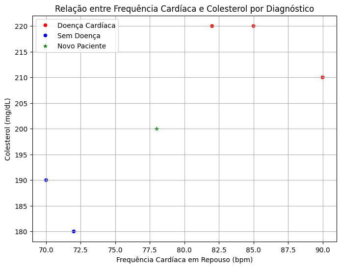

# English version

## Regression Formulation

The **k-nearest neighbours (KNN)** method is one of the most popular in the machine learning community.

The idea is to estimate the regression function **r(x)** for a given configuration **x** , using the average of the responses **$y_i$** of the  k  nearest neighbors to  x :

$$
g(x) = \frac{1}{k} \sum_{i∈N_x} y_i
$$


Where:
- **$N_x$**: set of the **k** observations closest to **x** 

**$N_x$** = \{i ∈ \{1,..., n\} : d($x_i$, x) **$d_x^k$**\}

- **$d_x^k$**: distance from the **k** -th nearest neighbor of  **x**

The choice of **k** is made via cross-validation:
- Large **k**: high bias, low variance
- Small **k**: low bias, high variance


### Example: Estimating Property Price

| Property | Size (m²) | Rooms | Price (R$) |
|----------|------------|--------|------------|
| 01       | 110        | 3      | 550,000    |
| 02       | 80         | 2      | 400,000    |
| 03       | 140        | 4      | 650,000    |
| 04       | 70         | 2      | 300,000    |
| 05       | 90         | 3      | 450,000    |

New property: Size = 100 m², Rooms = 3, k = 3

Euclidean Distance:  

$$
\text{dist} = \sqrt{(size_i - 100)^2 + (rooms_i - 3)^2}
$$

| Property | Distance to (100,3) |
|----------|----------------------|
| 01       | 10,00                |
| 02       | 20,02                |
| 03       | 40,01                |
| 04       | 30,02                |
| 05       | 10,00                |

Selected neighbors: 01, 05, 02  
Prices: 550.000  ; 450.000  ; 400.000

Now, considering all values of k from 1 to 5 and comparing the results, we can analyze the impact of \(k\) on the price estimation.

### k = 1:
The nearest neighbor is Property 01 (or 05, as they have the same distance), with a distance of 10.00 and a price of R$ 550,000 (or R$ 450,000). We will choose Property 01 for this case.

Estimated price (k=1): R$ 550,000

### k = 2:
The two nearest neighbors are Properties 01 and 05, with prices of R$ 550,000 and R$ 450,000.

$$
g(x) = \frac{1}{2}(550,000 + 450,000) = R$ 500,000
$$

Estimated price (k=2): R$ 500,000

### k = 3:
The three nearest neighbors are Properties 01, 05, and 02, with prices of R$ 550,000, R$ 450,000, and R$ 400,000.

$$
g(x) = \frac{1}{3}(550,000 + 450,000 + 400,000) = R$ 466,666.67
$$

Estimated price (k=3): R$ 466,666.67

### k = 4:

The four nearest neighbors are Properties 01, 05, 02, and 04, with prices of R$ 550,000, R$ 450,000, R$ 400,000, and R$ 300,000.

$$
g(x) = \frac{1}{4}(550,000 + 450,000 + 400,000 + 300,000) = R$ 425,000
$$

Estimated price (k=4): R$ 425,000

### k = 5:

The five nearest neighbors are Properties 01, 05, 02, 04, and 03, with prices of R$ 550,000, R$ 450,000, R$ 400,000, R$ 300,000, and R$ 650,000.

$$
g(x) = \frac{1}{5}(550,000 + 450,000 + 400,000 + 300,000 + 650,000) = R$ 470,000
$$

Estimated price (k=5): R$ 470,000

$$
g(x) = \frac{1}{3}(550.000 + 450.000 + 400.000) = 466.666,67~R\$
$$
<div align="center">
  
</div>
---

## Classification Formulation

KNN can also be used for classification. The classifier is:

$$
g(x) = \text{mode}_{i \in N_x} y_i
$$

That is, the most frequent class among the \( k \) nearest neighbors of \( x \).

### Example: Heart Disease Diagnosis

| ID | Resting Heart Rate (bpm) | Cholesterol (mg/dL) | Diagnosis        |
|----|---------------------------|----------------------|------------------|
| 01 | 82                        | 220                  | Heart Disease    |
| 02 | 70                        | 190                  | No Disease       |
| 03 | 90                        | 210                  | Heart Disease    |
| 04 | 72                        | 180                  | No Disease       |
| 05 | 85                        | 220                  | Heart Disease    |

## KNN Classification for New Patient (Heart Disease Diagnosis)

**New Patient Data:** Heart rate = 78 bpm, Cholesterol = 200 mg/dL

### 1. KNN with \( k = 1 \)

**Euclidean Distance:**

$$
\text{dist} = \sqrt{(freq_i - 78)^2 + (colest_i - 200)^2}
$$

| ID | Distance | Diagnosis      |
|----|----------|----------------|
| 02 | 12.81    | No Heart Disease |

**Mode:** **No Heart Disease**

The new patient is classified as **No Heart Disease** with KNN of \( k = 1 \).

### 2. KNN with \( k = 2 \)

**Euclidean Distance:**

$$
\text{dist} = \sqrt{(freq_i - 78)^2 + (colest_i - 200)^2}
$$

| ID | Distance | Diagnosis      |
|----|----------|----------------|
| 02 | 12.81    | No Heart Disease |
| 03 | 15.62    | Heart Disease    |

We have one vote for **No Heart Disease** and one vote for **Heart Disease**. In case of a tie, we can consider the nearest neighbor **(ID 02)**.

The new patient is classified as **No Heart Disease** with KNN of \( k = 2 \).

### 3. KNN with \( k = 3 \)

**Euclidean Distance:**

$$
\text{dist} = \sqrt{(freq_i - 78)^2 + (colest_i - 200)^2}
$$

| ID | Distance | Diagnosis      |
|----|----------|----------------|
| 02 | 12.81    | No Heart Disease |
| 03 | 15.62    | Heart Disease    |
| 01 | 20.40    | Heart Disease    |

**Mode:** **Heart Disease**

The new patient is classified as **Heart Disease** with KNN of \( k = 3 \).

### 4. KNN with \( k = 4 \)

**Euclidean Distance:**

$$
\text{dist} = \sqrt{(freq_i - 78)^2 + (colest_i - 200)^2}
$$

| ID | Distance | Diagnosis      |
|----|----------|----------------|
| 02 | 12.81    | No Heart Disease |
| 03 | 15.62    | Heart Disease    |
| 01 | 20.40    | Heart Disease    |
| 04 | 20.40    | No Heart Disease |

We have two votes for **No Heart Disease** and two votes for **Heart Disease**. Again, in case of a tie, we can consider the nearest neighbors. The two closest **(ID 02 and ID 03)** have different diagnoses. Another approach would be to consider the order of distances, thus **(ID 02)**.

The new patient is classified as **No Heart Disease** with KNN of \( k = 4 \).

### 5. KNN with \( k = 5 \)

Considering all five nearest neighbors, we have two votes for **No Heart Disease** and three votes for **Heart Disease**.

The new patient is classified as **Heart Disease** with KNN of \( k = 5 \).

<div align="center">
  
</div>

>The graph shows the New Patient and the 5 nearest neighbors. The new patient is classified as **Heart Disease** or **No Disease** depending on how the k value is classified. The k value is a parameter that can be adjusted to improve the classification accuracy.

## References
IZBICKI RAFAEL & MENDONÇA D.S. TIAGO, São Paulo, 2020. Aprendizado de Máquina: uma abordagem estatística.

O'REILLY, Rio de Janeiro, 2019. Mãos à Obras Aprendizado Máquina com Scikit-Learn e TensorFlow.

## **Where am I?**
```text
RepoAI/
└── KNN/
    ├── 1.Concepts/
    │   └── 1.History.md
    |   └── 2.ClassiferVsRegression.md
    |   └── 3.How_to_determine_the_value_of_k.md
    |   └── 4.Typical_problems.md
    |   └── 4.Fields_of_use.md
    └── 2.Code/
    |   └── Figures/
    |   └── 
    ├── 3.Mathematics/
    |   └── Figures/
    |   └── 1.generalldeas.md 
    |   └── 2.distances.md  
    |   └── 3.regressionAndclassification.md   
    |   └── 4.Regression_classification_KNN.md <---- You are here!! 
    |   └── 5.Computational_Consideration_KNN.md
    |   └── 6.Limits_KNN.md 
```
## 👾 **Contributors**
|  [<br><sub>Seidi Ducher</sub>](https://github.com/seidiDucher) 
| :---: | 


---
# Portuguese version
---

## Formulação de Regressão

O método dos **k-vizinhos mais próximos (KNN)** é um dos mais populares na comunidade de aprendizado de máquina.

A ideia é estimar a função de regressão **r(x)** para uma determinada configuração **x**, utilizando a média das respostas **$y_i$** dos  k  vizinhos mais próximos de  x:

$$
g(x) = \frac{1}{k} \sum_{i∈N_x} y_i
$$

Onde:
- **$N_x$**: conjunto das **k** observações mais próximas de **x**  

**$N_x$** = \{i ∈ \{1,..., n\} : d($x_i$, x) ≤ **$d_x^k$**\}

- **$d_x^k$**: distância do **k**-ésimo vizinho mais próximo de  **x**

A escolha de **k** é feita por validação cruzada:
- **k** grande: alto viés, baixa variância
- **k** pequeno: baixo viés, alta variância

### Exemplo: Estimando o Preço de um Imóvel

| Imóvel | Tamanho (m²) | Quartos | Preço (R$) |
|--------|---------------|---------|------------|
| 01     | 110           | 3       | 550.000    |
| 02     | 80            | 2       | 400.000    |
| 03     | 140           | 4       | 650.000    |
| 04     | 70            | 2       | 300.000    |
| 05     | 90            | 3       | 450.000    |

Novo imóvel: Tamanho = 100 m², Quartos = 3, k = 3

Distância Euclidiana:  

$$
\text{dist} = \sqrt{(tamanho_i - 100)^2 + (quartos_i - 3)^2}
$$

| Imóvel | Distância até (100,3) |
|--------|------------------------|
| 01     | 10,00                  |
| 02     | 20,02                  |
| 03     | 40,01                  |
| 04     | 30,02                  |
| 05     | 10,00                  |

Vizinhos selecionados: 01, 05, 02  
Preços: 550.000 ; 450.000 ; 400.000

$$
g(x) = \frac{1}{3}(550.000 + 450.000 + 400.000) = 466.666,67 R$
$$

Agora fazendo para todos os valores de k = 1  até k = 5, e comparando os resultados, podemos escolher o melhor valor de k.

###k = 1: 
O vizinho mais próximo é o Imóvel 01 (ou 05, pois têm a mesma distância), com distância de 10.00 e preço de R$ 550.000 (ou R$ 450.000). Vamos escolher o Imóvel 01 para este caso.

Preço estimado (k=1):  550.000 R$

###k = 2:
Os dois vizinhos mais próximos são os Imóveis 01 e 05, com preços de R$ 550.000 e R$ 450.000.

$$
g(x) = \frac{1}{2}(550.000 + 450.000 ) = 500.000 R$ 
$$

Preço estimado (k=2): 500.000 R$

###k = 4:

Os quatro vizinhos mais próximos são os Imóveis 01, 05, 02 e 04, com preços de R$ 550.000, R$ 450.000, R$ 400.000 e R$ 300.000.

$$
g(x) = \frac{1}{4}(550.000 + 450.000 + 400.000 + 300.000) = 425.000 R$ 
$$

Preço estimado (k=4):  425.000 R$

###k = 5:

Os cinco vizinhos mais próximos são os Imóveis 01, 05, 02, 04 e 03, com preços de R$ 550.000, R$ 450.000, R$ 400.000, R$ 300.000 e R$ 650.000.

$$
g(x) = \frac{1}{5}(550.000 + 450.000 + 400.000 + 300.000 + 650.000) = 470.000 R$ 
$$

<div align="center">
  
</div>

---

## Formulação de Classificação

O KNN também pode ser usado para classificação. O classificador é:

$$
g(x) = \text{moda}_{i \in N_x} y_i
$$

Ou seja, a classe mais frequente entre os \( k \) vizinhos mais próximos de \( x \).

### Exemplo: Diagnóstico de Doença Cardíaca

| ID | Freq. Cardíaca Repouso (bpm) | Colesterol (mg/dL) | Diagnóstico     |
|----|-------------------------------|----------------------|------------------|
| 01 | 82                            | 220                  | Doença Cardíaca |
| 02 | 70                            | 190                  | Sem Doença      |
| 03 | 90                            | 210                  | Doença Cardíaca |
| 04 | 72                            | 180                  | Sem Doença      |
| 05 | 85                            | 220                  | Doença Cardíaca |

1. Novo paciente: Freq. cardíaca = 78 bpm, Colesterol = 200 mg/dL, \( k = 1 \)

Distância Euclidiana:

$$
\text{dist} = \sqrt{(freq_i - 78)^2 + (colest_i - 200)^2}
$$

| ID | Distância | Diagnóstico     |
|----|-----------|------------------|
| 02 | 12,81     | Sem Doença      |

Moda: **Sem Doença**

O novo paciente é classificado como **Sem Doença** com KNN de \( k = 1 \).

2. Novo paciente: Freq. cardíaca = 78 bpm, Colesterol = 200 mg/dL, \( k = 2 \)

Distância Euclidiana:

$$
\text{dist} = \sqrt{(freq_i - 78)^2 + (colest_i - 200)^2}
$$

| ID | Distância | Diagnóstico     |
|----|-----------|------------------|
| 02 | 12,81     | Sem Doença      |
| 03 | 15,62     | Doença Cardíaca |

Temos um voto para **Sem Doença** e um voto para **Doença Cardíaca**. Em caso de empate, podemos considerar o vizinho mais próximo **(ID 02)**.

O novo paciente é classificado como **Sem Doença** com KNN de \( k = 2 \).

3. Novo paciente: Freq. cardíaca = 78 bpm, Colesterol = 200 mg/dL, \( k = 3 \)

Distância Euclidiana:

$$
\text{dist} = \sqrt{(freq_i - 78)^2 + (colest_i - 200)^2}
$$

| ID | Distância | Diagnóstico     |
|----|-----------|------------------|
| 02 | 12,81     | Sem Doença      |
| 03 | 15,62     | Doença Cardíaca |
| 01 | 20,40     | Doença Cardíaca |

Moda: **Doença Cardíaca**

O novo paciente é classificado como **Doença Cardíaca** com KNN de \( k = 3 \).

4. Novo paciente: Freq. cardíaca = 78 bpm, Colesterol = 200 mg/dL, \( k = 4 \)

Distância Euclidiana:

$$
\text{dist} = \sqrt{(freq_i - 78)^2 + (colest_i - 200)^2}
$$

| ID | Distância | Diagnóstico     |
|----|-----------|------------------|
| 02 | 12,81     | Sem Doença      |
| 03 | 15,62     | Doença Cardíaca |
| 01 | 20,40     | Doença Cardíaca |
| 04 | 20,40     | Sem Doença      |

Temos dois votos para **Sem Doença** e dois votos para **Doença Cardíaca**. Novamente, em caso de empate, podemos considerar os vizinhos mais próximos. Os dois mais próximos **(ID 02 e ID 03)** têm diagnósticos diferentes. Uma outra abordagem seria considerar a ordem das distâncias, com isso **\(ID 02\).

O novo paciente é classificado como **Sem Doença** com KNN de \( k = 4 \).

5. Novo paciente: Freq. cardíaca = 78 bpm, Colesterol = 200 mg/dL, \( k = 5 \)

Os cinco vizinhos mais próximos (todos os pacientes), temos dois votos para **Sem Doença** e três votos para **Doença Cardíaca**.

O novo paciente é classificado como **Doença Cardiaca** com KNN de \( k = 5 \).

<div align="center">
  
</div>

>O gráfico mostra o Novo Paciente e os 5 vizinhos mais próximos. O novo paciente é classificado como **Doença Cardíaca** ou **Sem Doença** dependo de como vai ser feito a classificação do valor de k. O valor de k é um parâmetro que pode ser ajustado para melhorar a precisão da classificação.

## Referências
IZBICKI RAFAEL & MENDONÇA D.S. TIAGO, São Paulo, 2020. Aprendizado de Máquina: uma abordagem estatística.

O'REILLY, Rio de Janeiro, 2019. Mãos à Obras Aprendizado Máquina com Scikit-Learn e TensorFlow.

## **Onde estou?**
```text
RepoAI/
└── KNN/
    ├── 1.Conceitos/
    │   └── 1.História.md
    |   └── 2.ClassificadorVsRegressao.md
    |   └── 3.Como_determinar_o_valor_de_k.md
    |   └── 4.Problemas_típicos.md
    |   └── 4.Áreas_de_aplicação.md
    └── 2.Código/
    |   └── Figuras/
    ├── 3.Matemática/
    |   └── Figuras/
    |   └── 1.Ideias_gerais.md 
    |   └── 2.Distâncias.md 
    |   └── 3.RegressaoEclassificacao.md 
    |   └── 4.Regressao_classificacao.md <---- Você está aqui!! 
    |   └── 5.Computacao_Considerações_KNN.md
    |   └── 6.Limites_KNN.md     
```
## 👾 Colaboradores
|  [<br><sub>Seidi Ducher</sub>](https://github.com/seidiDucher)  
| :---: | 


