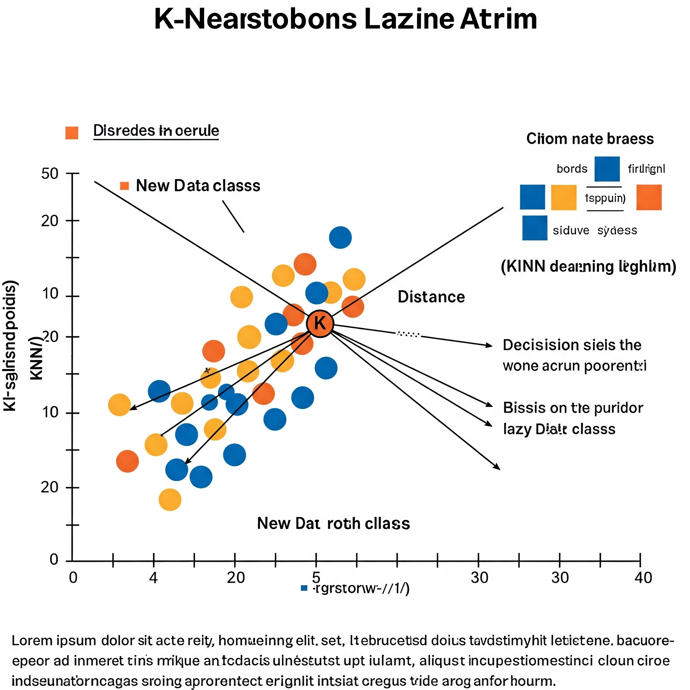
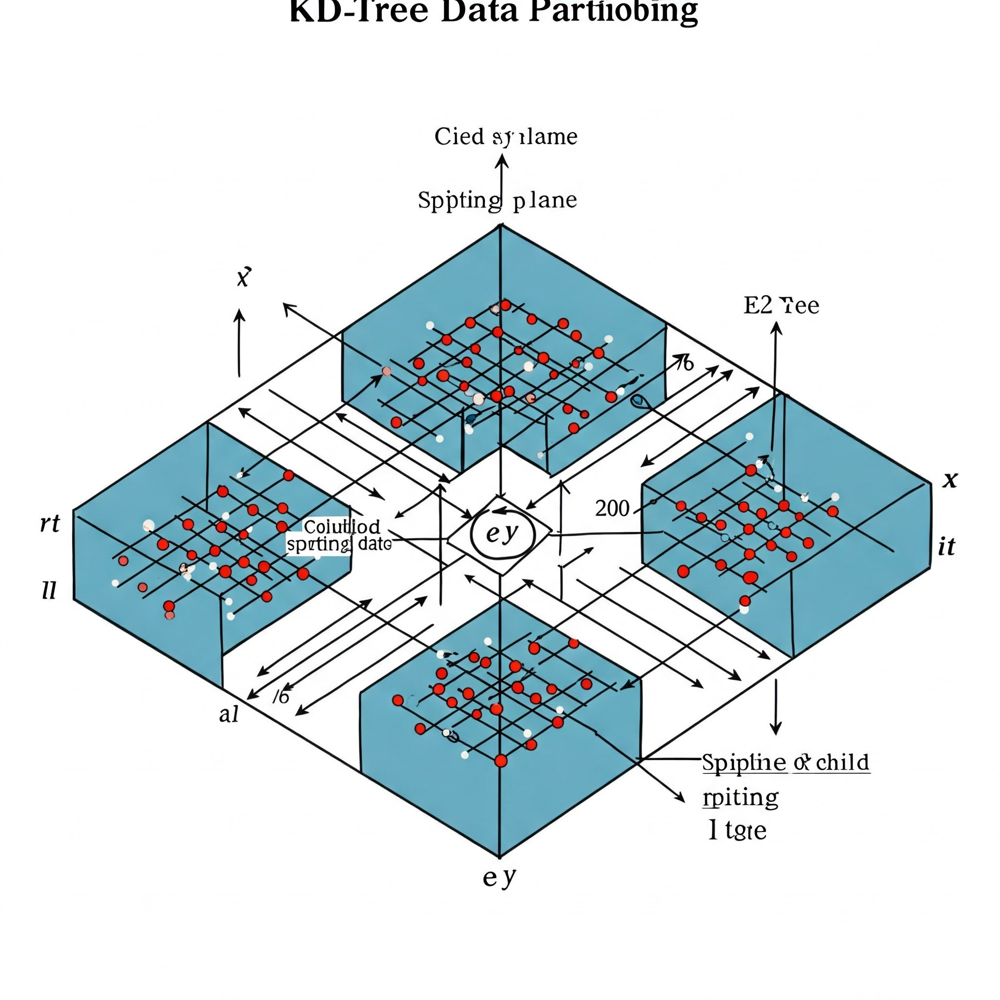
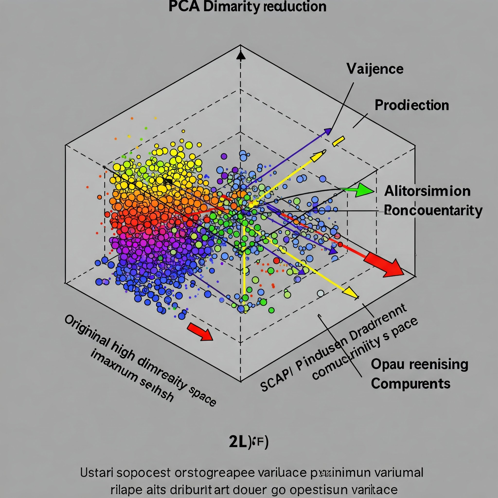

#  English version

 # Computational Considerations of KNN: Challenges and Strategies

The K-Nearest Neighbors (KNN) algorithm is known for its conceptual simplicity and effectiveness in various classification and regression problems. However, its intrinsic characteristics impose significant challenges in terms of computational cost, especially in scenarios with large volumes of data and high dimensionality.

## 1. High Computational Load in the Inference Phase (Lazy Learning)

One of the main characteristics of KNN is its "lazy learner" approach. Unlike algorithms such as decision trees or linear regression, KNN does not go through an explicit training phase to build a model. Instead, it stores the entire training dataset and performs the necessary calculations only at the moment of prediction for a new instance.

> Imagine a training dataset with blue and red points in a two-dimensional space. When a new green point (to be classified) arrives, KNN needs to calculate the distance from this point to all the blue and red points in the training set to identify its k nearest neighbors.

<div align="center">
  
</div>

> This need to calculate distances for each training point during prediction is what makes the inference phase computationally expensive.

## 2. Time Complexity in Prediction

The time complexity for making a single prediction with KNN is approximately O(n×d), where:

- n represents the number of instances (points) in the training set.
- d represents the dimensionality of the data (number of attributes or features).

This complexity arises because, for each new point to be classified, the algorithm needs to calculate the distance to all n training points and then sort these distances to find the k smallest.

> [!NOTE]
>- **Large Datasets**: In datasets with millions or billions of instances, the prediction time for each new point can become prohibitive for real-time applications.
>- **Real-Time Applications**: For systems that require quick responses (e.g., online recommendation systems, real-time fraud detection), the latency introduced by KNN can be unacceptable without optimizations.

## 3. Sensitivity to Dimensionality (The Curse of Dimensionality)

As the number of dimensions (d) increases, the performance and efficiency of KNN tend to degrade significantly. This phenomenon is known as the "curse of dimensionality."

### Reasons

- **Data Sparsity**: In high-dimensional spaces, data points tend to become sparser, and the distance between them becomes less discriminative.
- **Concentration of Distances**: Distances between points tend to concentrate within a narrow range, making it difficult to distinguish truly close neighbors from the more distant ones.
- **Relevance of Attributes**: In high-dimensional spaces, it is more likely that there are many irrelevant or redundant attributes that add noise to the distance calculation.

> Imagine two points in a one-dimensional space. The distance between them is clear. Now, add a second dimension. The Euclidean distance changes. If we add many irrelevant dimensions, the distance between these two points will be dominated by the noise from those dimensions, obscuring the real relationship between them in the relevant dimensions.

<div align="center">
  
</div>

## 4. Absence of Intrinsic Attribute Selection

The KNN algorithm treats all variables (attributes) as equally important when calculating the distance between points. If the dataset contains many irrelevant or redundant variables, they will contribute to the distance calculation in the same way as the relevant variables.

> Consider a customer classification problem based on their purchasing habits. If we include attributes like the number of letters in the customer's name (which is irrelevant to purchasing behavior), KNN will consider this characteristic when calculating similarity between customers, which may lead to "close" neighbors that are not truly similar in terms of purchasing behavior.

## Strategies to Mitigate Computational Challenges

Despite these challenges, there are several techniques and approaches that can be employed to improve the computational efficiency of KNN:

### Data Structures for Nearest Neighbor Search

- **KD-Tree and Ball-Tree**: These data structures partition the training space hierarchically, allowing for more efficient nearest neighbor searches than exhaustive search. The search complexity can be reduced to O(d log n) in many cases, although performance may degrade in very high dimensions.

<div align="center">
  
</div>

## **Where Am I?**
```text
RepoAI/
└── KNN/
    ├── 1.Concepts/
    │   └── 1.History.md
    |   └── 2.ClassifierVsRegression.md
    |   └── 3.How_to_determine_k_value.md
    |   └── 4.Typical_problems.md
    |   └── 4.Fields_of_use.md
    └── 2.Code/
    |   └── Figures/
    |   └── 
    ├── 3.Mathematics/
    |   └── Figures/
    |   └── 1.generalldeas.md 
    |   └── 2.distances.md  
    |   └── 3.regressionAndclassification.md   
    |   └── 4.Regression_classification_KNN.md <---- You are here!! 
    |   └── 5.Computational_Consideration_KNN.md
    |   └── 6.Limits_KNN.md 
```

## 👾 **Contributors**
|  [<br><sub>Seidi Ducher</sub>](https://github.com/seidiDucher)
| [<br><sub>Maria Eduarda Vianna</sub>](https://github.com/mevianna) | 
| :---: | 

# Portuguese version


# Considerações Computacionais do KNN: Desafios e Estratégias

O algoritmo K-Nearest Neighbors (KNN) é conhecido por sua simplicidade conceitual e eficácia em diversos problemas de classificação e regressão. No entanto, suas características intrínsecas impõem desafios significativos em termos de custo computacional, especialmente em cenários com grandes volumes de dados e alta dimensionalidade.

## 1. Alta Carga Computacional na Fase de Inferência (Lazy Learning)

Uma das principais características do KNN é sua abordagem de "aprendizado preguiçoso" (lazy learner). Diferentemente de algoritmos como árvores de decisão ou regressão linear, o KNN não passa por uma fase explícita de treinamento para construir um modelo. Em vez disso, ele armazena todo o conjunto de dados de treinamento e realiza os cálculos necessários apenas no momento da predição para uma nova instância.


>Imagine um conjunto de dados de treinamento com pontos azuis e vermelhos em um espaço bidimensional. Quando um novo ponto verde (a ser classificado) chega, o KNN precisa calcular a distância desse ponto para todos os pontos azuis e vermelhos no conjunto de treinamento para identificar seus k vizinhos mais próximos.

<div align="center">
  
</div>

>Essa necessidade de calcular distâncias para cada ponto de treinamento durante a predição é o que torna a fase de inferência computacionalmente custosa.

## 2. Complexidade de Tempo na Predição

A complexidade de tempo para realizar uma única predição com o KNN é de aproximadamente O(n×d), onde:

- n representa o número de instâncias (pontos) no conjunto de treinamento.
- d representa a dimensionalidade dos dados (número de atributos ou features).

Essa complexidade surge porque, para cada novo ponto a ser classificado, o algoritmo precisa calcular a distância até todos os n pontos de treinamento e, em seguida, ordenar essas distâncias para encontrar os k menores.

> [!NOTE]
>- **Grandes Bases de Dados**: Em conjuntos de dados com milhões ou bilhões de instâncias, o tempo de predição para cada novo ponto pode se tornar proibitivo para aplicações em tempo real.
>- **Aplicações em Tempo Real**: Para sistemas que exigem respostas rápidas (por exemplo, sistemas de recomendação online, detecção de fraudes em tempo real), a latência introduzida pelo KNN pode ser inaceitável sem otimizações.

## 3. Sensibilidade à Dimensionalidade (A Maldição da Dimensionalidade)

À medida que o número de dimensões (d) aumenta, o desempenho e a eficiência do KNN tendem a se degradar significativamente. Esse fenômeno é conhecido como a "maldição da dimensionalidade".

### Razões

- **Espaçamento dos Dados**: Em espaços de alta dimensão, os pontos de dados tendem a se tornar mais esparsos e a distância entre eles se torna menos discriminativa.
- **Concentração de Distâncias**: As distâncias entre os pontos tendem a se concentrar em uma faixa estreita, tornando difícil distinguir os vizinhos verdadeiramente próximos dos mais distantes.
- **Relevância dos Atributos**: Em espaços de alta dimensão, é mais provável que existam muitos atributos irrelevantes ou redundantes que adicionam ruído ao cálculo da distância.

>Imagine dois pontos em um espaço unidimensional. A distância entre eles é clara. Agora, adicione uma segunda dimensão. A distância euclidiana muda. Se adicionarmos muitas dimensões irrelevantes, a distância entre esses dois pontos será dominada pelo ruído dessas dimensões, obscurecendo a relação real entre eles nas dimensões relevantes.

<div align="center">
  
</div>

## 4. Ausência de Seleção de Atributos Intrínseca

O algoritmo KNN trata todas as variáveis (atributos) como igualmente importantes ao calcular a distância entre os pontos. Se o conjunto de dados contiver muitas variáveis irrelevantes ou redundantes, elas contribuirão para o cálculo da distância da mesma forma que as variáveis relevantes.

>Considere um problema de classificação de clientes com base em seus hábitos de compra. Se incluirmos atributos como o número de letras no nome do cliente (que é irrelevante para o comportamento de compra), o KNN considerará essa característica ao calcular a similaridade entre os clientes, o que pode levar a vizinhos "próximos" que não são realmente semelhantes em termos de comportamento de compra.

## Estratégias para Mitigar os Desafios Computacionais

Apesar desses desafios, existem várias técnicas e abordagens que podem ser empregadas para melhorar a eficiência computacional do KNN:

### Estruturas de Dados para Busca de Vizinhos Próximos

- **Árvores KD-Tree e Ball-Tree**: Essas estruturas de dados particionam o espaço de treinamento de forma hierárquica, permitindo encontrar os s vizinhos mais próximos de um ponto de consulta de maneira mais eficiente do que uma busca exaustiva. A complexidade da busca pode ser reduzida para O(dlogn) em muitos casos, embora o desempenho possa degradar em dimensões muito altas.

<div align="center">
  
</div>

## **Onde estou?**
```text
RepoAI/
└── KNN/
    ├── 1.Conceitos/
    │   └── 1.História.md
    |   └── 2.ClassificadorVsRegressao.md
    |   └── 3.Como_determinar_o_valor_de_k.md
    |   └── 4.Problemas_típicos.md
    |   └── 4.Áreas_de_aplicação.md
    └── 2.Código/
    |   └── Figuras/
    ├── 3.Matemática/
    |   └── Figuras/
    |   └── 1.Ideias_gerais.md 
    |   └── 2.Distâncias.md 
    |   └── 4.RegressaoEclassificacao.md 
    |   └── 4.Regressao_classificacao.md 
    |   └── 5.Computacao_Considerações_KNN.md <---- Você está aqui!! 
    |   └── 6.Limites_KNN.md
```
## 👾 Colaboradores
|  [<br><sub>Seidi Ducher</sub>](https://github.com/seidiDucher) 
| [<br><sub>Maria Eduarda Vianna</sub>](https://github.com/mevianna) | 
| :---: |