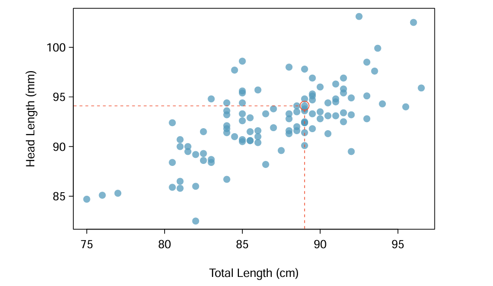

# English version

## **Typical Problems Solved with Linear Regression:**

Linear regression is widely used to model and predict linear relationships between variables. Some common problems include:

### 1. **Forecasting Expenses Based on Income:**
    
    A classic application of linear regression is forecasting personal expenses based on income. Suppose historical data indicates that expenses are, on average, half of the income. By applying linear regression, future expenses can be estimated from known income values.
    
### 2. **Estimating Property Prices:**
    
    In the real estate market, linear regression can estimate the sale price of a house based on characteristics such as size (built area), number of rooms, and location. For example, a model might indicate that for each additional square meter, the price increases by R$ 2,000.00.
    
### 3. **Sales Analysis in Relation to Price:**
    
    Companies often use linear regression to understand how the price of a product affects its sales. By analyzing historical data on prices and sales volumes, it is possible to determine the sensitivity of sales to price changes.
    

### Practical Example

The Australian brushtail possum is a marsupial native to Australia. Researchers captured 104 specimens and performed body measurements before releasing them back into the wild. Among the measurements, two metrics were considered: the total length of the animal (from head to tail) and head length.

The scatter plot below shows the relationship between head length and total length of the possums, where each point represents an animal.

Although the relationship is not perfectly linear, a straight line can help partially explain the connection between these variables. For instance, it shows that possums with a total length above average tend to also have above-average head lengths.



> A scatter plot showing head length versus total length for 104 Australian brushtail possums. A point representing a possum with a head length of 94.1mm and total length of 89cm is highlighted.

## **Where am I?**
```text
RepoAI/
└── Linear Regression/
    ├── 1.Concepts/
        └── Figures/
    │   └── 1.History.md  <---- You are here!!
    |   └── 2.Typical_problems.md
    |   └── 3.Potential_issues.md
    |   └── 4.Fields_of_use.md
    ├── 2.Code/
    |   └── Figures/
    |   └── 1.Dive_into_the_docs.md 
    |   └── 2.Boston_housing_price_reg.md
    |   └── 3.Student_study_hours_prediction.md
    └── 3.Mathematics/
    |   └── Figures/
    |   └── 1.General_representation_of_linear_regression.md 
    |   └── 2.The_least_square_method.md 
    |   └── 3.Equation_based_on_dataset.md   
```

## 👾 **Contributors**  
| [<br><sub>Alice Motin</sub>](https://github.com/AliceMotin) |  [<br><sub>Caroline Lanzuolo</sub>](https://github.com/carol-lanzu) | [<br><sub>Matheus Lima</sub>](https://github.com/matheus1103) | 
| :---: | :---: | :---: |

# Portuguese version

## **Problemas Típicos Resolvidos com Regressão Linear:**

A regressão linear é amplamente utilizada para modelar e prever relações lineares entre variáveis. Alguns problemas comuns incluem:

### 1. **Previsão de Despesas com Base na Renda:**
    
    Uma aplicação clássica da regressão linear é prever despesas pessoais com base na renda. Suponha que dados históricos indiquem que as despesas são, em média, metade da renda. Aplicando a regressão linear, é possível estimar as despesas futuras a partir de valores conhecidos de renda.
    
### 2. **Estimativa do Preço de Imóveis:**
    
    No mercado imobiliário, a regressão linear pode estimar o preço de venda de uma casa com base em características como tamanho (área construída), número de quartos e localização. Por exemplo, um modelo pode indicar que, para cada metro quadrado adicional, o preço aumenta em R$ 2.000,00.
    
### 3. **Análise de Vendas em Relação ao Preço:**
    
    Empresas frequentemente utilizam a regressão linear para entender como o preço de um produto afeta suas vendas. Por exemplo, ao analisar dados históricos de preços e volumes vendidos, é possível determinar a sensibilidade das vendas em relação a alterações de preço.
    

### Exemplo prático

O gambá-australiano Brushtail é um marsupial nativo da Austrália. Pesquisadores capturaram 104 exemplares e realizaram medições corporais antes de devolvê-los à natureza. Entre as medições, foram consideradas duas métricas: o comprimento total do animal (da cabeça à cauda) e o comprimento da cabeça.

O gráfico de dispersão abaixo apresenta a relação entre o comprimento da cabeça e o comprimento total dos gambás, onde cada ponto representa um animal. 

Embora a relação não seja perfeitamente linear, uma linha reta pode ajudar a explicar parcialmente a conexão entre essas variáveis, de forma que mostra por exemplo uma associação entre gambás com comprimento total acima da média tendem a apresentar também comprimentos de cabeça acima da média.


> Um gráfico de dispersão mostrando o comprimento da cabeça em relação ao comprimento total para 104 gambás-australianos. Um ponto representando um gambá com comprimento de cabeça de 94,1mm e comprimento total de 89cm está destacado.

## **Onde estou?**
```text
RepoAI/
└── Linear Regression/
    ├── 1.Concepts/
        └── Figures/
    │   └── 1.History.md  <---- Você está aqui!!
    |   └── 2.Typical_problems.md
    |   └── 3.Potential_issues.md
    |   └── 4.Fields_of_use.md
    ├── 2.Code/
    |   └── Figures/
    |   └── 1.Dive_into_the_docs.md 
    |   └── 2.Boston_housing_price_reg.md
    |   └── 3.Student_study_hours_prediction.md
    └── 3.Mathematics/
    |   └── Figures/
    |   └── 1.General_representation_of_linear_regression.md 
    |   └── 2.The_least_square_method.md 
    |   └── 3.Equation_based_on_dataset.md   
```

## 👾 **Contribuidores**  
| [<br><sub>Alice Motin</sub>](https://github.com/AliceMotin) |  [<br><sub>Caroline Lanzuolo</sub>](https://github.com/carol-lanzu) | [<br><sub>Matheus Lima</sub>](https://github.com/matheus1103) | 
| :---: | :---: | :---: |
