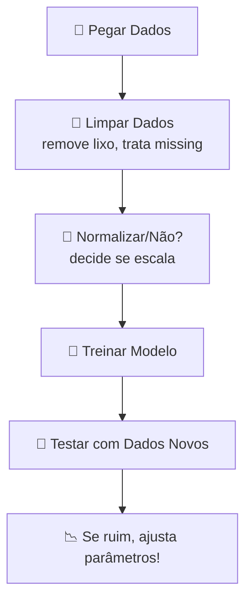

<details>
<summay> PORTUGUESE VERSION </summary>

---


# Regressão Linear: Tudo que Você Precisa Saber (de um jeito que você entende!)

---

## **Índice Gamer**
1. [O que é Regressão Linear?](#-o-que-é-essa-tal-de-regressão-linear)
2. [Configurando o Modelo](#%EF%B8%8F-configurando-o-modelo-como-um-chefe)
3. [Código Passo a Passo](#-código-passo-a-passo-sem-mimimi)
4. [Fluxo de Trabalho](#-fluxo-de-trabalho-tipo-uma-receita-de-bolo)
5. [Dicas Pro](#-dicas-pro-que-ninguém-te-conta)

---

## **O que é essa tal de Regressão Linear?**  
Imagina que você quer prever o preço de um **NFT** baseado no número de likes que ele tem. A regressão linear é tipo uma **calculadora mágica** que:  
1. Cria uma reta (aquela do "y = ax + b" da escola)  
2. Ajusta essa reta nos seus dados  
3. **Prevê valores novos** tipo: _"Se tiver 500 likes, o NFT vale R$ 2.000!"_  

**Traduzindo:** É o modelo mais simples de Machine Learning, mas MUITO útil para entender relações entre números.

---

## **Configurando o Modelo (como um chefe)**  

Quando você cria o modelo, tem umas **opções secretas** que mudam tudo:

### `fit_intercept`  
- **O que faz:** Decide se a reta começa no **zero** ou não.  
- **Exemplo:** Se seus dados são tipo "quantidade de pizza 🍕 vs. felicidade 😊", `fit_intercept=True` permite que mesmo sem pizza você tenha um nível de felicidade (tipo 5/10).  

### `n_jobs`  
- **O que faz:** Usa todos os processadores do PC pra calcular mais rápido.  
- **Quando usar:** Só vale a pena se seu dataset for **GIGANTE** (tipo 100k+ linhas).  

### `positive`  
- **O que faz:** Não deixa os coeficientes ficarem negativos.  
- **Exemplo:** Se "horas de estudo 📚" nunca podem reduzir a nota 🅰️, use `positive=True`.  

---

## **Código Passo a Passo (sem mimimi)**

```python
# PASSO 1: Importar as ferramentas
from sklearn.linear_model import LinearRegression
import numpy as np

# PASSO 2: Criar dados FAKE (tipo simulação)
# X = horas de estudo | y = nota na prova
X = np.array([[1], [2], [3], [4]])  # reshape pra matriz
y = np.array([4, 6, 8, 10])          # notas correspondentes

# PASSO 3: Criar e treinar o modelo
modelo = LinearRegression(fit_intercept=True)  # default é True
modelo.fit(X, y)  # o modelo "aprende" aqui!

# PASSO 4: Prever o futuro! 🔮
horas_estudo = [[5]]  # 5 horas de estudo
nota_prevista = modelo.predict(horas_estudo)
print(f"Com 5h de estudo, nota prevista: {nota_prevista[0]:.1f} 🎉")
# Saída: Com 5h de estudo, nota prevista: 12.0 🎉 (Ué? WTF?!)
```

### **Wait... 5h = Nota 12?**  
Calma, é um exemplo fake! Os dados originais são lineares perfeitos (4,6,8,10), então o modelo extrapolou. Na vida real, os dados são bagunçados! 🎲

---

## **Fluxo de Trabalho (tipo uma receita de bolo)**



### **Dicas do Fluxo:**  
- **Dados sujos?** O modelo vai prever errado, tipo um GPS com mapa rasgado 🗺️  
- **Testar sempre!** Não confie cegamente no modelo – faça ele prever dados que ele nunca viu!  

---

## **Dicas Pro (que ninguém te conta)**  

### 1. **Não use tudo de uma vez!**  
- Separe parte dos dados para teste (tipo 20%) – senão você cai no **autoengano**!  

### 2. **Cuidado com variáveis fantasmas!**  
- Se duas variáveis são **muito correlacionadas** (tipo "idade" e "ano de nascimento"), o modelo fica doido!  

### 3. **Comece simples!**  
- Regressão Linear é seu **primeiro passo** – só depois parta para redes neurais e modelos complexos!  

---

## 👾 **Contribuidores**  
| [<br><sub>Ítalo Silva</sub>](https://github.com/ITA-LOW) |  [<br><sub>Mateus Kramer</sub>](https://github.com/mateuskramer) |
| :---: | :---: |

---

## **Licença**  
[](https://pt.wikipedia.org/wiki/Licen%C3%A7a_MIT)  
**Tradução:** Use, modifique e compartilhe à vontade! ✌️
</details>