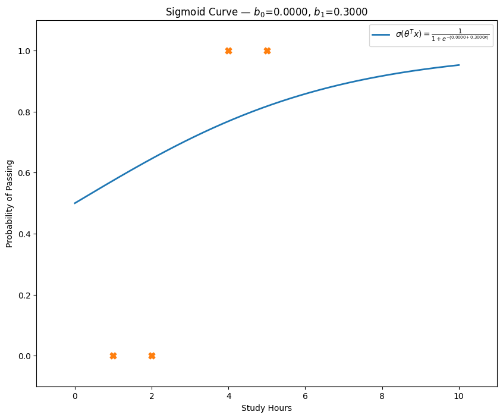
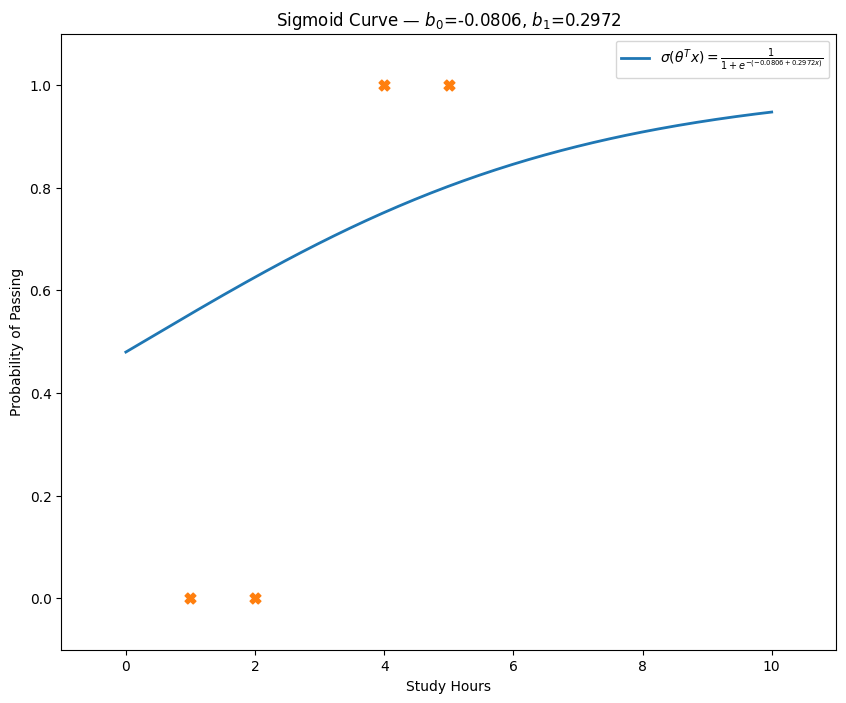
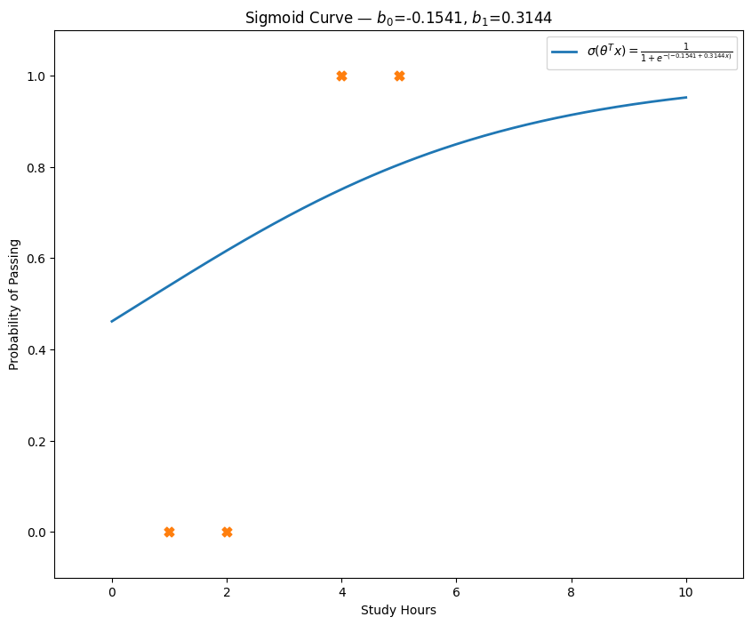
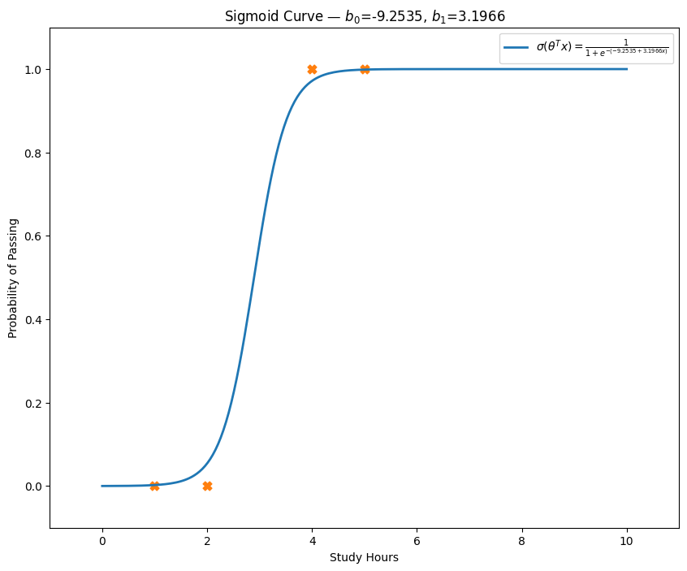

# Practical Example — Study Hours vs. Probability of Passing

In this practical example, we use a hypothetical dataset that relates each student’s number of study hours to the probability of passing an exam, applying logistic regression to model this relationship in a binary classification setting.  
The dataset consists of four representative observations—students who studied for 2, 4, 6, and 8 hours—and their corresponding outcomes (passed = 1 or failed = 0), illustrating how continuous variables can be mapped to probabilities of a discrete event.

## Application
| Study Hours (x) | Passed (y) |
|------------------|------------|
|        1         |     0      | 
|        2         |     0      |
|        4         |     1      |
|        5         |     1      |

Initially, both $\beta_0$ and $\beta_1$ are assumed to be 0, along with the learning rate (0.1). The learning rate is chosen by the practitioner and not derived mathematically from the model, as it influences the optimization process rather than the statistical structure.

---

### Iteration 1

$\beta_0^{0}$ = 0 ; $\beta_1^{0}$ = 0 ; $\alpha$ = 0.1

#### Step 1: Calculating each $z^{(i)}$:

- $z^{(1)}$ = $\beta_0$ + $\beta_1\cdot x_1$ = $0 + 0\cdot1$ = 0 $\therefore$ $z^{(1)}$ = 0
- $z^{(2)}$ = $\beta_0$ + $\beta_1\cdot x_2$ = $0 + 0\cdot2$ = 0 $\therefore$ $z^{(2)}$ = 0
- $z^{(3)}$ = $\beta_0$ + $\beta_1\cdot x_3$ = $0 + 0\cdot4$ = 0 $\therefore$ $z^{(3)}$ = 0
- $z^{(4)}$ = $\beta_0$ + $\beta_1\cdot x_4$ = $0 + 0\cdot5$ = 0 $\therefore$ $z^{(4)}$ = 0

#### Step 2: Found each value of $\sigma$ given $z^{i}$ - a.k.a doing predictions - $\hat y^{(i)}$

- $\sigma(z^{(1)})$ = $\frac{1}{1 + e^{-z}}$ = $\frac{1}{1 + e^{-0}}$ $\therefore$ $\sigma(z^{(1)})$ = 0.5
- $\sigma(z^{(2)})$ = $\frac{1}{1 + e^{-z}}$ = $\frac{1}{1 + e^{-0}}$ $\therefore$ $\sigma(z^{(2)})$ = 0.5
- $\sigma(z^{(3)})$ = $\frac{1}{1 + e^{-z}}$ = $\frac{1}{1 + e^{-0}}$ $\therefore$ $\sigma(z^{(3)})$ = 0.5
- $\sigma(z^{(4)})$ = $\frac{1}{1 + e^{-z}}$ = $\frac{1}{1 + e^{-0}}$ $\therefore$ $\sigma(z^{(4)})$ = 0.5

#### Step 3: Calculating the gradients

- $\frac{\partial{\ell}}{\partial{\beta_0}}$ = $\sum(y^{(i)} - \hat y^{(i)})$ = $(0 - 0.5) + (0 - 0.5) + (1 - 0.5) + (1 - 0.5) \therefore \frac{\partial{\ell}}{\partial{\beta_0}} = 0$
- $\frac{\partial{\ell}}{\partial{\beta_1}}$ = $\sum(y^{(i)} - \hat y^{(i)})\cdot x^{(i)}$ = $[(0 - 0.5)\cdot1] + [(0 - 0.5)\cdot2] + [(1 - 0.5)\cdot4] + [(1 - 0.5)\cdot5] \therefore \frac{\partial{\ell}}{\partial{\beta_1}} = 3$

#### Step 4: Using the gradient ascending to update the weights - like any supercomputer does

- $\beta_0^{(1)} = \beta_0^{0} + \alpha \cdot \frac{\partial{\ell}}{\partial{\beta_0}} = 0 + 0.1 \cdot 0 \therefore \beta_0^{(1)} = 0$
- $\beta_1^{(1)} = \beta_1^{0} + \alpha \cdot \frac{\partial{\ell}}{\partial{\beta_1}} = 0 + 0.1 \cdot 3 \therefore \beta_1^{(1)} = 0.3$

#### Finally, after the first iteration our model looks like this

<div align="center">
  
</div>

### Iteration 2

$\beta_0^{0}$ = 0 ; $\beta_1^{0}$ = 0.3 ; $\alpha$ = 0.1

#### Step 1: Calculating each $z^{(i)}$
- $z^{(1)} = 0 + 0.30\cdot1 = 0.30$
- $z^{(2)} = 0 + 0.30\cdot2 = 0.60$
- $z^{(3)} = 0 + 0.30\cdot4 = 1.20$
- $z^{(4)} = 0 + 0.30\cdot5 = 1.50$

#### Step 2: Predictions $\hat y^{(i)}$
- $\hat y^{(1)} = \frac{1}{1+e^{-0.30}} \approx 0.5744$
- $\hat y^{(2)} = \frac{1}{1+e^{-0.60}} \approx 0.6457$
- $\hat y^{(3)} = \frac{1}{1+e^{-1.20}} \approx 0.7685$
- $\hat y^{(4)} = \frac{1}{1+e^{-1.50}} \approx 0.8176$

#### Step 3: Calculating the gradients
- $\displaystyle \frac{\partial \ell}{\partial \beta_0}
  = (-0.5744)+(-0.6457)+(0.2315)+(0.1824)
  \approx -0.8062$
- $\displaystyle \frac{\partial \ell}{\partial \beta_1}
  = (-0.5744\cdot1)+(-0.6457\cdot2)+(0.2315\cdot4)+(0.1824\cdot5)
  \approx -0.0278$

#### Step 4: Updating the weights
- $\displaystyle \beta_{0}^{(2)}
  = 0 + 0.1 \times (-0.8062)
  \approx -0.0806$
- $\displaystyle \beta_{1}^{(2)}
  = 0.30 + 0.1 \times (-0.0278)
  \approx 0.2972$

#### Tthe second iteration

<div align="center">
  
</div>

---

### Iteration 3

$\displaystyle \beta_{0}^{(2)} \approx -0.0806,\quad \beta_{1}^{(2)} \approx 0.2972,\quad \alpha = 0.1$

#### Step 1: Calculating each $z^{(i)}$
- $z^{(1)} = -0.0806 + 0.2972\cdot1 \approx 0.2166$
- $z^{(2)} = -0.0806 + 0.2972\cdot2 \approx 0.5138$
- $z^{(3)} = -0.0806 + 0.2972\cdot4 \approx 1.1082$
- $z^{(4)} = -0.0806 + 0.2972\cdot5 \approx 1.4054$

#### Step 2: Predictions $\hat y^{(i)}$
- $\hat y^{(1)} = \frac{1}{1+e^{-0.2166}} \approx 0.5549$
- $\hat y^{(2)} = \frac{1}{1+e^{-0.5138}} \approx 0.6257$
- $\hat y^{(3)} = \frac{1}{1+e^{-1.1082}} \approx 0.7516$
- $\hat y^{(4)} = \frac{1}{1+e^{-1.4054}} \approx 0.8030$

#### Step 3: Calculating the gradients
- $\displaystyle \frac{\partial \ell}{\partial \beta_0}
  = (-0.5549)+(-0.6257)+(0.2484)+(0.1970)
  \approx -0.7352$
- $\displaystyle \frac{\partial \ell}{\partial \beta_1}
  = (-0.5549\cdot1)+(-0.6257\cdot2)+(0.2484\cdot4)+(0.1970\cdot5)
  \approx 0.1723$

#### Step 4: Updating the weights
- $\displaystyle \beta_{0}^{(3)}
  = -0.0806 + 0.1 \times (-0.7352)
  \approx -0.1541$
- $\displaystyle \beta_{1}^{(3)}
  = 0.2972 + 0.1 \times 0.1723
  \approx 0.3144$

#### The third iteration

<div align="center">
  
</div>

### Nothing change at first glimpse, but after 1000 iterations...

<div align="center">
  
</div>

### ...We can see how the methods actually works!!

>[!NOTE]
> Interesting fact, if with 1 and 2 hours I not pass but with 4 and 5 I pass, what should be the probability of pass if I study for 3 hours?
>
> Our final model has the following weights: $\beta_0 = -9.25348$  $\beta_1= 3.19660$, so:
>
> $$P(y=1 \mid x = 3) = \frac{1}{1 + e^{-(-9.253 + 3.196 \cdot (3))}} = 0.58$$
>
>Amazing!! The model is not linear!!

---

# Exemplo Prático — Horas de Estudo x Probabilidade de Aprovação

Neste exemplo prático, usamos um conjunto de dados hipotético que relaciona o número de horas de estudo de cada aluno à probabilidade de aprovação em uma prova, aplicando regressão logística como classificador binário.  
A base contém quatro observações — alunos que estudaram 1, 2, 4 e 5 horas — e seus resultados (aprovado = 1 ou reprovado = 0), mostrando como variáveis contínuas podem ser convertidas em probabilidades de um evento discreto.

## Aplicação

| Horas de Estudo (x) | Aprovado (y) |
|---------------------|--------------|
|          1          |      0       |
|          2          |      0       |
|          4          |      1       |
|          5          |      1       |

Inicialmente, assume‑se $\beta_{0}=0$ e $\beta_{1}=0$, assim como a taxa de aprendizado $\alpha=0,1$. A taxa de aprendizado é escolhida pelo praticante e não faz parte da estrutura estatística do modelo, mas sim do processo de otimização.

---

### Iteração 1

$\beta_{0}^{(0)} = 0$ ; $\beta_{1}^{(0)} = 0$ ; $\alpha = 0,1$

#### Passo 1: Calculando cada $z^{(i)}$

- $z^{(1)} = \beta_{0} + \beta_{1}\cdot x_{1} = 0 + 0\cdot1 = 0$  
- $z^{(2)} = 0 + 0\cdot2 = 0$  
- $z^{(3)} = 0 + 0\cdot4 = 0$  
- $z^{(4)} = 0 + 0\cdot5 = 0$  

#### Passo 2: Previsões $\hat y^{(i)} = \sigma(z^{(i)})$

- $\hat y^{(1)} = \dfrac{1}{1 + e^{-0}} = 0,5$  
- $\hat y^{(2)} = 0,5$  
- $\hat y^{(3)} = 0,5$  
- $\hat y^{(4)} = 0,5$  

#### Passo 3: Calculando os gradientes

- $\displaystyle \frac{\partial \ell}{\partial \beta_{0}}
  = \sum_{i=1}^{4}\bigl(y^{(i)} - \hat y^{(i)}\bigr)
  = (0-0{,}5)+(0-0{,}5)+(1-0{,}5)+(1-0{,}5)
  = 0$  

- $\displaystyle \frac{\partial \ell}{\partial \beta_{1}}
  = \sum_{i=1}^{4}\bigl(y^{(i)} - \hat y^{(i)}\bigr)\,x^{(i)}
  = (0-0{,}5)\cdot1 + (0-0{,}5)\cdot2 + (1-0{,}5)\cdot4 + (1-0{,}5)\cdot5
  = 3{,}0$  

#### Passo 4: Atualização dos pesos

- $\beta_{0}^{(1)} = \beta_{0}^{(0)} + \alpha\,\frac{\partial \ell}{\partial \beta_{0}}
  = 0 + 0{,}1 \times 0
  = 0$  

- $\beta_{1}^{(1)} = \beta_{1}^{(0)} + \alpha\,\frac{\partial \ell}{\partial \beta_{1}}
  = 0 + 0{,}1 \times 3{,}0
  = 0{,}3$  

#### Após a primeira iteração, o modelo fica assim

<div align="center">
  
</div>

---

### Iteração 2

$\beta_{0}^{(1)} = 0$ ; $\beta_{1}^{(1)} = 0,3$ ; $\alpha = 0,1$

#### Passo 1: Calculando cada $z^{(i)}$

- $z^{(1)} = 0 + 0{,}3\cdot1 = 0{,}3$  
- $z^{(2)} = 0 + 0{,}3\cdot2 = 0{,}6$  
- $z^{(3)} = 0 + 0{,}3\cdot4 = 1{,}2$  
- $z^{(4)} = 0 + 0{,}3\cdot5 = 1{,}5$  

#### Passo 2: Previsões $\hat y^{(i)}$

- $\hat y^{(1)} = \dfrac{1}{1 + e^{-0,3}} \approx 0,5744$  
- $\hat y^{(2)} = \dfrac{1}{1 + e^{-0,6}} \approx 0,6457$  
- $\hat y^{(3)} = \dfrac{1}{1 + e^{-1,2}} \approx 0,7685$  
- $\hat y^{(4)} = \dfrac{1}{1 + e^{-1,5}} \approx 0,8176$  

#### Passo 3: Calculando os gradientes

- $\displaystyle \frac{\partial \ell}{\partial \beta_{0}}
  = (-0{,}5744)+(-0{,}6457)+(0{,}2315)+(0{,}1824)
  \approx -0{,}8062$  

- $\displaystyle \frac{\partial \ell}{\partial \beta_{1}}
  = (-0{,}5744\cdot1)+(-0{,}6457\cdot2)+(0{,}2315\cdot4)+(0{,}1824\cdot5)
  \approx -0{,}0278$  

#### Passo 4: Atualização dos pesos

- $\beta_{0}^{(2)} = 0 + 0{,}1 \times (-0{,}8062) \approx -0{,}0806$  
- $\beta_{1}^{(2)} = 0{,}3 + 0{,}1 \times (-0{,}0278) \approx 0{,}2972$  

#### Modelo após a segunda iteração

<div align="center">
  
</div>

---

### Iteração 3

$\beta_{0}^{(2)} \approx -0{,}0806$ ; $\beta_{1}^{(2)} \approx 0{,}2972$ ; $\alpha = 0,1$

#### Passo 1: Calculando cada $z^{(i)}$

- $z^{(1)} = -0{,}0806 + 0{,}2972\cdot1 \approx 0{,}2166$  
- $z^{(2)} = -0{,}0806 + 0{,}2972\cdot2 \approx 0{,}5138$  
- $z^{(3)} = -0{,}0806 + 0{,}2972\cdot4 \approx 1{,}1082$  
- $z^{(4)} = -0{,}0806 + 0{,}2972\cdot5 \approx 1{,}4054$  

#### Passo 2: Previsões $\hat y^{(i)}$

- $\hat y^{(1)} = \dfrac{1}{1 + e^{-0,2166}} \approx 0,5549$  
- $\hat y^{(2)} = \dfrac{1}{1 + e^{-0,5138}} \approx 0,6257$  
- $\hat y^{(3)} = \dfrac{1}{1 + e^{-1,1082}} \approx 0,7516$  
- $\hat y^{(4)} = \dfrac{1}{1 + e^{-1,4054}} \approx 0,8030$  

#### Passo 3: Calculando os gradientes

- $\displaystyle \frac{\partial \ell}{\partial \beta_{0}}
  = (-0{,}5549)+(-0{,}6257)+(0{,}2484)+(0{,}1970)
  \approx -0{,}7352$  

- $\displaystyle \frac{\partial \ell}{\partial \beta_{1}}
  = (-0{,}5549\cdot1)+(-0{,}6257\cdot2)+(0{,}2484\cdot4)+(0{,}1970\cdot5)
  \approx 0{,}1723$  

#### Passo 4: Atualização dos pesos

- $\beta_{0}^{(3)} = -0{,}0806 + 0{,}1 \times (-0{,}7352) \approx -0{,}1541$  
- $\beta_{1}^{(3)} = 0{,}2972 + 0{,}1 \times 0{,}1723 \approx 0{,}3144$  

#### Modelo após a terceira iteração

<div align="center">
  
</div>

---

### Nada muda à primeira vista, mas após 1000 iterações…

<div align="center">
  
</div>

### ...podemos ver como o método converge aos valores finais de $\beta_{0}$ e $\beta_{1}$.

---


>[!NOTE]
> Fato interessante, se estudando 1 ou 2 horas eu não passo mas estudando 4 ou 5 eu passo, qual deve ser a probabilidade de passar se eu estudar 3 horas?
>
> Nosso modelo final tem os seguintes pesos: $\beta_0 = -9.25348$  $\beta_1= 3.19660$, então:
>
> $$P(y=1 \mid x = 3) = \frac{1}{1 + e^{-(-9.253 + 3.196 \cdot (3))}} = 0.58$$
>
> Incrível!! O modelo não é linear!!

---

# Bonus stage
Os cálculos utilizados nesse exemplo foram muito simples e fornecemos o código para voce copiar e colar em um notebook colab ou jupyter. Teste outros valores no dataset, altere a
taxa de aprendizado e número de iterações para ver como as predições se comportam.

```python
import numpy as np

# Dataset
x = np.array([1, 2, 4, 5], dtype=float)
y = np.array([0, 0, 1, 1], dtype=float)

# Hyperparametros - a única coisa que precisa alterar
alpha = 0.1       # taxa de aprendizado
n_iter = 1000000000   # número de iterações

# chute inicial
b0 = 0.0
b1 = 0.0

# Sigmoid
def sigmoid(z):
    return 1.0 / (1.0 + np.exp(-z))

# Gradiente ascendente - podia ser descendente tbm
for t in range(1, n_iter + 1):
    # Passo 1
    z = b0 + b1 * x
    
    # Passo 2
    preds = sigmoid(z)
    
    # Passo 3
    grad_b0 = np.sum(y - preds)
    grad_b1 = np.sum((y - preds) * x)
    
    # Passo 4
    b0 += alpha * grad_b0
    b1 += alpha * grad_b1

# Resultados
print(f"Depois de {n_iter} iterações:")
print(f"  β₀ = {b0:.6f}")
print(f"  β₁ = {b1:.6f}")

# What if eu estudar 3 horas??
y_pred = sigmoid(b0 + b1 * 3)
print(f"Chance de passar: {y_pred * 100} %")

Chance de passar: 57.677557764329926%
```


## **Contributors**  
| [<br><sub>Ítalo Silva</sub>](https://github.com/ITA-LOW) |  [<br><sub>Arthur Bogoni</sub>](https://github.com/ArthurBogoni) | 
| :---: | :---: | 
