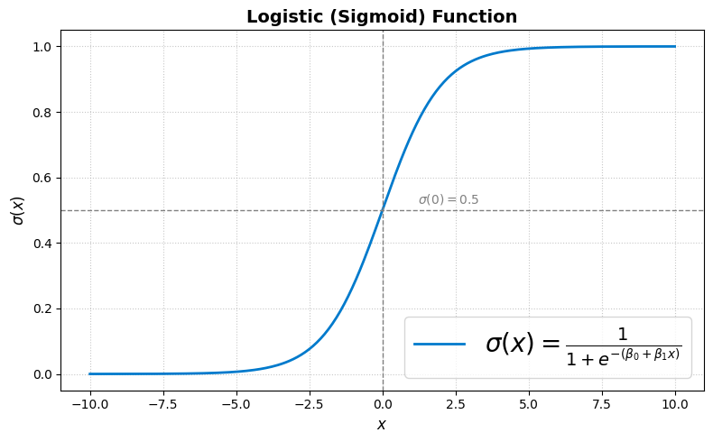

# Logistic Regression at a Glance 🚀

  

- **Goal**  
  Estimate the probability of a binary outcome $y\in {0,1}$ by passing a linear score through the **sigmoid** (logistic) function.

- **How It Works**  
  Compute  
  $$
    P(y=1\mid x)=\sigma(\boldsymbol\theta^T x)=\frac{1+e^{- \beta_0 + \beta_1x}},
  $$  
  then classify by thresholding at 0.5.
---
## **Index**

1. [Glossary of Key Terms](#glossary-of-key-terms)  
2. [What is Logistic Regression?](#what-is-logistic-regression)  
3. [The Logistic Function (a.k.a Sigmoid)](#setting-up-the-model-like-a-boss)  
4. [Step-by-Step Math (No Nonsense)](#step-by-step-math-no-nonsense)  
5. [Workflow (Like a Cake Recipe)](#workflow-like-a-cake-recipe)  
6. [Pro Tips (The Ones No One Tells You)](#pro-tips-the-ones-no-one-tells-you)  
7. [Contributors](#contributors)

---
## Glossary of Key Terms

- **Sigmoid (Logistic) Function**  
  A smooth S-shaped curve defined as $\sigma(z) = \frac{1}{1 + e^{-z}}$, which maps any real number to the interval (0,1). It represents the probability output of the logistic regression model.

- **Hypothesis**  
  Denoted $h_{\boldsymbol\theta}(x)$, it is the model’s predicted probability that the outcome $y=1$ given input $x$. In logistic regression, it is equal to $\sigma(\boldsymbol\theta^T x)$.

- **Odds**  
  The ratio $\frac{P(y=1)}{P(y=0)}$, which expresses how much more likely the positive outcome is compared to the negative one.

- **Log-Odds (Logit)**  
  The natural logarithm of the odds. In logistic regression, the log-odds are modeled as a linear function of the input:  
  $$
  \log\frac{P(y=1\mid x)}{P(y=0\mid x)} = \boldsymbol\theta^T x.
  $$
  The log‑odds tells you how the logarithm of an event’s odds changes for each one‑unit change in a variable, providing a linear measure of effect; for example, if a model’s log‑odds coefficient for “hours studied” is 0.4, then each extra hour increases the log‑odds of passing by 0.4 equivalently, the odds of passing are multiplied by $\exp{0.4} = 1.49$ (a $49\%$ increase).

- **Maximum Likelihood Estimation (MLE)**  
  A statistical method used to estimate the parameters $\boldsymbol\theta$ of a model by maximizing the likelihood function, i.e., the probability of observing the given data. In logistic regression, MLE adjusts the coefficients $\theta$ to maximize the predicted probabilities for the correct classes e.g., tuning a model to predict whether an email is spam by maximizing the likelihood of correct labels given the input words.

- **Gradient**  
  A vector of partial derivatives of a function with respect to its parameters. It indicates the direction of the steepest increase and is used to optimize the model via gradient ascent or descent.

- **Cost Function (Log-Loss)**  
  The negative log-likelihood averaged over the dataset. It measures the difference between predicted probabilities and actual outcomes. In logistic regression, it is convex, ensuring a single global minimum. This convexity means that optimization algorithms like gradient descent won’t get stuck in bad local minima—they are guaranteed to find the best possible solution within the parameter space.
  $$
    J(\boldsymbol\theta) = -\frac{1}{m} \sum_{i=1}^m \left[ y^{(i)} \log\left(h_{\boldsymbol\theta}(\mathbf{x}^{(i)})\right) + \left(1 - y^{(i)}\right) \log\left(1 - h_{\boldsymbol\theta}(\mathbf{x}^{(i)})\right) \right]
  $$
  where
  - $m$ is the number of training examples
  - $y^i \in 0,1$ is the true label
  - $h_{\theta}(x^i)$ is the predict probability that $y=1$
  - $\theta$ are the model parameters
  The cost increases sharply when the model is confident and wrong, and is minimized when predicted probabilities match the true outcomes.

- **Convexity**  
  A property of functions where any local minimum is also a global minimum. Convex cost functions make optimization reliable and stable.

- **Decision Boundary**  
  The surface where the predicted probability is exactly 0.5. In logistic regression, this boundary is linear and defined by $\boldsymbol\theta^T x = 0$.

- **Regularization (L1 / L2)**  
  Techniques used to prevent overfitting by adding a penalty to the cost function:  
  - L1 (Lasso): adds $\sum |\theta_j|$  
  - L2 (Ridge): adds $\sum \theta_j^2$  

- **Deviance**  
  A measure of how well the model fits the data, defined as twice the difference between the log-likelihood of a saturated model (perfect fit) and the current model.
  $$
  D = 2 \left( \ell_{\text{saturated}} - \ell_{\text{model}} \right)
  $$
  where
  - $\ell_{\text{saturated}}$​ is the log-likelihood of the saturated model
  - $\ell_{\text{model}}$ is the log-likelihood of the current fitted model

- **Pseudo-$R^2$**  
  Analogues to the $R^2$ metric from linear regression. Common variants include Cox–Snell and McFadden, used to evaluate the explanatory power of logistic models.

  1) MCFadden's

    $$R^2_{\mathrm{McF}} = 1 - \frac{\ell_{\mathrm{full}}}{\ell_{0}}$$
    - $\ell_{0}$ log‑likelihood of the null model (intercept only)
    - $\ell_{\mathrm{full}}$ log‑likelihood of the fitted model

  McFadden’s pseudo‑$R^2$ measures the proportional improvement in log‐likelihood of the fitted model over the null model. Values closer to 1 indicate a better fit, though typical values are much lower than linear $R^2$.

- **Multiclass Logistic Regression**  
  Extensions of logistic regression to handle more than two classes, either by fitting multiple binary classifiers (one-vs-rest) or using the multinomial logistic model.

- **Softmax Function**  
  A generalization of the sigmoid function for multiclass classification. It transforms a vector of real-valued scores into a probability distribution over multiple classes:
  $$
    \mathrm{softmax}(z)_k = \frac{e^{z_k}}{\sum_{j=1}^K e^{z_j}}.
  $$

>[!Warning] Do not overheat, it was just a first handshake!
---

## What is Logistic Regression?

Logistic regression is a **classification algorithm** used to predict the probability of a binary outcome (e.g., success/failure, spam/not spam, disease/no disease) based on one or more input features.

At its core, logistic regression estimates the **probability** that a given input \(\mathbf{x}\) belongs to class 1 (i.e., \(y=1\)) rather than class 0. Unlike linear regression, which can output any real number, logistic regression keeps predictions in the interval \([0, 1]\) by using the **logistic (sigmoid) function**.

### The Idea in One Sentence:
> Logistic regression fits a **sigmoid curve** to a **linear combination** of inputs to model the probability of a binary outcome.

---

### The Logistic Function:

\[
\sigma(z) = \frac{1}{1 + e^{-z}}
\]

Where:
- \(z = \boldsymbol\theta^T \mathbf{x}\) is a linear combination of the input features and model parameters.
- The function \(\sigma(z)\) maps any real number to a value between 0 and 1, representing a probability.

---

### Interpretation:

- If \(\sigma(z) \approx 1\), the model strongly predicts class 1.
- If \(\sigma(z) \approx 0\), the model strongly predicts class 0.
- If \(\sigma(z) \approx 0.5\), the model is uncertain.

---

### Logistic vs. Linear

| Feature          | Linear Regression                  | Logistic Regression                          |
|------------------|------------------------------------|----------------------------------------------|
| Output Range     | \((-\infty, \infty)\)              | \((0, 1)\)                                   |
| Used For         | Continuous outcome prediction      | Binary classification                        |
| Decision Rule    | Threshold on predicted value       | Threshold on probability \(P(y=1)\)          |
| Cost Function    | Mean Squared Error (MSE)           | Log-Loss (Cross Entropy)                     |

---

## 3. The Logistic (Sigmoid) Function

### 3.1 Definition

The logistic function—commonly referred to as the **sigmoid function**—is a smooth, differentiable function defined as:

\[
\sigma(z) = \frac{1}{1 + e^{-z}}
\]

It transforms real-valued inputs \( z \in \mathbb{R} \) into values within the interval \( (0, 1) \), making it especially suited for modeling probabilities in binary classification problems (Brunner, 2011).

---

### 3.2 Properties

Key mathematical properties of the sigmoid function include:

- **Range**: \( \sigma(z) \in (0, 1) \)
- **Symmetry**: \( \sigma(-z) = 1 - \sigma(z) \)
- **Midpoint**: \( \sigma(0) = 0.5 \)
- **Limit behavior**:
  \[
  \lim_{z \to -\infty} \sigma(z) = 0, \quad \lim_{z \to +\infty} \sigma(z) = 1
  \]
- **Smoothness**: Infinitely differentiable, which is critical for gradient-based methods

These properties make \(\sigma(z)\) ideal for use in models where the output must be interpreted as a probability (Kunovich, 2015).

---

### 3.3 Derivative

The derivative of the sigmoid function is elegant and computationally efficient:

\[
\sigma'(z) = \frac{d\sigma}{dz} = \sigma(z)\left(1 - \sigma(z)\right)
\]

This identity allows for simplified gradient expressions in optimization algorithms such as gradient descent (Brunner, 2011).

---
## 4. Model Specification

In logistic regression, the probability that a binary response variable \( y \in \{0, 1\} \) equals 1 given a feature vector \( \mathbf{x} \in \mathbb{R}^n \) is modeled using the sigmoid function:

\[
h_{\boldsymbol\theta}(\mathbf{x}) = \sigma(\boldsymbol\theta^T \mathbf{x}) = \frac{1}{1 + e^{-\boldsymbol\theta^T \mathbf{x}}}
\]

Here, \( \boldsymbol\theta = [\theta_0, \theta_1, \dots, \theta_n]^T \) is the parameter vector, and \( \mathbf{x} = [1, x_1, \dots, x_n]^T \) includes the intercept term \( x_0 = 1 \). This formulation ensures a **linear combination of inputs**, passed through a **nonlinear activation** \( \sigma(z) \), outputs a probability (Brunner, 2011).

---

### 4.1 Log-Odds Interpretation

The logistic model is derived from the assumption that the **log-odds** (logit) of the outcome is linear in the features:

\[
\log\left(\frac{P(y = 1 \mid \mathbf{x})}{P(y = 0 \mid \mathbf{x})}\right) = \boldsymbol\theta^T \mathbf{x}
\]

This leads to:

\[
P(y = 1 \mid \mathbf{x}) = \frac{1}{1 + e^{-\boldsymbol\theta^T \mathbf{x}}}
\]

Thus, the **logit function** maps probabilities back to a linear form. From this, the exponentiated coefficient \( \exp(\theta_j) \) represents the **odds ratio** for a one-unit increase in feature \( x_j \), holding others constant (Cox, 1958).

---

### 4.2 Probabilistic Model

Given this setup, the model outputs:

\[
P(y = 1 \mid \mathbf{x}) = h_{\boldsymbol\theta}(\mathbf{x}), \quad P(y = 0 \mid \mathbf{x}) = 1 - h_{\boldsymbol\theta}(\mathbf{x})
\]

This makes logistic regression a **probabilistic discriminative model**, estimating class probabilities directly (Kunovich, 2015).

---

## 5. Maximum Likelihood Estimation

Logistic regression is typically trained via **maximum likelihood estimation (MLE)**, which seeks the parameter vector \( \boldsymbol\theta \) that **maximizes the probability** of observing the data.

---

### 5.1 Likelihood Function

Given a dataset with \( m \) independent samples \( \{(\mathbf{x}^{(i)}, y^{(i)})\}_{i=1}^m \), the likelihood is the product of probabilities:

\[
L(\boldsymbol\theta) = \prod_{i=1}^m \left[h_{\boldsymbol\theta}(\mathbf{x}^{(i)})\right]^{y^{(i)}} \left[1 - h_{\boldsymbol\theta}(\mathbf{x}^{(i)})\right]^{1 - y^{(i)}}
\]

This formulation combines the probability of \( y=1 \) and \( y=0 \) into a single expression using exponents.

---

### 5.2 Log-Likelihood Function

Since the product can be numerically unstable, we work with the **log-likelihood**:

\[
\ell(\boldsymbol\theta) = \sum_{i=1}^m \left[ y^{(i)} \ln h_{\boldsymbol\theta}(\mathbf{x}^{(i)}) + (1 - y^{(i)}) \ln(1 - h_{\boldsymbol\theta}(\mathbf{x}^{(i)})) \right]
\]

Maximizing this log-likelihood is equivalent to finding the best-fitting parameters for the logistic model.

---

### 5.3 Gradient for Optimization

To optimize \( \ell(\boldsymbol\theta) \), we compute the gradient:

\[
\nabla_{\boldsymbol\theta}\,\ell(\boldsymbol\theta) = \sum_{i=1}^m \left( y^{(i)} - h_{\boldsymbol\theta}(\mathbf{x}^{(i)}) \right) \mathbf{x}^{(i)}
\]

This expression is used in **gradient ascent**, where each update moves in the direction of the gradient:

\[
\boldsymbol\theta := \boldsymbol\theta + \alpha \nabla_{\boldsymbol\theta}\,\ell(\boldsymbol\theta)
\]

Alternatively, if minimizing the **negative log-likelihood**, we use gradient **descent**.

---

### 5.4 Interpretation

- The log-likelihood captures the model’s fit to observed labels.
- Each sample contributes a term weighted by its probability under the model.
- The gradient reflects the **error** between prediction and label.

MLE ensures that we are choosing the parameters that best explain the data under the logistic model assumptions.

---

## 5. Convex Cost Function

In logistic regression, the cost function (also called **log-loss** or **cross-entropy**) is convex. This means that there is a single global minimum, which guarantees that optimization techniques like gradient descent will converge to the optimal solution.

The log-loss cost function for logistic regression is defined as:

\[
J(\boldsymbol\theta) = - \frac{1}{m} \sum_{i=1}^m \left[ y^{(i)} \ln h_{\boldsymbol\theta}(\mathbf{x}^{(i)}) + (1 - y^{(i)}) \ln(1 - h_{\boldsymbol\theta}(\mathbf{x}^{(i)})) \right]
\]

Since the function is convex, gradient descent can reliably find the best parameters \(\boldsymbol\theta\) that minimize the cost function.

---

## 6. Decision Boundary & Interpretation

The **decision boundary** in logistic regression is the surface where the model is equally likely to predict class 0 or class 1. In other words, it's where the predicted probability is 0.5. Mathematically, this occurs when:

\[
\sigma(\boldsymbol\theta^T \mathbf{x}) = 0.5
\]

Solving for \( \mathbf{x} \), we find the decision boundary occurs when:

\[
\boldsymbol\theta^T \mathbf{x} = 0
\]

This means that the decision boundary is a linear function of the input features. For a 2D dataset, the decision boundary is a straight line, and for higher dimensions, it becomes a hyperplane.

### Interpretation:
- **Coefficients**: The magnitude of each coefficient \(\theta_j\) represents how much the corresponding feature \(x_j\) influences the model's prediction. A larger magnitude means the feature has a more significant impact on the prediction.
- **Odds Ratio**: The odds ratio for a feature is given by \(\exp(\theta_j)\), which tells us how the odds of the outcome change when the feature increases by one unit.

---

## 7. Regularization

To prevent overfitting, **regularization** is often applied to logistic regression models. Regularization penalizes large coefficients, forcing the model to use only the most important features.

- **L1 Regularization (Lasso)**: Adds a penalty equal to the absolute value of the coefficients:
  \[
  J(\boldsymbol\theta) = - \frac{1}{m} \sum_{i=1}^m \left[ y^{(i)} \ln h_{\boldsymbol\theta}(\mathbf{x}^{(i)}) + (1 - y^{(i)}) \ln(1 - h_{\boldsymbol\theta}(\mathbf{x}^{(i)})) \right] + \lambda \sum_{j=1}^n |\theta_j|
  \]
  L1 regularization encourages sparsity, meaning some coefficients may become exactly zero, effectively performing feature selection.

- **L2 Regularization (Ridge)**: Adds a penalty equal to the square of the coefficients:
  \[
  J(\boldsymbol\theta) = - \frac{1}{m} \sum_{i=1}^m \left[ y^{(i)} \ln h_{\boldsymbol\theta}(\mathbf{x}^{(i)}) + (1 - y^{(i)}) \ln(1 - h_{\boldsymbol\theta}(\mathbf{x}^{(i)})) \right] + \lambda \sum_{j=1}^n \theta_j^2
  \]
  L2 regularization discourages large coefficients but does not necessarily set them to zero, allowing for all features to be included in the model.

---

## 8. Goodness-of-Fit & Extensions

### 8.1 Goodness-of-Fit

There are several metrics used to evaluate the performance of a logistic regression model:

- **Deviance**: Measures how well the model fits the data by comparing the log-likelihood of the fitted model to that of a saturated model (perfect fit).
  
- **Hosmer–Lemeshow Test**: A statistical test that assesses the goodness-of-fit by comparing observed and expected frequencies across different deciles of predicted probabilities. A significant result (low p-value) suggests poor fit.

- **Pseudo-\(R^2\)**: A measure analogous to \(R^2\) in linear regression. It quantifies the proportion of variability in the outcome explained by the model. Common variants include **McFadden's \(R^2\)** and **Cox-Snell's \(R^2\)**.

### 8.2 Extensions

- **Multiclass Logistic Regression**: Logistic regression can be extended to handle multiple classes using techniques like the **one-vs-rest** approach or the **softmax function**.

- **Bayesian Logistic Regression**: This is a probabilistic extension of logistic regression where parameters are treated as random variables, and a prior distribution is assumed for the parameters. Inference is then done using Bayesian methods.

- **Regularized Logistic Regression**: Combining regularization with logistic regression (L1 or L2) helps prevent overfitting, especially in high-dimensional spaces.

---

## Final References

- Brunner, E. (2011). *Logistic regression and related methods: Analysis of categorical data*. Springer.

- Cox, D. R. (1958). *The regression analysis of binary sequences*. Journal of the Royal Statistical Society: Series B (Methodological), 20(2), 215-242.

- Kunovich, S. (2015). *Statistical methods for binary classification*. Wiley.

- Agresti, A. (2018). *Statistical methods for the social sciences*. Pearson.

- Hosmer, D. W., & Lemeshow, S. (2000). *Applied logistic regression* (2nd ed.). Wiley-Interscience.

- McFadden, D. (1974). *Conditional logit analysis of qualitative choice behavior*. In P. Zarembka (Ed.), *Frontiers in econometrics* (pp. 105-142). Academic Press.

- Nelder, J. A., & Wedderburn, R. W. M. (1972). *Generalized linear models*. Journal of the Royal Statistical Society: Series A (General), 135(3), 370-384.

## Summary:

Logistic regression is a **foundational model in supervised machine learning**. It is mathematically elegant, interpretable, and works well as a baseline classifier. It’s also the **basis for many advanced models**, including neural networks and generalized linear models.

