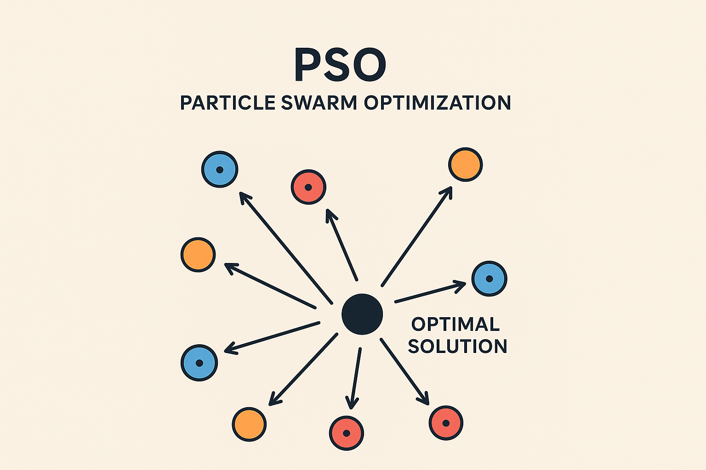
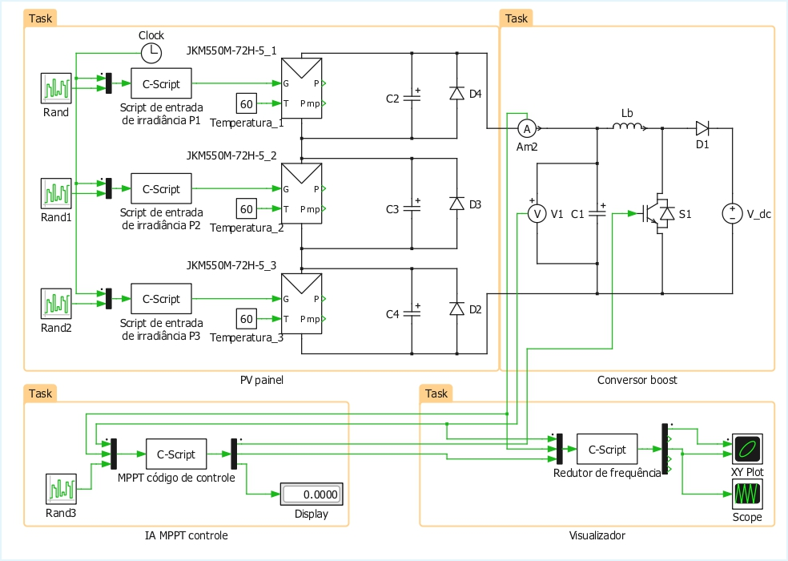

# PSO-MPPT com Reset Dinâmico (DMR)

<p align="center">
  
</p>

Este repositório apresenta a implementação e estudo de uma técnica de **Maximum Power Point Tracking (MPPT)** baseada no **Particle Swarm Optimization (PSO)** com o mecanismo de **Dynamic Monitoring Reset (DMR)**.  
O objetivo é maximizar a eficiência de sistemas fotovoltaicos, especialmente sob **condições de sombreamento parcial**, evitando que o algoritmo fique preso em máximos locais.

O projeto deriva do artigo submetido à **EvoStar 2025**:  
> *A PSO-based MPPT with Dynamic Monitoring Reset for PV Systems*  
> Igor de Matos da Rosa, Alison R. Panisson, Lenon Schmitz (UFSC, 2025)

---

## Conteúdo
- [Estrutura do Repositório](#estrutura-do-repositório)
- [O que é MPPT e PSO?](#o-que-é-mppt-e-pso)
- [Dynamic Monitoring Reset (DMR)](#dynamic-monitoring-reset-dmr)
- [Implementação](#implementação)
- [Pré-Requisitos e Instalações Necessárias](#pré-requisitos-e-instalações-necessárias)
- [Resultados de Simulação](#resultados-de-simulação)
- [Contribuidores](#contribuidores)
- [Licença 📝](#licença-)

---

## O que é MPPT e PSO?

### MPPT – Maximum Power Point Tracking

Sistemas fotovoltaicos precisam operar em seu ponto de máxima potência (**MPP**) para extrair o máximo de energia.
Técnicas clássicas como **Perturba e Observa (P\&O)** e **Condutância Incremental (INC)** funcionam bem em condições uniformes, mas falham em **sombreamento parcial**, pois tendem a se prender em máximos locais (**LMPP**) ao invés do **Global Maximum Power Point (GMPP)**.

### PSO – Particle Swarm Optimization

O **PSO** é um algoritmo de inteligência de enxame inspirado no movimento coletivo de pássaros e cardumes.
Cada partícula representa uma solução (ponto de operação no conversor), movendo-se no espaço de busca em direção ao melhor valor encontrado individualmente (**Pbest**) e globalmente (**Gbest**).
Essa característica o torna robusto para encontrar o GMPP mesmo em cenários com múltiplos picos.

<p align="left">
  
</p>

---

## Dynamic Monitoring Reset (DMR)

O **DMR** foi proposto para resolver o problema de **estagnação** do PSO:

* Quando o algoritmo converge para um ponto que não é mais o ótimo global (devido a mudanças de irradiância ou sombreamento), o DMR detecta essa variação.
* Caso a potência caia fora de uma **zona de tolerância configurável**, o DMR **reseta** a população de partículas e reinicia a busca pelo GMPP.

> \[!TIP]
> O DMR atua **independentemente do PSO**, apenas sinalizando o momento de reinicializar. Isso evita resets desnecessários e mantém o sistema estável.

<p align="left">
  
</p>

---

## Implementação

O sistema foi implementado no **PLECS**, com o controle embarcado em **C Script** no bloco de PWM do conversor Boost.

* **Modelo fotovoltaico:** JKM550M-72H (baseado no modelo de diodo único).
* **Conversor:** Boost DC-DC conectado a um barramento de 400 V.
* **Controle:** algoritmo PSO com parâmetros ajustáveis (`ω = 0.15`, `c1 = 0.6`, `c2 = 0.6`).
* **Reset DMR:** tolerância de 1% sobre a potência do GMPP.

Arquivos principais:

* `Busca_MPPT.c` → código do PSO-MPPT com DMR
* `Busca_MPPT.plecs` → circuito simulado
* `Busca_MPPT.md` → como utilizar o codigo para o PLECS
* `Uso_básico_PLECS.md` → exemplo introdutório
* `Datasheet_JKM550M-72HL4-V.pdf` → especificações do módulo

---

## Pré-Requisitos e Instalações Necessárias

### Pré-requisitos 💻

* **PLECS** (versão >= 4.8 recomendada)

### Instalação 🚀

Windows:
...

Após instalar o compilador, abra o projeto `Busca_MPPT.plecs` no **PLECS** e coloque o código do arquivo `Busca_MPPT.c` ao bloco de controle.
Defina os inputs e outputs corretamente.

#### Como definir os inputs e outputs

---

## Resultados de Simulação
{Colocar os testes}

Comparação entre **PSO-DMR** e métodos clássicos (**P\&O, INC**):

| Método      | Potência Média (W) | Convergência (s) | Desempenho em Sombreamento |
| ----------- | ------------------ | ---------------- | -------------------------- |
| P\&O        | \~498              | 0.011            | Fica preso em LMPP         |
| INC         | \~498              | 0.015            | Fica preso em LMPP         |
| **PSO-DMR** | **633**            | 0.139            | Encontra GMPP com sucesso  |

> \[!IMPORTANT]
> O PSO-DMR apresentou **ganhos acima de 20%** em cenários de sombreamento parcial quando comparado com INC e P\&O.

---

## Contribuidores

| [<br><sub>Igor da Rosa</sub>](https://github.com/Ig0r-Rosa) |
| :---------------------------------------------------------------------------------------------------------------------------: |

---

## Estrutura do Repositório

```text
RepoAI/
└── PSO_MPPT_DMR/
    ├── content/
    │   ├── Datasheet_JKM550M-72HL4-V.pdf
    │   ├── schematic_PLECS.jpg
    │   └── schematic_PLECS.pdf
    ├── code/
    │   ├── Busca_MPPT.md
    │   ├── Busca_MPPT.c
    │   ├── Busca_MPPT.plecs
    │   └── Uso_básico_PLECS.md
    ├── README.md
    └── LICENSE
```

---

## Licença 📝

Este projeto está sob a licença **CC-BY 4.0**.


