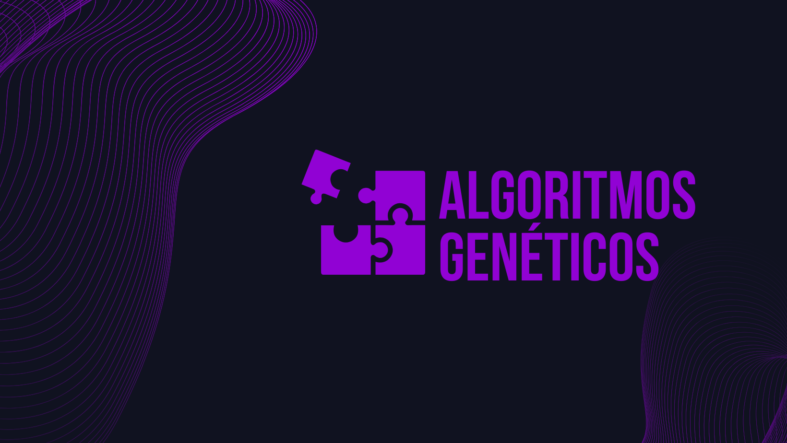

# Guia prático para algoritmos genéticos


Neste tutorial você encontrará o passo-a-passo para a implementação do seu algoritmo genético em Python. Tire um tempo para leitura, ela é importante para assimilar conceitos e você levará eles para o resto da vida. Ao final dessa leitura tenho certeza que você estará mais perto de programar seu próprio algoritmo em qualquer linguagem, saberá identificar quais problemas podem ser resolvidos com esse tipo de abordagem e terá uma base para explorar variações e melhorias, adaptando-os a diferentes contextos.

## Conteúdo
  - [Principais peças do quebra-cabeças](#principais-pe%C3%A7as-do-quebra-cabe%C3%A7as)
## Principais peças do quebra-cabeças
Um algoritmo genético é composto por elementos fundamentais que simulam o processo de evolução natural. Aqui estão os principais:  

- [**Cromossomo**](#o-que-%C3%A9-um-cromossomo): Representam as soluções candidatas de forma codificada (por exemplo, um vetor ou string).  
- [**População**](#popula%C3%A7%C3%A3o): Conjunto de indivíduos que evoluem ao longo das gerações.  
- [**Função de Aptidão**](#fun%C3%A7%C3%A3o-de-aptid%C3%A3o): Mede o desempenho de cada solução, indicando sua qualidade para o problema em questão.
- [**Operadores Genéticos**](#operadores-gen%C3%A9ticos): Os operadores de seleção, cruzamento e mutação são a chave do processo evolutivo.
- [**Critério de Parada**](#crit%C3%A9rios-de-parada): Define quando o algoritmo deve parar, seja por atingir uma solução satisfatória ou um limite de gerações.  

Esses componentes interagem em ciclos, permitindo que a população evolua e encontre soluções otimizadas de forma inspirada na seleção natural.

---

### O que é um cromossomo?

Um **cromossomo** é uma representação codificada de uma solução para o problema que você está tentando resolver. Abaixo, apresento alguns exemplos de diferentes tipos de indivíduos e como eles podem ser usados:

#### Cromossomo Numérico
Um indivíduo numérico é uma sequência de números reais ou inteiros que representam os valores de variáveis de uma solução.

**Exemplo**: Suponha que você tenha uma equação que precisa ser otimizada (maximizada ou minimizada), como uma função matemática com várias variáveis:
```plaintext
f(x1, x2, x3) = x1² + x2³ + x3
```
```plaintext
[1.5, -2.3, 4.0] <- esse indivíduo representa uma possível resposta
```
#### Cromossomo Binário
Indivíduos binários são representações em formato de 0s e 1s, frequentemente usados para problemas de otimização combinatória, como o problema da mochila ou para representar decisões binárias.

**Exemplo**: Vamos considerar um problema em que você tem várias opções de objetos para carregar em uma mochila, e cada objeto pode ser incluído ou não. Suponha que temos 5 objetos e a sequência binária indica se o objeto está ou não na mochila.
```plaintext
[1, 0, 1, 0, 1]
```
#### Cromossomo de String

Em problemas onde a solução é representada por uma sequência de caracteres, como na otimização de strings ou em problemas de reconhecimento de padrões, indivíduos de string são utilizados. Eles representam uma sequência de caracteres que, ao longo das gerações, podem evoluir para uma solução desejada.

**Exemplo**: Suponha que o objetivo seja evoluir uma população de strings até que ela corresponda à frase "Olá, Mundo!". Nesse caso, cada indivíduo seria uma string composta por caracteres, e a função de aptidão avaliaria quão próxima a string gerada está da frase desejada.

```plaintext
Frase desejada: "Olá, Mundo!"
```
---

### População
Para nosso algoritmo genético funcionar precisamos "inicializar uma população". No caso do exemplo de indivíduo de string que falamos anteriormente, uma população pode ser o exemplo abaixo:
1. `"Ola, Mundo!"`  
2. `"Ol@, Munde!"`  
3. `"Olé, Mund0!"`  
4. `"Ola Mundo!"`  
5. `"Xlã, Mwndo!"`

Perceba que a população inicializada tem indivíduos semelhantes (são da mesma espécie). Todos os "genes" desse indivíduo são caracteres alfabéticos e os "indivíduos" possuem a mesma quantidade de genes no cromossomo.
> [!NOTE]
> Em algoritmos genéticos computacionais, não é possível cruzar espécies diferentes. Isso é sempre assim? Pense sobre isso!

---

### Função de Aptidão

A **função de aptidão** avalia a qualidade das soluções geradas pelos indivíduos. Ela atribui um valor numérico que indica o quão próxima a solução está da ideal, guiando o algoritmo na seleção dos melhores indivíduos para a próxima geração.

#### Função de Aptidão para o Problema "Olá, Mundo!"

Suponha que o objetivo seja evoluir uma população de strings até que elas correspondam à frase "Olá, Mundo!". Neste caso, a função de aptidão pode contar o número de caracteres corretos na posição correta, comparando a string do indivíduo com a frase desejada.

**Frase desejada**: `Olá, Mundo!`

- **indivíduo 1**: `Ola, Mundo!`  
  - **Aptidão**: 10/11 (Faltando apenas um caractere, o á em "Olá")
  
- **indivíduo 2**: `Ol@, Munde!`  
  - **Aptidão**: 9/11 (Erro no caractere "@" e no caractere "e" em "Munde")
  
- **indivíduo 3**: `Olé  MundO!`  
  - **Aptidão**: 8/11 (Erro na letra "é", o "O" no lugar do "o" em "Mundo" e existe um espaço no lugar da vírgula)

Neste caso, o indivíduo `Ola, Mundo!` tem a maior aptidão porque está mais próximo da solução desejada.

---

#### Função de Aptidão para o Problema do Caixeiro Viajante (TSP)

Em problemas como o **Problema do Caixeiro Viajante**, Travelling salesman problem (TSP), onde o objetivo é encontrar a rota mais curta para visitar todas as cidades, a função de aptidão pode ser definida com base na **distância total percorrida**. Quanto menor a distância total de uma solução, maior sua aptidão.

**Exemplo de distâncias entre cidades**:

- A cidade A está a 5 km de B, a 10 km de C.
- A cidade B está a 5 km de A, a 8 km de C.
- A cidade C está a 10 km de A, a 8 km de B.

Indivíduos podem representar diferentes **ordens** para visitar todas as cidades. Por exemplo:

- **indivíduo 1**: A → B → C  
  - Distância total: 5 + 8 = 13 km  
  - **Aptidão**: 1 / 13 (quanto menor a distância, maior a aptidão)
  
- **indivíduo 2**: B → A → C  
  - Distância total: 5 + 10 = 15 km  
  - **Aptidão**: 1 / 15

A função de aptidão para o TSP é inversamente proporcional à distância percorrida. Ou seja, quanto menor a distância, maior a aptidão.
> [!NOTE]
> Você já ouviu falar sobre o algoritmo de Dijkstra? Ele e vários outros também podem achar o caminho mais curto entre cidades. Mas se aumentarmos a quantidade de cidades, a quantidade de rotas aumenta exponencialmente (Por quê?). Pense sobre o critério de parada do algoritmo de Dijkstra e na opção de se usar algoritmos genéticos como alternativa.

---

### Operadores genéticos
Em algoritmos genéticos, os operadores de **seleção**, **cruzamento** e **mutação** são a chave do processo de evolução para gerar soluções melhores a cada iteração.

#### Seleção
A seleção escolhe quais indivíduos da população irão se reproduzir, com base em sua aptidão. Técnicas comuns incluem:
- **Seleção por roleta**: A probabilidade de seleção é proporcional à aptidão.
- **Seleção por torneio**: Indivíduos competem entre si para determinar o selecionado.

#### Cruzamento
Após a seleção, os indivíduos selecionados trocam partes de suas informações genéticas para gerar descendentes. O cruzamento combina características dos pais para formar novos indivíduos, com a esperança de que as combinações resultem em soluções melhores.

#### Mutação
Introduz mudanças aleatórias nas soluções geradas pelo cruzamento. A mutação visa explorar novas regiões do espaço de busca, prevenindo a convergência prematura do algoritmo para um ótimo local. Ela altera um ou mais genes de um indivíduo de forma aleatória.

---
### Critérios de parada
Os critérios de parada determinam quando o algoritmo genético deve ser interrompido. Eles são essenciais para evitar que o algoritmo continue executando sem a necessidade, economizando tempo de computação e recursos. Alguns dos critérios de parada mais comuns incluem:

#### Número Máximo de Gerações
O algoritmo é interrompido após um número pré-determinado de gerações (iterações). Este critério é simples de implementar e garante que o algoritmo não continue indefinidamente.

#### Condição de Convergência
O algoritmo para quando a população atinge um nível de convergência, ou seja, quando as soluções não apresentam melhorias significativas em várias gerações consecutivas. Isso pode ser medido pela variação na média ou na melhor aptidão da população.

#### Solução Ótima Encontrada
Se uma solução ótima ou satisfatória for encontrada (isto é, uma solução que atenda aos critérios de qualidade ou um valor de aptidão que ultrapasse um limiar pré-estabelecido), o algoritmo é interrompido. Esse critério busca garantir que o algoritmo não execute mais do que o necessário quando uma boa solução já foi alcançada.

---
