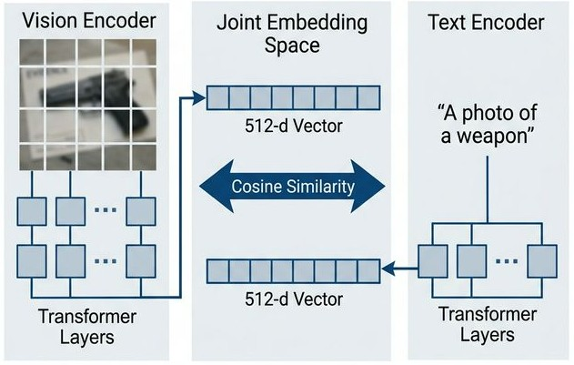
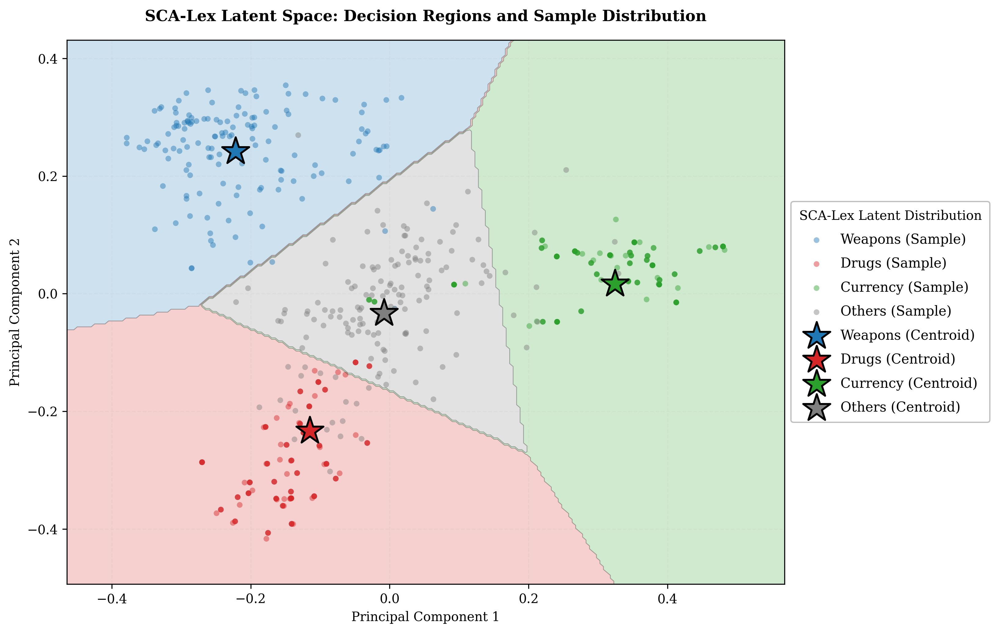

<div align="center">

# SCA-Lex: Semantic Centroid Alignment Lexicon 🔍

**Zero-Shot Multimodal Forensic Triage using CLIP Foundation Models and Hybrid Fusion**

*Presented at [BRACIS 2026](https://bracis2026.org/) · Brazil*

[](https://python.org)
[](https://github.com/openai/CLIP)
[](LICENSE)
[](https://bracis2026.org/)

</div>

---

## Overview

During criminal investigations, law enforcement agencies face a "Forensic Tsunami"—the extraction of millions of chaotic, unclassified multimedia files from seized smartphones. The SCA-Lex framework presents an offline, highly scalable solution for initial forensic triage.

This repository implements a **Hybrid Fusion Framework** that jointly leverages:

| Component | Description |
|---|---|
| **Zero-Shot Vision** | Uses OpenAI's CLIP (ViT-B/32) without requiring any task-specific fine-tuning. |
| **Forensic Semantic Lexicon** | Employs multi-prompt textual anchors to generate highly contextualized semantic centroids. |
| **Hybrid Alignment** | Computes cosine similarity in the hyperspace, effectively bypassing traditional visual "distractors". |

The key contributions are:

- **No-Cloud Data Sovereignty** — The entire pipeline runs completely offline on standard forensic workstations, ensuring strict compliance with judicial chain-of-custody protocols.
- **Resilience to Distractors** — Successfully differentiates between illicit visual evidence and chaotic internet clutter (e.g., memes, aggressive advertising, and toy replicas).
- **Ablation Validated** — Demonstrates empirical superiority through rigorous ablation testing against isolated vision and text modalities.

---

## The "Forensic Tsunami" & Visual Distractors

When extracting data from a seized smartphone, investigators deal with massive visual "noise". SCA-Lex effectively ignores typical false positives that confound traditional CNN models. For example:

<div align="center">

| Airsoft Toy Gun | Aggressive Gambling Ad |
| :---: | :---: |
|  |  |
| *Accurately filtered out as simulated context* | *Successfully ignored despite high saturation* |

</div>

---

## Framework Architecture & Latent Space

Below is the processing pipeline and the resulting data projection in the scientific latent space, explicitly demonstrating the topological separation of illicit evidence from legal distractors:

<div align="center">



<br/>



</div>

---

## Repository Structure

```text
cv_SCAlex/
│
├── data_samples/           # Raw forensic distractor samples
│   └── README.md           # Instructions on dataset ingestion
│
├── evaluation/             # Evaluation metrics and ablation studies
│   └── README.md           # Methodology for performance validation
│
├── img/                    # Architecture diagrams and scientific plots
│   └── README.md           # Image rendering specifications
│
├── lexicon/                # Multi-prompt textual anchor datasets
│   └── README.md           # Lexicon engineering rationale
│
├── src/                    # Core PCA projection and similarity engine
│   ├── visualize_scientific_split.py # Main visualization script
│   └── README.md           # Instructions on running the engine
│
├── requirements.txt        # Frozen Python dependencies
└── README.md               # Main project documentation
```

---

## Quick Start

### 1. Clone & Install Environment

```bash
# Initialize sparse-checkout to download ONLY the cv_SCAlex folder
git clone --filter=blob:none --sparse https://github.com/Liga-IA/RepoAI.git
cd RepoAI
git sparse-checkout set cv_SCAlex
cd cv_SCAlex

# Install environment
python3 -m venv .venv
source .venv/bin/activate
pip install -r requirements.txt
```

### 2. Run the Latent Space Visualization

```bash
python src/visualize_scientific_split.py
```
This script computes the PCA matrices and renders the 2D/3D scatter plots of the local model's topology.

---

## Citing This Work

If you use this code or framework in your research, please cite:

```bibtex
@inproceedings{Silva2026SCALex,
  author    = {Italo Firmino da Silva and Co-authors},
  title     = {SCA-Lex: Semantic Centroid Alignment Lexicon for Zero-Shot Forensic Triage},
  booktitle = {Proceedings of the Brazilian Conference on Intelligent Systems (BRACIS 2026)},
  year      = {2026},
}
```

---

## Acknowledgements

In compliance with academic transparency policies, the authors acknowledge the use of Large Language Models solely for proofreading and linguistic refinement of the manuscript.

<div align="center">
<sub>BRACIS 2026 · Brazilian Conference on Intelligent Systems</sub>
</div>
