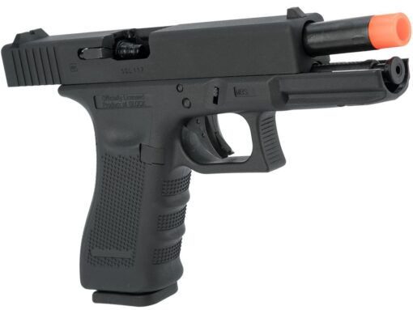
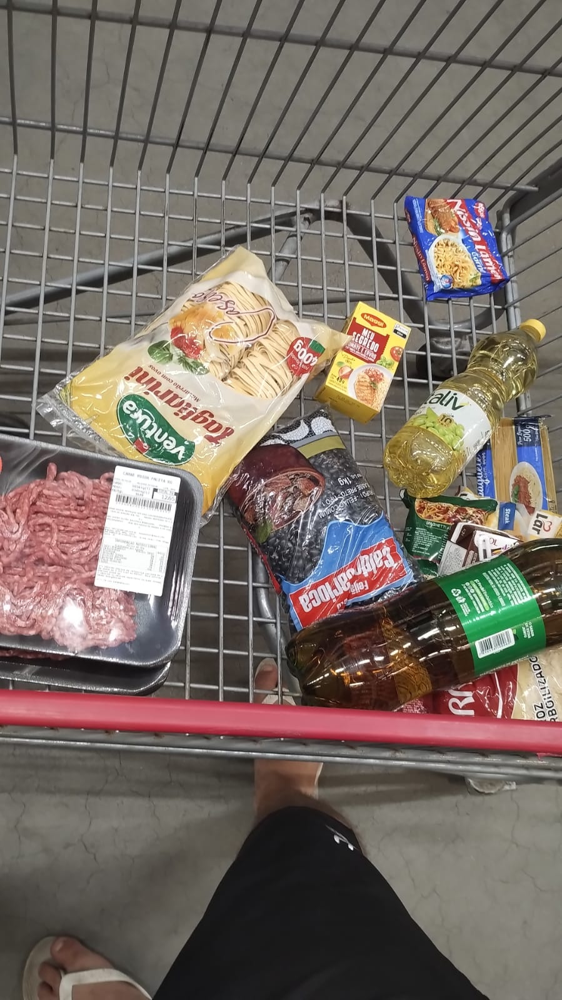

# Forensic Data Samples (Distractors)

This directory serves as a sample repository demonstrating the chaos of digital evidence extraction.

### Context
When parsing a suspect's phone, 99% of images are irrelevant (memes, ads, screenshots). These are called "distractors". Below is a sample gallery to demonstrate the real-world chaos investigators deal with on a daily basis.

Our framework, **SCA-Lex**, is specifically designed to handle highly saturated, ambiguous, and noisy imagery without being confused into mislabeling them as illicit evidence.

### The "Forensic Tsunami" Gallery

| Distractor Type 1 | Distractor Type 2 | Distractor Type 3 |
| :---: | :---: | :---: |
|  |  |  |
| *Airsoft Toy Gun* | *Gambling Advertisement* | *Internet Clutter* |

| Distractor Type 4 | Distractor Type 5 | Distractor Type 6 |
| :---: | :---: | :---: |
|  |  |  |
| *Social Media / Selfie* | *Irrelevant Screenshot* | *Random Photo* |

> **Note**: Notice how these distractors vary vastly in visual style, text density, and color palette. This demonstrates the challenge of "Zero-Shot" triage and why text-alignment is superior to pure visual classification for avoiding false positives.
