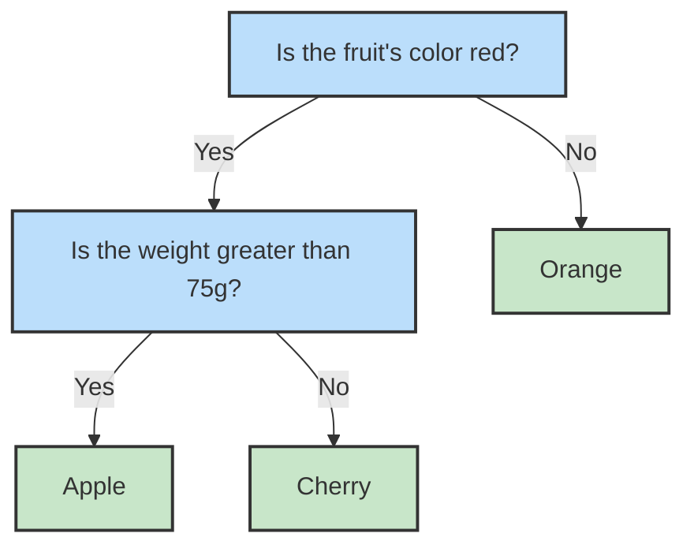

# English Version

## Introductory Ideas

A decision tree is a model that can be used for both classification and regression.[1]  

> [!NOTE]  
> Remember that regression problems predict numbers, such as the price of a house. Classification problems, on the other hand, predict “labels” or “categories,” such as whether an email belongs to the “spam” or “not spam” category.  

Just like in a tree, we have roots and leaves. In the model, the root is the top node and contains the entire dataset. The leaves are the final nodes and represent the predictions made by the model.[1]  

### But how do we go from the root (dataset) to the leaves (final answers)?

Basically, we submit the data to questions, which we call “tests.” Already at the root, we can see the first test. If the answer is true, we move to the left node; if it’s false, we move to the right node.[1]  

We repeat this process until we reach a leaf!  

#### For example:

Let’s say we have three different fruits: **apple**, **orange**, and **cherry**. Based on characteristics like color and weight, we can build a tree to classify them.

In the example above, the tests are in blue, and the answers (leaves) are in green!

> [!IMPORTANT]
> The choice of tests we make changes the structure of the tree and directly affects the algorithm’s efficiency! We will discuss this further in [3.splitting_criteria.md](./3.splitting_criteria.md)

## References:

[1] Müller, A. C., & Guido, S. (2016). Introduction to machine learning with Python: A guide for data scientists. O'Reilly Media.

[2] Bishop, C. M. (2006). Pattern recognition and machine learning. Springer.

## 👾 **Contributors**  
| [ Maria Eduarda Vianna](https://github.com/mevianna) | 
| :---: |
