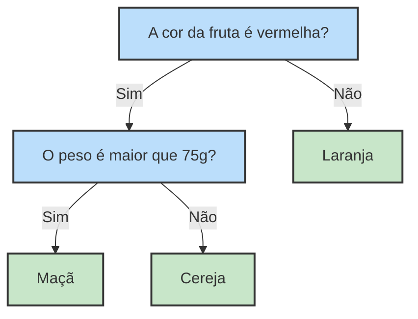

# Portuguese Version

## Ideias introdutórias

A árvore de decisão é um modelo que serve tanto para classificação e regressão. [1] 

> [!NOTE]
> Lembrando que os problemas de regressão preveem números, como o preço de uma casa. Os de classificação são aqueles que preveem “rótulos” ou “categorias”, como se um email se encaixa na categoria “spam” ou “não spam”.
 
Como em uma árvore, temos raízes e folhas. No caso do modelo, a raíz é o nó superior e contém todo o conjunto de dados. As folhas são os nós finais e representam as respostas previstas pelo modelo.[1]

### Mas como saímos da raíz (conjunto de dados) e chegamos nas folhas (respostas finais)?

Basicamente, submetemos os dados à perguntas, as quais chamamos de “testes”. Já na raíz podemos ver o primeiro teste. Se a resposta for verdadeira, vamos ao nó da esquerda, se for falsa, vamos ao nó da direita.[1]

Repetiremos esse processo até chegarmos na folha!

#### Por exemplo:

Digamos que temos três frutas diferentes: **maçã**, **laranja** e **cereja**. A partir de características como cor e peso, podemos construir uma árvore para classificá-las.

No caso acima, temos os testes em azul e as respostas (folhas) em verde!

> [!IMPORTANT]
> As escolhas de testes que fazemos mudam a estrutura da árvore e interferem diretamente na eficiência do algoritmo! Sobre isso, veremos em [3.criterio_separacao.md](./3.criterio_separacao.md)

## Referências:

[1] Müller, A. C., & Guido, S. (2016). Introduction to machine learning with Python: A guide for data scientists. O'Reilly Media.

[2] Bishop, C. M. (2006). Pattern recognition and machine learning. Springer.

## 👾 **Contribuidores**  
| [ Maria Eduarda Vianna](https://github.com/mevianna) | 
| :---: |
