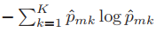
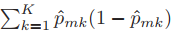

# Portuguese Version

## Qual o melhor teste?

Devemos ter o teste que:
- Para regressão, faz ter menor variabilidade entre os valores dos dados separados.
  
- Para classificação, mais separa as classes, fazendo os nós serem mais "puros".

De forma mais objetiva, temos a minimizacão de algumas funcoes específicas relacionadas ao erro (para regressão) ou a impurezas (para classificação). Vamos considerá-las a partir de agora:

### Classificacao
Temos **duas formas** de avaliar se a divisão está promovendo um bom desempenho: **entropia (cross-entropy) e o índice de Gini**. 

#### Entropia

A Entropia tem a seguinte fórmula, retirada de [2]:

Em que:

- $\hat{p}_{mk}$ : É a proporção de amostras pertencentes à classe k que estão no nó m.
- $K$: É o número total de classes distintas no problema.

#### Índice de Gini

O Índice de Gini tem a seguinte fórmula, retirada de [2]:

Em que:
- $\hat{p}_{mk}$ : É a proporção de amostras pertencentes à classe k que estão no nó m.
- $(1 - \hat{p}_{mk})$: Representa a probabilidade de um item não pertencer à classe k.
- $K$: É o número total de classes distintas no problema.

### Regressão

Devemos ter o **menor RSS (Soma dos Quadrados dos Resíduos)** possível.[1] 

Sua fórmula, adaptada de [3], é:

$$
RSS = \sum_{i=1}^{n} (y_i - \hat{y}_i)^2
$$

Em que:  
- $y_i$ é o valor real da i-ésima observação,  
- $\hat{y}_i$ é o valor previsto pelo modelo para a i-ésima observação.

> [!NOTE]
> A soma dos quadrados dos resíduos mede a variabilidade que permanece não explicada pelo modelo após a regressão ter sido efetuada. [3]

#### Exemplo

Árvore de regressão que prevê a nota de um estudante em uma prova com base em horas estudadas. A árvore tentará dividir os dados em dois grupos, objetivando o menor RSS!

| x = Horas estudadas | y = Nota na prova |
|---------------------|-------------------|
| 1                   | 2                 |
| 2                   | 3                 |
| 3                   | 2                 |
| 4                   | 8                 |

**1) Tentando uma divisão: `x ≤ 2.5` e `x > 2.5`**

Grupo 1 (x ≤ 2.5): A, B  
- Notas: 2, 3  
- Média: 
  $$\hat{y}_1 = \frac{2 + 3}{2} = 2.5$$
- RSS: 
  $$(2 - 2.5)^2 + (3 - 2.5)^2 = 0.25 + 0.25 = 0.5$$

Grupo 2 (x > 2.5): C, D 
- Notas: 2, 8  
- Média: 
  $$\hat{y}_2 = \frac{2 + 8}{2} = 5$$
- RSS:
  $$(2 - 5)^2 + (8 - 5)^2 = 9 + 9 = 18$$

#### RSS total da divisão:
$$RSS_{total} = 0.5 + 18 = 18.5$$

**2) Tentando outra divisão: `x ≤ 3.5` e `x > 3.5`**

Grupo 1: A, B, C  
- Notas: 2, 3, 2  
- Média: 
  $$\hat{y}_1 = \frac{2 + 3 + 2}{3} = 2.33$$
- RSS:
  $$(2 - 2.33)^2 + (3 - 2.33)^2 + (2 - 2.33)^2 \approx 0.11 + 0.44 + 0.11 = 0.66$$

Grupo 2: D  
- Notas: 8  
- Média: 8  
- RSS: 0 (sem erro, pois há só um dado)

#### RSS total:
$$RSS_{total} \approx 0.66 + 0 = 0.66$$

#### Conclusão

- A melhor divisão foi em `x ≤ 3.5`, pois teve **RSS total menor** (≈ 0.66).
- A árvore de decisão **escolheria essa divisão** no primeiro nó.

## Referências
[1] Bishop, C. M. (2006). Pattern recognition and machine learning. Springer.

[2] Hastie, T., Tibshirani, R., & Friedman, J. (2009). The elements of statistical learning: Data mining, inference, and prediction (2nd ed.). Springer.

[3] James, G., Witten, D., Hastie, T., Tibshirani, R., & Taylor, A. (2023). An Introduction to Statistical Learning with Applications in Python. Springer.

## 👾 **Contribuidores**  
| [ Maria Eduarda Vianna](https://github.com/mevianna) | 
| :---: |
