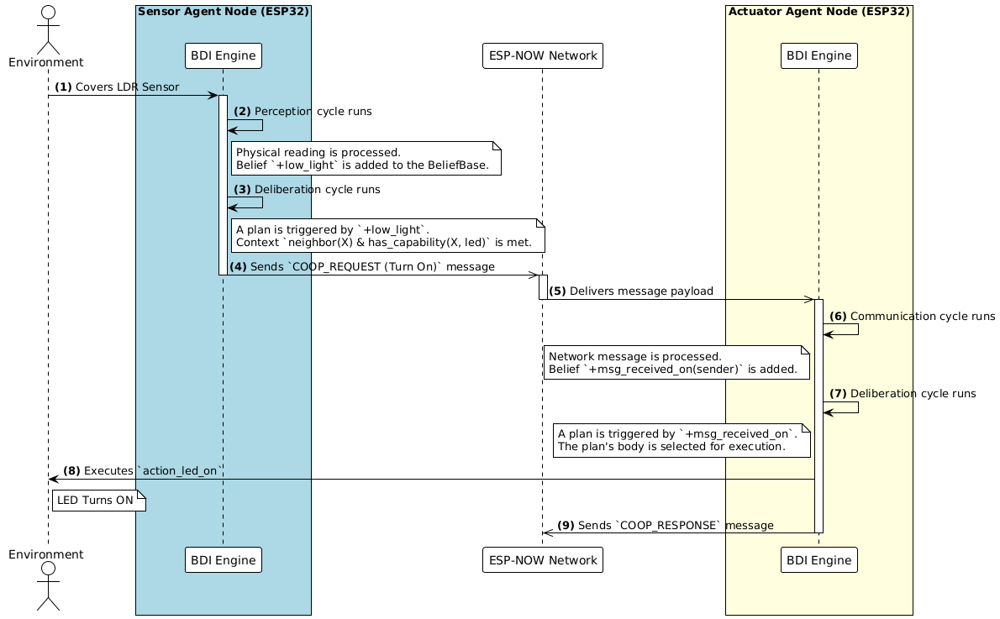
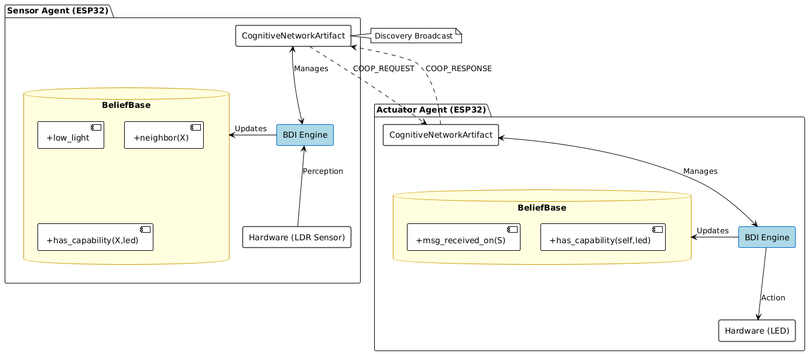

# Cooperative Multi-Agent System with BDI for ESP32

This repository contains the implementation of a **Cooperative Multi-Agent System** using the **BDI (Beliefs, Desires, Intentions)** reasoning architecture. The agents, running on microcontrollers of the family **ESP32**, form a distributed intelligence network capable of perceiving their environment and collaborating to achieve goals.

## Key Features

-   **Autonomous Reasoning (BDI)**: Each agent uses the BDI cycle to deliberate on its beliefs (what it knows about the world) and execute plans to achieve its goals.
-   **ESP-NOW Mesh Network**: Agents discover and communicate with each other efficiently and with low latency, without the need for a central router.
-   **Intelligent Cooperation**: Agents can request help and delegate tasks to others that possess the necessary capabilities (e.g., "turn on your LED," "sound your alarm").
-   **Persistent Goal-Oriented Behavior**: Implementation of goal-driven logic that allows agents to maintain continuous behaviors until a specific condition is met.

## System Architecture

The system is composed of a network of independent agents. Communication is the backbone of the architecture, allowing the perceptions of one agent to trigger actions in another.

## The Agents

The network currently consists of:

1.  **Sensor Agent (ESP32)**: Equipped with multiple sensors (LDR, Potentiometer, LM35...) and actuators (Buzzer). It can coordinate actions and respond to requests.
2.  **Actuator Agent (ESP32-S3)**: Act in coordination with Sensor Agent turning on a LED when LDR sensor detects low light.
3.  **Sonic Sensor Agent (ESP32)**: Act in coordination with Sensor Agent send a cooperation request when proximity is detected.

## Development Journey & Roadmap

This section details the project's evolution and future objectives.

### ✅ Milestones

-   [x] **BDI Foundation**: Implemented the core reasoning cycle and basic plans.
-   [x] **ESP-NOW Communication**: Created a robust module for neighbor discovery and management.
-   [x] **Goal-Oriented Reasoning**: Implemented "recursive" plans that enable persistent behaviors, such as an alarm that sounds intermittently until deactivated.
-   [ ] **Multi-Hop Routing**: Allow agents to forward messages, creating a true mesh network where cooperation can occur even between agents that are not in direct range.
-   [x] **Capability Expansion**: Integrate sensors (DHT11, LM35, LDR...) and develop more complex use-case scenarios.
-   [x] **Network Resilience Testing**: Validate the system's ability to self-heal when agents leave and rejoin the network.
-   [x] **Context-Based Plan Selection**: Implement multiple plans for the same trigger, allowing an agent to choose the best strategy based on a broader context (e.g., a power-saving mode, presence or absence of an agent with certain capabilities).

## Design Patterns and Technical Solutions

In addition to classic patterns (Producer-Consumer, Observer, Command), this project employs two specific solutions to address the challenges of embedded and networked systems:

### 🎭 Bitmasking for Capability Broadcasting

To efficiently communicate what each agent can do, we use a **bitmask**. Instead of sending strings, a single byte can represent up to 8 distinct capabilities (e.g., `CAP_SENSOR_LIGHT`, `CAP_ACTUATOR_BUZZER`). The `|` (bitwise OR) operator is used to combine capabilities for sending, and the `&` (bitwise AND) operator is used to check for them, resulting in extremely lightweight network communication.

### 🎯 Goal-Oriented Recursive Plans

To create persistent behaviors (like an alarm that sounds until turned off), we use an advanced BDI pattern. An initial event (e.g., `+is_hot`) doesn't trigger an action directly, but rather a **goal** (e.g., `+!cool_down_room`). Multiple plans react to this goal:

1.  **The Looping Plan**: Executes the action (e.g., sounds the alarm) and, in its body, **re-posts its own goal**. This forces the agent to re-evaluate the intention in the next cycle, creating a loop.
2.  **The Exit Plan**: Has a context that represents the "success condition" (e.g., user intervention). When this plan is executed, the goal is achieved, and the loop is broken.

This enables the creation of complex, self-sustaining behaviors by leveraging the agent's continuous reasoning cycle.

## Hardware and Pinout

| Hardware | Platform |
| :--- | :--- |
| **Central Agent** | ESP32-S3 Board |
| **LED Agent** | ESP32 Board |
| **Sonic Agent**| ESP32 Board |

## How to Get Started

This project is developed using **PlatformIO** with the Arduino framework.

1.  Clone this repository.
2.  Open the desired agent's folder (e.g., `central_agent/`) in VS Code with the PlatformIO extension.
3.  Connect your hardware and use the PlatformIO functions to **Build** and **Upload**.
4.  To monitor the output, use the **Serial Monitor** at a baud rate of **115200**.

---
Authors

[ Ítalo Silva](https://github.com/ITA-LOW)
| :---: |

## References
If you use this work, please refers the authors

    @inproceedings{ronzani2026bdi,
      author = {Ronzani, M. D. and Firmino da Silva, I. and Lau, J. and Rodrigues-Filho, R. and Ourique, F. and Panisson, A. R.},
      title = {Towards a BDI Architecture for Cooperative Agents on Resource-Constrained Microcontrollers},
      booktitle = {Proceedings of the 18th International Conference on Agents and Artificial Intelligence - Volume 1},
      year = {2026},
      pages = {294--301},
      isbn = {978-989-758-796-2},
      issn = {2184-433X}
    }
