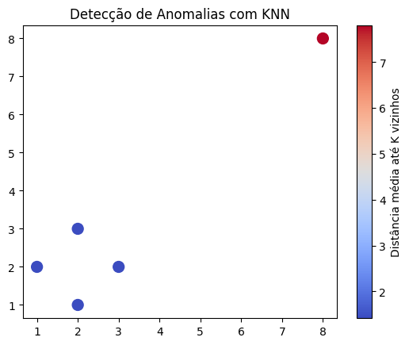

## KNN Examples with Graphs

[Link to Colab Notebook](https://colab.research.google.com/drive/1weSNTv3ZqPqpdrtPQrczzHxfoQMkhLQu#scrollTo=vZfd4X1kdFVe)

### 1) Iris Dataset

The code presents an implementation of the K-Nearest Neighbors (KNN) algorithm applied to the famous Iris dataset.  
This dataset contains measurements of three species of iris flowers (setosa, versicolor, and virginica) based on four features: sepal length, sepal width, petal length, and petal width.

Main elements of the implementation:
- Loading the Iris dataset and splitting into training (70%) and testing (30%) sets.
- Initial application of KNN with k=10 neighbors.
- 3D visualization of the separation between species using Plotly.
- Creation of a confusion matrix to evaluate the classifier's performance.
- Use of a pipeline with data standardization (`StandardScaler`).
- Search for the optimal value of k via `GridSearchCV` (testing values from 1 to 15).
- Model evaluation with classification metrics.

### 2) Simple Recommendation with User-Based Collaborative Filtering

In this example, KNN is used to predict the rating that a given user would give to a movie (or any other product) based on the preferences of nearby users, such as a group of friends or people located in a certain region.

In the code, we can simulate users as follows:

```python
ratings = np.array([
    [5, 3, 0],  # User 1
    [4, 0, 4],  # User 2
    [1, 1, 5]   # User 3
])

In this matrix, each row represents a user and each column represents a movie rating.

Now, we need to create a function to predict the rating using KNN:

```python
def predict_rating(user_index, item_index, k=2):
    # Gets the rating vectors of all users except the current one
    user_ratings = ratings[:, item_index]
    similarities = []

    for other_user in range(ratings.shape[0]):
        if other_user != user_index and ratings[other_user, item_index] != 0:
            # Calculates cosine similarity between users
            sim = cosine_similarity(
                [ratings[user_index]], 
                [ratings[other_user]]
            )[0][0]
            similarities.append((sim, ratings[other_user, item_index]))

    # Sorts by most similar
    similarities.sort(reverse=True)
    top_k = similarities[:k]

    if not top_k:
        return 0  # No information to predict

    # Weighted average by similarities
    num = sum(sim * rating for sim, rating in top_k)
    den = sum(abs(sim) for sim, _ in top_k)
    return num / den if den != 0 else 0
```

In the function, we receive the user ID (row position) for which we want to predict the rating, the chosen movie (column position), and the value of K, which dictates how many neighbors we will look for.

Inside the function, we exclude the user ID we are predicting for and loop through all ratings, comparing them using cosine similarity between the target user and each other user.

We then sort the most similar users by the chosen K and compute the weighted average to get the predicted rating for the movie.

```python
Predicted rating of User 1 for Movie 3: 4.17
```

### 3) Anomaly Detection with KNN

KNN can be used to identify points that are very far from their nearest neighbors, which is a strong indication of anomalous behavior.

This technique can be efficient for:

- Fraud detection in financial transactions.
- Industrial sensor monitoring.
- Failure analysis in distributed systems.
- Identification of malicious behavior in networks.

We start the example with a matrix simulating nearby points:

```python
X = np.array([
    [1, 2], [2, 3], [3, 2], [2, 1],
    [8, 8],  # <- possibly anomaly
])
```

Using the built-in NearestNeighbors function from scikit-learn, we define the value of K and the neighbors, obtaining the average distance of each point:

```python
k = 2
nbrs = NearestNeighbors(n_neighbors=k+1)  # +1 because the closest point to itself is the point itself
nbrs.fit(X)
distances, _ = nbrs.kneighbors(X)
mean_distances = distances[:, 1:].mean(axis=1)
```
As a result, we can, for example, create an image illustrating the discrepancy of points, the farther away a point is, the more likely it is to be considered an anomaly:
