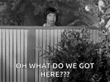

## Introduction ##
  K-Nearest Neighbor is a supervised machine learning model, meaning it learns from labeled data consisting of inputs (x) and their corresponding desired outputs (y). This model is employed for predicting both categorical and numerical data, utilizing an instance-based learning approach. This approach involves storing the training data, subsequently, when a new instance is presented, a set of related, similar instances is retrieved from memory and used to classify the novel query instance.

  In the k-Nearest Neighbor (KNN) model, each data instance is represented as a point in a feature space. New instances are classified based on their proximity to instances in the training set, using a similarity measure. In this way, the prediction is made by considering the k nearest neighbors.

## History ##
  The k-Nearest Neighbor (KNN) algorithm originated in the 1950s, initially proposed by Evelyn Fix and Joseph Hodges in a theoretical work presented as *Technical Report No. 21* at the University of California, Berkeley, in 1951. Years later, during the 1960s, the algorithm was refined and formally developed by Thomas M. Cover and Peter E. Hart in their 1967 paper *"Nearest Neighbor Pattern Classification."*.

## References
FIX, Evelyn; HODGES Jr., Joseph L. Discriminatory Analysis. Nonparametric Discrimination: Consistency Properties. Berkeley: University of California, 1951. (Technical Report nº 21).

COVER, Thomas M.; HART, Peter E. Nearest Neighbor Pattern Classification. IEEE Transactions on Information Theory, 1967. 

Halder, R.K., Uddin, M.N., Uddin, M.A. et al. Enhancing K-nearest neighbor algorithm: a comprehensive review and performance analysis of modifications. J Big Data 11, 113 (2024). 

## **Contributors**  
| [ Beatriz Schuelter Tartare](https://github.com/beastartare) |
| :---: |