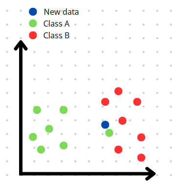

## How to define the value of k?
The choice of k directly impacts the accuracy of the KNN algorithm, but this decision is not straightforward. Selecting the right value of k requires balance: very low values only consider extremely close neighbors, resulting in poor generalization, while very high values can oversimplify the model, ignoring important patterns in the data. Therefore, it is essential to consider common errors associated with different k values, as discussed below.

### Overfitting and low values of k
**Overfitting** occurs when a model fits the training data too closely, capturing even noise and specific variations that do not generalize well. This leads to inaccurate predictions on new data, as the model becomes overly sensitive to atypical points, known as outliers.

In the KNN algorithm, choosing a very low value for k can lead to overfitting, since the model will only consider the nearest neighbors, which may include outliers. As a result, the algorithm's accuracy may be negatively affected.

> [!NOTE] 
> For example, imagine a dataset with two separated classes, A and B, but with a point from class A inserted into class B — in other words, an outlier. If a new point is added to class B, but extremely close to the outlier, then with k=1, it will be incorrectly classified as belonging to class A due to the sensitivity to the nearest neighbor. This example is illustrated in the figures below: the first shows the location of the new data point (in blue), and the second shows its incorrect classification when using k=1.

**Figure 1: Insertion of a new data point**

**Figure 2: Classification of the new data point**

### Underfitting and high values of k
**Underfitting** occurs when a model is too simple and becomes overly generalized, losing the ability to identify specific and relevant features of the data. As a result, its predictions are also inaccurate.

In this way, in the KNN algorithm, a very high number for k can lead to underfitting, because too many neighbors are considered, losing the specifics of the new data.

> [!NOTE]
> As another example, consider again two well-defined classes, A and B, with a total of 20 training data points, where class B contains 14 points. If a new point is inserted in the center of class A’s region and `k=20`, the model will consider many neighbors, most of which will likely belong to class B, since it represents the majority of the dataset. This results in the incorrect classification of the new point as a member of class B, illustrating the model's excessive triviality. This example is shown in a simplified form in the figures below.

**Figure 3: Insertion of a new data point**  

**Figure 4: Classification of the new data point**  

### Even Values of k
Consider a dataset with two distinct classes, A and B. Also, assume that the value of k is practically ideal, meaning it is balanced enough to avoid both overfitting and underfitting. However, suppose that k is an even number. In the case of a tie when analyzing the majority of neighbors near a new data point, the model is forced to arbitrarily choose a class for the point. This makes the result inaccurate, even if tie-breaking criteria are implemented, because the choice will not always truly reflect the reality of the data. Therefore, it is recommended to set an odd value for k to avoid this situation.

> [!NOTE]
> Imagine that in this dataset, `k=4` and the tie-breaking criterion is to classify the new data point based on the class of its nearest neighbor. If a new point is added such that half of its closest neighbors belong to class A and the other half to class B, a tie will occur. In that case, the class of the new point will be determined by its nearest neighbor. However, if that neighbor is an outlier from class A located within class B's region, the point will be incorrectly classified as a member of class A, even though it is closer to class B’s region. This can be seen in the figures below.

**Figure 5: Insertion of a new data point**  

**Figure 6: Classification of the new data point**  

### The best value of k
Given the potential issues arising from the choice of k, it is essential to define a value that is not so sensitive to its neighbors that it fails to generalize, but also not so broad that it ignores relevant patterns. Additionally, choosing an odd value for k is equally essential to avoid possible ties when analyzing the majority of the nearest neighbors.

A common strategy for selecting k is to use the square root of the total number of data points in the dataset, as this value will not be too small to cause overfitting, nor too large to cause underfitting. If the resulting value is even, it is recommended to adjust it to the nearest odd number in order to avoid ties. Furthermore, the use of cross-validation is recommended to help in selecting the ideal value for k, as it allows for a preemptive evaluation of the worst k values, thus preventing both overfitting and underfitting.

  
<strong>What are cross-validation techniques?</strong>

  Cross-validation techniques involve dividing the data into N smaller parts, with a specific value of k. The model is trained on N-1 parts and tested on the remaining part, repeating this process N times, using each part as the test set once. The model's efficiency is then calculated based on the average performance across all runs. The same procedure is repeated for different values of k. The value of k that shows the best average performance is chosen

## References
**IBM.** _K-nearest neighbors (KNN)_. Disponível em: https://www.ibm.com/think/topics/KNN. Acesso em: 21 de abril de 2025.
**FERREIRA, E.** _Cross-Validation_. Universidade Federal do Paraná. Disponível em: http://www.leg.ufpr.br/~eferreira/CE064/ency-cross-validation.pdf. Acesso em: 27 de abril de 2025.
**MARIZ, Filipe Mendes.** _Avaliação e comparação de versões modificadas do algoritmo KNN_. 2017. [s.l.], Universidade Federal de Pernambuco, Centro de Informática, 2017. Disponível em: https://www.cin.ufpe.br/~tg/2017-2/fmm4-tg.pdf. Acesso em: 23 de abril de 2025.
**SINGH, Manjeet; SINGH, Gurpreet.** _A Survey of KNN Algorithm_. 2018. Disponível em: https://www.researchgate.net/publication/348305327_A_Survey_of_KNN_Algorithm. Acesso em: 23 de abril de 2025.

## 👾 **Contributors**  
| [ Rafaela Savaris](https://github.com/rafasavaris) |
| :---: |
