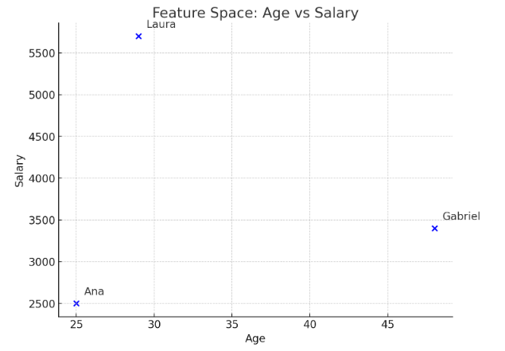

## General Ideas About KNN
KNN is a **supervised** machine learning model, used for both **regression** and **classification**.

> [!NOTE]
> Supervised learning learns from data that already include the correct answers (also called labeled examples). From these, it makes predictions on new data.

> [!IMPORTANT]
> Regression problems predict numerical values, such as the price of a house. Classification problems predict labels or categories, such as whether an email is classified as “spam” or “not spam.”

In the KNN model, similar data points tend to be close to each other in what we call the “feature space.” To understand this concept, we can imagine a table whose columns are the features of a data point, as shown below:

|  Name   | Age | Salary |
|:-------|-------:|:---------:|
| Ana   | 25    | 2500|
| Gabriel  | 48    | 3400    |
| Laura  | 29    | 5700 |

**Think about the following before continuing with the reading:**
How could we represent this feature space graphically?

> [!TIP]
> The number of features is equal to the number of dimensions in the space.

We can represent it as shown below:

Therefore, since we have two features (age and salary), the feature space is represented in two dimensions.

## References
Müller, A. C., & Guido, S. (2016). Introduction to Machine Learning with Python: A guide for data scientists. O’Reilly Media.

MIT OpenCourseWare. (2010). 6.034 Artificial Intelligence – Fall 2010: Tutorial 3: K-nearest neighbors, decision trees, neural nets [PDF]. Retrieved April 25, 2025, from https://ocw.mit.edu/courses/6-034-artificial-intelligence-fall-2010/4efa5e563ccb9d54fdd72068a8dda879_MIT6_034F10_tutor03.pdf

## Colaborators
| [ Maria Eduarda Vianna](https://github.com/mevianna) | 
| :---: | 

