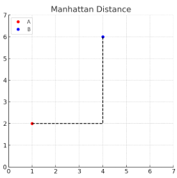
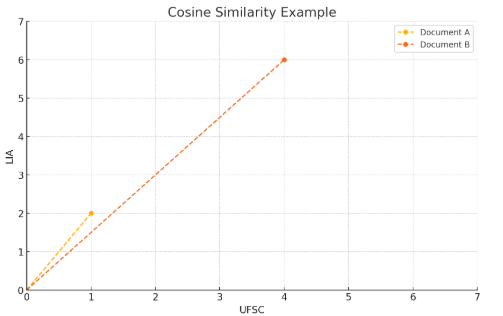

## Distances

As explained in the [General Ideas Section](./1.general_ideas.md), we will make predictions based on the proximity of data in the feature space. Therefore, we need to calculate distances.

The most common way to do this is by using the concept of Euclidean distance.

### Euclidean Distance

Euclidean distance calculates a straight line between two points $P (p_1, p_2, \dots, p_n)$ and $Q (q_1, q_2, \dots, q_n)$.
It can be represented as follows:

$$
d = \sqrt{\sum_{i=1}^{n} (p_i - q_i)^2}
$$

In the particular case of two dimensions, this can be expressed as:

$$
d = \sqrt{(q_1 - p_1)^2 + (q_2 - p_2)^2}
$$

#### Example:

For A = (1, 2) and B = (4, 6):

$$
d_{\text{euclid}} = \sqrt{(4 - 1)^2 + (6 - 2)^2} \\
= \sqrt{3^2 + 4^2} \\
= \sqrt{9 + 16} \\
= \sqrt{25} \\
= 5
$$

Graphically, we are calculating the dashed line.

### Manhattan Distance

It considers the sum of the absolute differences between the coordinates of the points.

The Manhattan Distance between two points $P (p_1, p_2, \dots, p_n)$ and $Q (q_1, q_2, \dots, q_n)$ is:

$$
d = \sum_{i=1}^{n} |p_i - q_i|
$$

#### Example:

For A = (1, 2) and B = (4, 6) (which are the same values from the previous example):

$$
d_{\text{manhattan}} = |4 - 1| + |6 - 2| \\
= 3 + 4 \\
= 7
$$

Graphically, we are calculating the dashed line:

#### When to use Euclidean or Manhattan Distance in the context of KNN?
Manhattan Distance gives less weight to large differences between points. Therefore, when we have extreme values ("outliers"), it may be more appropriate to use it. On the other hand, Euclidean Distance is more suitable for data with features that have a more direct and continuous relationship.

### Minkowski Distance

Generalizes the Euclidean and Manhattan distances. For the Euclidean distance, we use p=2, and for the Manhattan distance, we use p=1.

The Minkowski distance between two points $M (m_1, m_2, \dots, m_n)$ and $Q(q_1, q_2, \dots, q_n)$ with parameter \(p\) is:

$$
d = \left( \sum_{i=1}^{n} |m_i - q_i|^p \right)^{1/p}
$$

### Cosine Similarity

It is widely used in text classification. Words are the dimensions, and documents are vectors of words.

$$
\cos(\theta) = \frac{\vec{x} \cdot \vec{y}}{ \|\vec{x}\| \cdot \|\vec{y}\| } 
$$

-  $\theta$ is the **angle** between the vectors. The smaller the angle, the higher the similarity.
  
-  $\vec{x}$ and $\vec{y}$ are the **vectors** we want to compare (for example, documents represented by word vectors).
  
-  $\vec{x}$ $\cdot$ $\vec{y}$ is the **dot product** between the vectors.
  
-  $\|\vec{x}\|$ and $\|\vec{y}\|$ are the **norms (magnitudes)** of the vectors, i.e., their lengths:

$$
\|\vec{x}\| = \sqrt{x_1^2 + x_2^2 + \cdots + x_n^2}
\quad\quad
\|\vec{y}\| = \sqrt{y_1^2 + y_2^2 + \cdots + y_n^2}
$$

#### Example:

Let’s use the same values as in the previous examples, but contextualize them for text classification.

Suppose we have two texts containing the words UFSC (the acronym for our university) and LIA (the acronym for the Artificial Intelligence League, of which we are members).

- The first text contains the word UFSC once and the word LIA twice. We represent it with the vector

 $$
\vec{A} = [1,\ 2] 
$$

- The second text contains the word UFSC four times and the word LIA six times. We represent it with the vector

$$   
\vec{B} = [4,\ 6]
$$
  

> [!NOTE]
> We will consider only two words for didactic purposes. However, when analyzing texts, we may have vectors with many dimensions.

Visually, this can be represented as:

We will calculate the cosine similarity of two documents:

1. Dot product:

$$
\vec{A} \cdot \vec{B} = (1 \cdot 4) + (2 \cdot 6) = 4 + 12 = 16
$$

2. Vector norm:

$$
\|\vec{A}\| = \sqrt{1^2 + 2^2} = \sqrt{1 + 4} = \sqrt{5}
$$

$$
\|\vec{B}\| = \sqrt{4^2 + 6^2} = \sqrt{16 + 36} = \sqrt{52}
$$

3. Cosine similarity:

$$
\cos(\theta) = \frac{\vec{A} \cdot \vec{B}}{\|\vec{A}\| \cdot \|\vec{B}\|} = \frac{16}{\sqrt{5} \cdot \sqrt{52}} \approx \frac{16}{16.1245} \approx 0.9923
$$

Notice that when the cosine value approaches 1, the angle between the vectors approaches zero. In other words, the two documents are highly similar!

> [!TIP]
> In the context of KNN, we use cosine similarity to let the model decide whether a third document, for example, is closer to the first or the second. The smaller the angle, the closer the neighbor!

## References
Raschka, S. (2020). Lecture notes for STAT 451: Introduction to machine learning (Lecture 2: K-Nearest Neighbors). Retrieved April 25, 2025, from https://sebastianraschka.com/pdf/lecture-notes/stat451fs20/02-KNN__notes.pdf

MIT OpenCourseWare. (2010). 6.034 Artificial Intelligence – Fall 2010: Tutorial 3: K-nearest neighbors, decision trees, neural nets [PDF]. Retrieved April 25, 2025, from https://ocw.mit.edu/courses/6-034-artificial-intelligence-fall-2010/4efa5e563ccb9d54fdd72068a8dda879_MIT6_034F10_tutor03.pdf

MIT OpenCourseWare. (2014, January 10). 10. Introduction to Learning, Nearest Neighbors [Video]. YouTube. https://www.youtube.com/watch?v=09mb78oiPkA

Mariz, F. M. (2017). Evaluation and comparison of modified versions of the KNN algorithm (Undergraduate thesis). Federal University of Pernambuco, Center for Informatics, Recife, Brazil. Retrieved April 25, 2025, from https://www.cin.ufpe.br/~tg/2017-2/fmm4-tg.pdf

Winston, P. H. (1992). Artificial intelligence (3rd ed.). Addison-Wesley.

## Colaborators
| [ Maria Eduarda Vianna](https://github.com/mevianna) | 
| :---: | 

