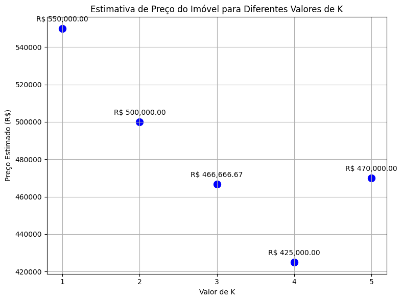
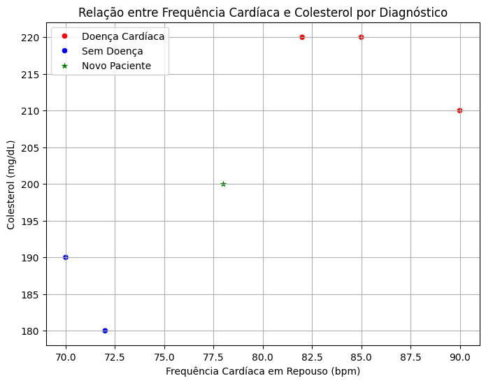

## Regression Formulation

The **k-nearest neighbours (KNN)** method is one of the most popular in the machine learning community.

The idea is to estimate the regression function **r(x)** for a given configuration **x** , using the average of the responses **$y_i$** of the  k  nearest neighbors to  x :

$$
g(x) = \frac{1}{k} \sum_{i∈N_x} y_i
$$

Where:
- **$N_x$**: set of the **k** observations closest to **x** 

**$N_x$** = \{i ∈ \{1,..., n\} : d($x_i$, x) **$d_x^k$**\}

- **$d_x^k$**: distance from the **k** -th nearest neighbor of  **x**

The choice of **k** is made via cross-validation:
- Large **k**: high bias, low variance
- Small **k**: low bias, high variance

### Example: Estimating Property Price

| Property | Size (m²) | Rooms | Price (R$) |
|----------|------------|--------|------------|
| 01       | 110        | 3      | 550,000    |
| 02       | 80         | 2      | 400,000    |
| 03       | 140        | 4      | 650,000    |
| 04       | 70         | 2      | 300,000    |
| 05       | 90         | 3      | 450,000    |

New property: Size = 100 m², Rooms = 3, k = 3

Euclidean Distance:  

$$
\text{dist} = \sqrt{(size_i - 100)^2 + (rooms_i - 3)^2}
$$

| Property | Distance to (100,3) |
|----------|----------------------|
| 01       | 10,00                |
| 02       | 20,02                |
| 03       | 40,01                |
| 04       | 30,02                |
| 05       | 10,00                |

Selected neighbors: 01, 05, 02  
Prices: 550.000  ; 450.000  ; 400.000

Now, considering all values of k from 1 to 5 and comparing the results, we can analyze the impact of \(k\) on the price estimation.

### k = 1:
The nearest neighbor is Property 01 (or 05, as they have the same distance), with a distance of 10.00 and a price of R$ 550,000 (or R$ 450,000). We will choose Property 01 for this case.

Estimated price (k=1): R$ 550,000

### k = 2:
The two nearest neighbors are Properties 01 and 05, with prices of R$ 550,000 and R$ 450,000.

$$
g(x) = \frac{1}{2}(550,000 + 450,000) = \text{R}\$ 500,000
$$

Estimated price (k=2): R$ 500,000

### k = 3:
The three nearest neighbors are Properties 01, 05, and 02, with prices of R$ 550,000, R$ 450,000, and R$ 400,000.

$$
g(x) = \frac{1}{3}(550,000 + 450,000 + 400,000) = \text{R}\$ 466,666.67
$$

Estimated price (k=3): R$ 466,666.67

### k = 4:

The four nearest neighbors are Properties 01, 05, 02, and 04, with prices of R$ 550,000, R$ 450,000, R$ 400,000, and R$ 300,000.

$$
g(x) = \frac{1}{4}(550,000 + 450,000 + 400,000 + 300,000) = R$ 425,000
$$

Estimated price (k=4): R$ 425,000

### k = 5:

The five nearest neighbors are Properties 01, 05, 02, 04, and 03, with prices of R$ 550,000, R$ 450,000, R$ 400,000, R$ 300,000, and R$ 650,000.

$$
g(x) = \frac{1}{5}(550,000 + 450,000 + 400,000 + 300,000 + 650,000) = R$ 470,000
$$

Estimated price (k=5): R$ 470,000

$$
g(x) = \frac{1}{3}(550.000 + 450.000 + 400.000) = 466.666,67~R\$
$$

  

---

## Classification Formulation

KNN can also be used for classification. The classifier is:

$$
g(x) = \text{mode}_{i \in N_x} y_i
$$

That is, the most frequent class among the \( k \) nearest neighbors of \( x \).

### Example: Heart Disease Diagnosis

| ID | Resting Heart Rate (bpm) | Cholesterol (mg/dL) | Diagnosis        |
|----|---------------------------|----------------------|------------------|
| 01 | 82                        | 220                  | Heart Disease    |
| 02 | 70                        | 190                  | No Disease       |
| 03 | 90                        | 210                  | Heart Disease    |
| 04 | 72                        | 180                  | No Disease       |
| 05 | 85                        | 220                  | Heart Disease    |

## KNN Classification for New Patient (Heart Disease Diagnosis)

**New Patient Data:** Heart rate = 78 bpm, Cholesterol = 200 mg/dL

### 1. KNN with \( k = 1 \)

**Euclidean Distance:**

$$
\text{dist} = \sqrt{(freq_i - 78)^2 + (colest_i - 200)^2}
$$

| ID | Distance | Diagnosis      |
|----|----------|----------------|
| 02 | 12.81    | No Heart Disease |

**Mode:** **No Heart Disease**

The new patient is classified as **No Heart Disease** with KNN of \( k = 1 \).

### 2. KNN with \( k = 2 \)

**Euclidean Distance:**

$$
\text{dist} = \sqrt{(freq_i - 78)^2 + (colest_i - 200)^2}
$$

| ID | Distance | Diagnosis      |
|----|----------|----------------|
| 02 | 12.81    | No Heart Disease |
| 03 | 15.62    | Heart Disease    |

We have one vote for **No Heart Disease** and one vote for **Heart Disease**. In case of a tie, we can consider the nearest neighbor **(ID 02)**.

The new patient is classified as **No Heart Disease** with KNN of \( k = 2 \).

### 3. KNN with \( k = 3 \)

**Euclidean Distance:**

$$
\text{dist} = \sqrt{(freq_i - 78)^2 + (colest_i - 200)^2}
$$

| ID | Distance | Diagnosis      |
|----|----------|----------------|
| 02 | 12.81    | No Heart Disease |
| 03 | 15.62    | Heart Disease    |
| 01 | 20.40    | Heart Disease    |

**Mode:** **Heart Disease**

The new patient is classified as **Heart Disease** with KNN of \( k = 3 \).

### 4. KNN with \( k = 4 \)

**Euclidean Distance:**

$$
\text{dist} = \sqrt{(freq_i - 78)^2 + (colest_i - 200)^2}
$$

| ID | Distance | Diagnosis      |
|----|----------|----------------|
| 02 | 12.81    | No Heart Disease |
| 03 | 15.62    | Heart Disease    |
| 01 | 20.40    | Heart Disease    |
| 04 | 20.40    | No Heart Disease |

We have two votes for **No Heart Disease** and two votes for **Heart Disease**. Again, in case of a tie, we can consider the nearest neighbors. The two closest **(ID 02 and ID 03)** have different diagnoses. Another approach would be to consider the order of distances, thus **(ID 02)**.

The new patient is classified as **No Heart Disease** with KNN of \( k = 4 \).

### 5. KNN with \( k = 5 \)

Considering all five nearest neighbors, we have two votes for **No Heart Disease** and three votes for **Heart Disease**.

The new patient is classified as **Heart Disease** with KNN of \( k = 5 \).

  

>The graph shows the New Patient and the 5 nearest neighbors. The new patient is classified as **Heart Disease** or **No Disease** depending on how the k value is classified. The k value is a parameter that can be adjusted to improve the classification accuracy.

## References
IZBICKI RAFAEL & MENDONÇA D.S. TIAGO, São Paulo, 2020. Aprendizado de Máquina: uma abordagem estatística.

O'REILLY, Rio de Janeiro, 2019. Mãos à Obras Aprendizado Máquina com Scikit-Learn e TensorFlow.

## **Contributors**
|  [ Seidi Ducher](https://github.com/seidiDucher) 
| :---: | 

