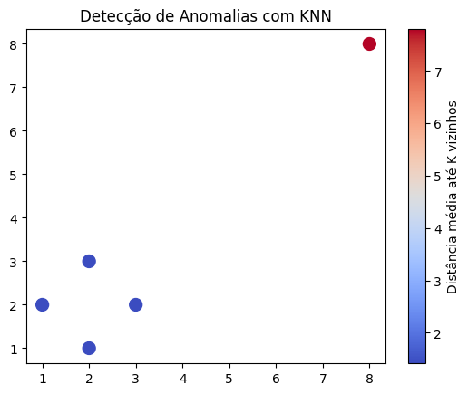

## Exemplos de KNN com gráficos

[Link Notebook no Colab](https://colab.research.google.com/drive/1weSNTv3ZqPqpdrtPQrczzHxfoQMkhLQu#scrollTo=vZfd4X1kdFVe)
### 1)  Dataset Iris

O código apresenta uma implementação do algoritmo K-Nearest Neighbors (KNN) aplicado ao famoso dataset Iris. Este conjunto de dados contém medidas de três espécies de flores íris (setosa, versicolor e virginica) baseadas em quatro características: comprimento da sépala, largura da sépala, comprimento da pétala e largura da pétala.

   Principais elementos da implementação:
- Carregamento do dataset Iris e divisão em conjuntos de treino (70%) e teste (30%)
- Aplicação inicial do KNN com k=10 vizinhos
- Visualização 3D da separação entre as espécies usando plotly
- Criação de matriz de confusão para avaliar o desempenho do classificador
- Uso de pipeline com padronização dos dados (StandardScaler)
- Busca do valor ótimo de k via GridSearchCV (testando valores de 1 a 15)
- Avaliação do modelo com métricas de classificação

### 2) Recomendação simples com filtragem colaborativa baseada em usuários

Para este exemplo, a utilização do KNN é realizada para prever a nota que X usuário daria para um filme (ou qualquer outro produto) baseado na preferência de usuários próximos, como por exemplo, grupo de amigos ou pessoas localizadas em X região.

Dentro do código, podemos simular os usuários da seguinte forma:

```python
ratings = np.array([
    [5, 3, 0],  # Usuário 1
    [4, 0, 4],  # Usuário 2
    [1, 1, 5]   # Usuário 3
])
```

Nesta matriz, cada linha representa um usuário e cada coluna representa a nota de avaliação de um filme.

Agora, necessitamos de criar uma função para prever a nota utilizando o KNN:

```python
def predict_rating(user_index, item_index, k=2):
    # Pega os vetores de todos os usuários exceto o atual
    user_ratings = ratings[:, item_index]
    similarities = []

    for other_user in range(ratings.shape[0]):
        if other_user != user_index and ratings[other_user, item_index] != 0:
            # Calcula a similaridade de cosseno entre os usuários
            sim = cosine_similarity(
                [ratings[user_index]], 
                [ratings[other_user]]
            )[0][0]
            similarities.append((sim, ratings[other_user, item_index]))

    # Ordena pelos mais similares
    similarities.sort(reverse=True)
    top_k = similarities[:k]

    if not top_k:
        return 0  # Nenhuma informação para prever

    # Média ponderada pelas similaridades
    num = sum(sim * rating for sim, rating in top_k)
    den = sum(abs(sim) for sim, _ in top_k)
    return num / den if den != 0 else 0
```

Na função recebemos o id do usuário (posição da linha) que queremos prever a nota, o filme escolhido (posição da coluna) e o valor de K, que irá ditar quanto de vizinhos que iremos buscar.

Dentro da função, excluímos o id do usuário que queremos buscar e se inicia um loop para percorrer todas as avaliações e comparar pela similaridade de cossenos cada avaliação de cada usuário comparado com o usuário desejado.

Desta forma, ordenamos os mais similares pelo K escolhido e fazemos a média ponderada para assim receber a nota prevista para o filme.

```python
Nota prevista do Usuário 1 para o Filme 3: 4.17
```

### 3) Detecção de Anomalias com KNN

O KNN pode ser usado para identificar **pontos que estão muito distantes de seus vizinhos mais próximos**, o que é um forte indicativo de comportamento anômalo.

Essa técnica pode ser eficiente para:

- Detecção de fraudes em transações financeiras.
- Monitoramento de sensores industriais.
- Análise de falhas em sistemas distribuídos.
- Identificação de comportamento malicioso em redes.

Iniciaremos o exemplo com uma matriz que simula pontos próximos:

```python
X = np.array([
    [1, 2], [2, 3], [3, 2], [2, 1],
    [8, 8],  # <- possível anomalia
])
```

Com a própria função do sklearn chamada `NearestNeighbors` iremos definir o valor de K e os vizinhos, nos dando assim a distância média de cada ponto do sistema:

```python
k = 2
nbrs = NearestNeighbors(n_neighbors=k+1)  # +1 porque o ponto mais próximo de si mesmo é ele mesmo
nbrs.fit(X)
distances, _ = nbrs.kneighbors(X)
mean_distances = distances[:, 1:].mean(axis=1)
```

Como resultado, podemos por exemplo fazer uma imagem ilustrando a discrepância dos pontos, quanto mais afastado, mais considerado como anomalia:

