# English version

## Linear Regression: Everything You Need to Know (In a Way You Understand!)


> [!NOTE]
> All the information gathered here comes from official documentation. Follow this [link](https://scikit-learn.org/stable/modules/generated/sklearn.linear_model.LinearRegression.html#sklearn.linear_model.LinearRegression) for further information.

---

<div align="center">
  
</div>

---

### **Index**
1. [What is Linear Regression?](#what-is-linear-regression)
2. [Setting Up the Model](#setting-up-the-model-like-a-boss)
3. [Step-by-Step Code (No Nonsense)](#step-by-step-code-no-nonsense)
4. [Workflow (Like a Cake Recipe)](#workflow-like-a-cake-recipe)
5. [Pro Tips (The Ones No One Tells You)](#pro-tips-the-ones-no-one-tells-you)
6. [Contributors](#-contributors)

---

### **What is Linear Regression?**  
Imagine you want to predict the price of an **NFT** based on the number of likes it receives. Linear regression is like a **magic calculator** that:  
1. Creates a line (that "y = ax + b" from school)  
2. Fits that line to your data  
3. **Predicts new values** such as: _"If it gets 500 likes, the NFT is worth $2,000!"_  

**In other words:** It's the simplest Machine Learning model, but EXTREMELY useful to understand relationships between numbers.

---

### **Setting Up the Model (Like a Boss)**  

When you create the model, there are some **secret options** that can change everything:

#### `fit_intercept`  
- **What it does:** Decides whether the line starts at **zero** or not.  
- **Example:** If your data is like "number of pizzas 🍕 vs. happiness 😊", `fit_intercept=True` allows you to have a certain level of happiness (say, 5/10) even without any pizza.

#### `n_jobs`  
- **What it does:** Uses all of your computer's processors to calculate faster.  
- **When to use:** Only worthwhile if your dataset is **HUGE** (like 100k+ rows).

#### `positive`  
- **What it does:** Prevents the coefficients from becoming negative.  
- **Example:** If "hours of studying 📚" should never lower your grade 🅰️, use `positive=True`.

---

### **Step-by-Step Code (No Nonsense)**

```python
# STEP 1: Import the necessary libraries
from sklearn.linear_model import LinearRegression
import numpy as np

# STEP 2: Create FAKE data (simulation)
# X = study hours | y = exam score
X = np.array([[1], [2], [3], [4]])  # reshaped to a matrix
y = np.array([4, 6, 8, 10])          # corresponding scores

# STEP 3: Create and train the model
model = LinearRegression(fit_intercept=True)  # default is True
model.fit(X, y)  # the model "learns" here!

# STEP 4: Predict the future! 🔮
study_hours = [[5]]  # 5 hours of study
predicted_score = model.predict(study_hours)
print(f"With 5h of study, predicted score: {predicted_score[0]:.1f} 🎉")
# Output: With 5h of study, predicted score: 12.0 🎉 (Wait, WTF?!)
```

#### **Wait... 5h = Score 12?**  
Relax, it's a fake example! The original data is perfectly linear (4, 6, 8, 10), so the model extrapolated. In real life, data is messy! 🎲. 

For futher details, see this implementation here -> <a href="3.student_study_hours_prediction.md">Student study hours prediction</a>

---

### **Workflow (Like a Cake Recipe)**

```mermaid
flowchart TD
    A[🛒 Get Data] --> B[🧼 Clean Data<br>remove junk, handle missing values]
    B --> C[📏 Normalize? or Not?<br>decide whether to scale]
    C --> D[🤖 Train the Model]
    D --> E[🧪 Test with New Data]
    E --> F[📉 If it's bad, tweak parameters!]
```


#### **Workflow Tips:**  
- **Dirty data?** The model will predict incorrectly, like a GPS with a torn map 🗺️  
- **Always test!** Don’t blindly trust the model – have it predict data it has never seen before!

---

### **Pro Tips (The Ones No One Tells You)**  

#### 1. **Don't use everything at once!**  
- Split your data for testing (around 20%) – otherwise, you'll fall into **self-deception**!

#### 2. **Beware of ghost variables!**  
- If two variables are **highly correlated** (like "age" and "birth year"), the model will go crazy!

#### 3. **Start simple!**  
- Linear Regression is your **first step** – only then move on to neural networks and more complex models!

## **Where am I?**
```text
RepoAI/
└── Linear Regression/
    ├── 1.Concepts/
        └── 1.Figures/
    │   └── 1.History.md
    |   └── 2.Typical_problems.md
    |   └── 3.Potential_issues.md
    |   └── 4.Fields_of_use.md
    ├── 2.Code/
    |   └── Figures/
    |   └── 1.Dive_into_the_docs.md  <---- Você está aqui!!
    |   └── 2.Boston_housing_price_reg.md
    |   └── 3.Student_study_hours_prediction.md
    └── 3.Mathematics/
    |   └── Figures/
    |   └── 1.General_representation_of_linear_regression.md 
    |   └── 2.The_least_square_method.md 
    |   └── 3.Equation_based_on_dataset.md   
```

## 👾 **Contributors**  
| [<br><sub>Ítalo Silva</sub>](https://github.com/ITA-LOW) |  [<br><sub>Mateus Kramer</sub>](https://github.com/mateuskramer) |  [<br><sub>Seidi Ducher</sub>](https://github.com/seidiDucher)
| :---: | :---: | :---: | 

---

## **License**  
[](https://pt.wikipedia.org/wiki/Licen%C3%A7a_MIT)  
**Traslation:** Use, modify, and share at will! ✌️

# Portuguese version

## Regressão Linear: Tudo que Você Precisa Saber (de um jeito que você entende!)

---

### **Índice**

1. [O que é Regressão Linear?](#o-que-é-essa-tal-de-regressão-linear)
2. [Configurando o Modelo](#configurando-o-modelo-como-um-chefe)
3. [Código Passo a Passo](#código-passo-a-passo-sem-mimimi)
4. [Fluxo de Trabalho](#fluxo-de-trabalho-tipo-uma-receita-de-bolo)
5. [Dicas Pro](#dicas-pro-que-ninguém-te-conta)
6. [Contribuidores](#-contribuidores)

---

### **O que é essa tal de Regressão Linear?**  
Imagina que você quer prever o preço de um **NFT** baseado no número de likes que ele tem. A regressão linear é tipo uma **calculadora mágica** que:  
1. Cria uma reta (aquela do "y = ax + b" da escola)  
2. Ajusta essa reta nos seus dados  
3. **Prevê valores novos** tipo: _"Se tiver 500 likes, o NFT vale R$ 2.000!"_  

**Traduzindo:** É o modelo mais simples de Machine Learning, mas MUITO útil para entender relações entre números.

---

### **Configurando o Modelo**  

Quando você cria o modelo, tem umas **opções secretas** que mudam tudo:

#### `fit_intercept`  
- **O que faz:** Decide se a reta começa no **zero** ou não.  
- **Exemplo:** Se seus dados são tipo "quantidade de pizza 🍕 vs. felicidade 😊", `fit_intercept=True` permite que mesmo sem pizza você tenha um nível de felicidade (tipo 5/10).  

#### `n_jobs`  
- **O que faz:** Usa todos os processadores do PC pra calcular mais rápido.  
- **Quando usar:** Só vale a pena se seu dataset for **GIGANTE** (tipo 100k+ linhas).  

#### `positive`  
- **O que faz:** Não deixa os coeficientes ficarem negativos.  
- **Exemplo:** Se "horas de estudo 📚" nunca podem reduzir a nota 🅰️, use `positive=True`.  

---

### **Código Passo a Passo (sem mimimi)**

```python
# PASSO 1: Importar as ferramentas
from sklearn.linear_model import LinearRegression
import numpy as np

# PASSO 2: Criar dados FAKE (tipo simulação)
# X = horas de estudo | y = nota na prova
X = np.array([[1], [2], [3], [4]])  # reshape pra matriz
y = np.array([4, 6, 8, 10])          # notas correspondentes

# PASSO 3: Criar e treinar o modelo
modelo = LinearRegression(fit_intercept=True)  # default é True
modelo.fit(X, y)  # o modelo "aprende" aqui!

# PASSO 4: Prever o futuro! 🔮
horas_estudo = [[5]]  # 5 horas de estudo
nota_prevista = modelo.predict(horas_estudo)
print(f"Com 5h de estudo, nota prevista: {nota_prevista[0]:.1f} 🎉")
# Saída: Com 5h de estudo, nota prevista: 12.0 🎉 (Ué? WTF?!)
```

#### **Wait... 5h = Nota 12?**  
Calma, é um exemplo fake! Os dados originais são lineares perfeitos (4,6,8,10), então o modelo extrapolou. Na vida real, os dados são bagunçados! 🎲

---

### **Fluxo de Trabalho (tipo uma receita de bolo)**

```mermaid
flowchart TD
    A[🛒 Pegar Dados] --> B[🧼 Limpar Dados<br>remove lixo, trata missing]
    B --> C[📏 Normalizar/Não?<br>decide se escala]
    C --> D[🤖 Treinar Modelo]
    D --> E[🧪 Testar com Dados Novos]
    E --> F[📉 Se ruim, ajusta parâmetros!]
```



#### **Dicas do Fluxo:**  
- **Dados sujos?** O modelo vai prever errado, tipo um GPS com mapa rasgado 🗺️  
- **Testar sempre!** Não confie cegamente no modelo – faça ele prever dados que ele nunca viu!  

---

### **Dicas Pro (que ninguém te conta)**  

#### 1. **Não use tudo de uma vez!**  
- Separe parte dos dados para teste (tipo 20%) – senão você cai no **autoengano**!  

#### 2. **Cuidado com variáveis fantasmas!**  
- Se duas variáveis são **muito correlacionadas** (tipo "idade" e "ano de nascimento"), o modelo fica doido!  

#### 3. **Comece simples!**  
- Regressão Linear é seu **primeiro passo** – só depois parta para redes neurais e modelos complexos!  

---

## Onde estou? 
```text
RepoAI/
└── Linear Regression/
    ├── 1.Concepts/
        └── 1.Figures/
    │   └── 1.History.md
    |   └── 2.Typical_problems.md
    |   └── 3.Potential_issues.md
    |   └── 4.Fields_of_use.md
    ├── 2.Code/
    |   └── Figures/
    |   └── 1.Dive_into_the_docs.md  <---- Você está aqui!!
    |   └── 2.Boston_housing_price_reg.md
    |   └── 3.Student_study_hours_prediction.md
    └── 3.Mathematics/
    |   └── Figures/
    |   └── 1.General_representation_of_linear_regression.md 
    |   └── 2.The_least_square_method.md 
    |   └── 3.Equation_based_on_dataset.md   
```

## 👾 **Contribuidores**  
| [<br><sub>Ítalo Silva</sub>](https://github.com/ITA-LOW) |  [<br><sub>Mateus Kramer</sub>](https://github.com/mateuskramer) |  [<br><sub>Seidi Ducher</sub>](https://github.com/seidiDucher)
| :---: | :---: | :---: | 

---

## **Licença**  
[](https://pt.wikipedia.org/wiki/Licen%C3%A7a_MIT)  
**Tradução:** Use, modifique e compartilhe à vontade! ✌️
