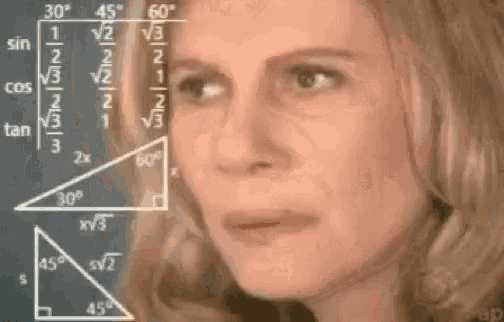
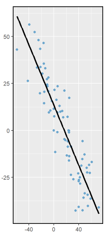

# English version

## General representation of linear regression

Mathematically, linear regression is a model used to predict numerical values based on one or more independent variables. It assumes the relationship between the dependent variable and the features is linear.

Therefore, it is represented by a linear equation, such as:

$$
\hat{y} = \beta_0 + \beta_1 x_1 + \beta_2 x_2 + \cdots + \beta_n x_n
$$

- **$\hat{y}$**: The dependent variable or the predicted value.
- **$\beta_0$**: The intercept term, which corresponds to the value of $y$ when all $x$ values are zero.
- **$\beta_1, \beta_2, \dots, \beta_n$**: The coefficients for each independent variable, which represent how much each variable influences the prediction of y.
- **$x_1, x_2, \dots, x_n$**: The independent variables or features that are used to predict y.

If a model has two or more independent values, it is called **multiple linear regression**. However, this explanation will focus more on the simplest case, in which there is only one independent variable (**simple linear regression**).



### Simple Linear Regression (two dimensions)

In two dimensions, we can think about linear regression as a straight line, which follows the equation:

$$
\hat{y} = \beta_0 + \beta_1 x_1
$$

- **$\hat{y}$**: Dependent variable (response).
- **$\beta_0$**: Intercept.
- **$\beta_1$**: Coefficient of the independent variable.
- **$x_1$**: Independent variable (feature).

This representation can be viewed in figure 1:



The blue dots represent the actual values collected from real-world data. The straight line shows the model's predictions.

> [!IMPORTANT]
> Since the blue dots are not exactly where the straight line is, there is an associated error that we must consider when using linear regression. In order to calculate the error (in both simple and multiple linear regression), do the following:
 
$$
e = y - \hat{y}
$$

- **$e$**: Error
- **$\hat{y}$**: Predicted value from the model.
- **$y$**: Real-world value. 

### Exercise

By analyzing a graph, such as the figure 1 one, how can we determine which blue dots have a bigger error?
<details>
  <summary>Click to see the answer</summary>
  The farther from the straight line the dot is, the bigger the error. Our goal is to have the blue dots as close as possible to the line, as this makes the model more accurate.
</details>

## References
Universidade Federal do Rio Grande do Sul. (n.d.). Probabilidade e Estatística. Retrieved March 30, 2025, from https://www.ufrgs.br/probabilidade-estatistica/livro/livro_completo/ch7-reg-simples.html

HASTIE, Trevor; TIBSHIRANI, Robert; FRIEDMAN, Jerome. An introduction to statistical learning. 2009.

Weisberg, S. Applied linear regression (4th ed.). Wiley. Retrieved March 30, 2025, from https://www.stat.purdue.edu/~qfsong/teaching/525/book/Weisberg-Applied-Linear-Regression-Wiley.pdf


## Where am I?

```text
RepoAI/
└── Linear Regression/
    ├── 1.Concepts/
    │   └── Figures/
    │   └── 1.History.md
    |   └── 2.Typical_problems.md
    |   └── 3.Potential_issues.md
    |   └── 5.Fields_of_use.md
    ├── 2.Code/
    |   └── Figures/
    |   └── 1.Dive_into_the_docs.md  
    |   └── 2.Boston_housing_price_reg.md
    |   └── 3.Student_study_hours_prediction.md
    └── 3.Mathematics/
    |   └── Figures/
    |   └── 1.General_representation_of_linear_regression.md <---- You are here!! 
    |   └── 2.The_least_square_method.md
    |   └── 3.Equation_based_on_dataset.md   
```

## 👾 **Contributors**  
| [<br><sub>Maria Eduarda Vianna</sub>](https://github.com/mevianna) |  [<br><sub>Beatriz Schuelter Tartare</sub>](https://github.com/beastartare) | [<br><sub>Rafaela Savaris</sub>](https://github.com/rafasavaris) | [<br><sub>Vinícius Muchulski</sub>](https://github.com/vini-muchulski) | 
| :---: | :---: | :---: | :---: |

## **License**  
[](https://pt.wikipedia.org/wiki/Licen%C3%A7a_MIT)  
**Traslation:** Use, modify, and share at will! ✌️

# Portuguese version
 
## Representação geral da regressão linear

Matematicamente, a regressão linear é um modelo usado para prever um valor numérico baseado em uma ou mais variáveis independentes. Ele assume que a relação entre a variável dependente e as caracteríticas é linear.

Portanto, é representado por uma equação linear:

$$
  \hat{y} = \beta_0 + \beta_1 x\_1 + \cdots + \beta_n x_n
$$

- **$\hat{y}$**: Variável dependente ou valor previsto.
- **$\beta_0$**: Valor de intersecção em $y$ para quando todos os valores de $x$ são zero.
- **$\beta_1, \beta_2, \cdots, \beta_n$**: Coeficientes de cada variável independente, que representam o quanto cada variável influencia na predição de y.
- **$x_1, x_2, \dots, x_n$**: Variáveis independentes ou características que são usadas para prever y.

Se um modelo tem dois ou mais valores independentes, é chamado de **regressão linear múltipla**. No entanto, esta explicação focará no caso mais simples, em que há apenas uma variável independente (**regressão linear simples**).


### Regressão linear simples (duas dimensões)

Em duas dimensões, podemos pensar na regressão linear como sendo uma linha reta, que segue a equação:

$$
\hat{y} = \beta_0 + \beta_1 x_1
$$

- **$\hat{y}$**: Variável dependente
- **$\beta_0$**: Intercepto.
- **$\beta_1$**: Coeficiente da variável independente.
- **$x_1$**: Variável independente (característica).

Esta representação do modelo pode ser vista na figura 1:


Os pontos em azul representam os valores coletados de dados reais. A linha reta mostra a predição do modelo.

> [!IMPORTANT]
> Tendo em vista que os pontos azuis não estão exatamente onde a linha reta está, há um erro associado que devemos considerar quando utilizarmos regressão linear. Para calcular o erro (tanto na regressão linear simples quanto na múltipla), faça o seguinte:

$$
e = y - \hat{y}
$$

- **$e$**: Erro
- **$\hat{y}$**: Valor previsto pelo modelo.
- **$y$**: Valor real. 


### Exercício

Ao analisarmos um gráfico, como o da figura 1, como podemos determinar qual ponto azul tem maior erro?
<details>
  <summary>Clique para ver a resposta</summary>
  Quanto mais longe o ponto está da linha reta, maior o erro. Nosso objetivo é ter os pontos azuis o mais perto possível da linha, haja vista que isso faz o modelo mais preciso.
</details>

## Referências
UNIVERSIDADE FEDERAL DO RIO GRANDE DO SUL. Probabilidade e Estatística. Disponível em: https://www.ufrgs.br/probabilidade-estatistica/livro/livro_completo/ch7-reg-simples.html. Acesso em: 30 mar. 2025.

HASTIE, Trevor; TIBSHIRANI, Robert; FRIEDMAN, Jerome. An introduction to statistical learning. 2009.

WEISBERG, Sanford. Applied linear regression. 4. ed. Hoboken: Wiley, [s.d.]. Disponível em: https://www.stat.purdue.edu/~qfsong/teaching/525/book/Weisberg-Applied-Linear-Regression-Wiley.pdf. Acesso em: 30 mar. 2025.

## Onde estou?

```text
RepoAI/
└── Linear Regression/
    ├── 1.Concepts/
    │   └── Figures/
    │   └── 1.History.md
    |   └── 2.Typical_problems.md
    |   └── 3.Potential_issues.md
    |   └── 4.Fields_of_use.md
    ├── 2.Code/
    |   └── Figures/
    |   └── 1.Dive_into_the_docs.md  
    |   └── 2.Boston_housing_price_reg.md
    |   └── 3.Student_study_hours_prediction.md
    └── 3.Mathematics/
    |   └── Figures/
    |   └── 1.General_representation_of_linear_regression.md <---- Você está aqui!! 
    |   └── 2.The_least_square_method.md
    |   └── 3.Equation_based_on_dataset.md   
```

## 👾 **Contribuidores**  
| [<br><sub>Maria Eduarda Vianna</sub>](https://github.com/mevianna) |  [<br><sub>Beatriz Schuelter Tartare</sub>](https://github.com/beastartare) | [<br><sub>Rafaela Savaris</sub>](https://github.com/rafasavaris) | [<br><sub>Vinícius Muchulski</sub>](https://github.com/vini-muchulski) | 
| :---: | :---: | :---: | :---: |

## **Licença**  
[](https://pt.wikipedia.org/wiki/Licen%C3%A7a_MIT)  
**Traslation:** Use, modifique e compartilhe à vontade! ✌️
