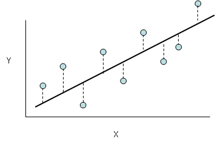

## Linear Regression: Everything You Need to Know (In a Way You Understand!)


> [!NOTE]
> All the information gathered here comes from official documentation. Follow this [link](https://scikit-learn.org/stable/modules/generated/sklearn.linear_model.LinearRegression.html#sklearn.linear_model.LinearRegression) for further information.

---

<div align="center">
  
</div>

---

### **Index**
1. [What is Linear Regression?](#what-is-linear-regression)
2. [Setting Up the Model](#setting-up-the-model-like-a-boss)
3. [Step-by-Step Code (No Nonsense)](#step-by-step-code-no-nonsense)
4. [Workflow (Like a Cake Recipe)](#workflow-like-a-cake-recipe)
5. [Pro Tips (The Ones No One Tells You)](#pro-tips-the-ones-no-one-tells-you)
6. [Contributors](#-contributors)

---

### **What is Linear Regression?**  
Imagine you want to predict the price of an **NFT** based on the number of likes it receives. Linear regression is like a **magic calculator** that:  
1. Creates a line (that "y = ax + b" from school)  
2. Fits that line to your data  
3. **Predicts new values** such as: _"If it gets 500 likes, the NFT is worth $2,000!"_  

**In other words:** It's the simplest Machine Learning model, but EXTREMELY useful to understand relationships between numbers.

---

### **Setting Up the Model (Like a Boss)**  

When you create the model, there are some **secret options** that can change everything:

#### `fit_intercept`  
- **What it does:** Decides whether the line starts at **zero** or not.  
- **Example:** If your data is like "number of pizzas 🍕 vs. happiness 😊", `fit_intercept=True` allows you to have a certain level of happiness (say, 5/10) even without any pizza.

#### `n_jobs`  
- **What it does:** Uses all of your computer's processors to calculate faster.  
- **When to use:** Only worthwhile if your dataset is **HUGE** (like 100k+ rows).

#### `positive`  
- **What it does:** Prevents the coefficients from becoming negative.  
- **Example:** If "hours of studying 📚" should never lower your grade 🅰️, use `positive=True`.

---

### **Step-by-Step Code (No Nonsense)**

```python
# STEP 1: Import the necessary libraries
from sklearn.linear_model import LinearRegression
import numpy as np

# STEP 2: Create FAKE data (simulation)
# X = study hours | y = exam score
X = np.array([[1], [2], [3], [4]])  # reshaped to a matrix
y = np.array([4, 6, 8, 10])          # corresponding scores

# STEP 3: Create and train the model
model = LinearRegression(fit_intercept=True)  # default is True
model.fit(X, y)  # the model "learns" here!

# STEP 4: Predict the future! 🔮
study_hours = [[5]]  # 5 hours of study
predicted_score = model.predict(study_hours)
print(f"With 5h of study, predicted score: {predicted_score[0]:.1f} 🎉")
# Output: With 5h of study, predicted score: 12.0 🎉 (Wait, WTF?!)
```

#### **Wait... 5h = Score 12?**  
Relax, it's a fake example! The original data is perfectly linear (4, 6, 8, 10), so the model extrapolated. In real life, data is messy! 🎲. 

For futher details, see this implementation here -> <a href="3.student_study_hours_prediction.md">Student study hours prediction</a>

---

### **Workflow (Like a Cake Recipe)**

```mermaid
flowchart TD
    A[🛒 Get Data] --> B[🧼 Clean Data<br>remove junk, handle missing values]
    B --> C[📏 Normalize? or Not?<br>decide whether to scale]
    C --> D[🤖 Train the Model]
    D --> E[🧪 Test with New Data]
    E --> F[📉 If it's bad, tweak parameters!]
```


#### **Workflow Tips:**  
- **Dirty data?** The model will predict incorrectly, like a GPS with a torn map 🗺️  
- **Always test!** Don’t blindly trust the model – have it predict data it has never seen before!

---

### **Pro Tips (The Ones No One Tells You)**  

#### 1. **Don't use everything at once!**  
- Split your data for testing (around 20%) – otherwise, you'll fall into **self-deception**!

#### 2. **Beware of ghost variables!**  
- If two variables are **highly correlated** (like "age" and "birth year"), the model will go crazy!

#### 3. **Start simple!**  
- Linear Regression is your **first step** – only then move on to neural networks and more complex models!

## 👾 **Contributors**  
| [<br><sub>Ítalo Silva</sub>](https://github.com/ITA-LOW) |  [<br><sub>Mateus Kramer</sub>](https://github.com/mateuskramer) |  [<br><sub>Seidi Ducher</sub>](https://github.com/seidiDucher)
| :---: | :---: | :---: | 