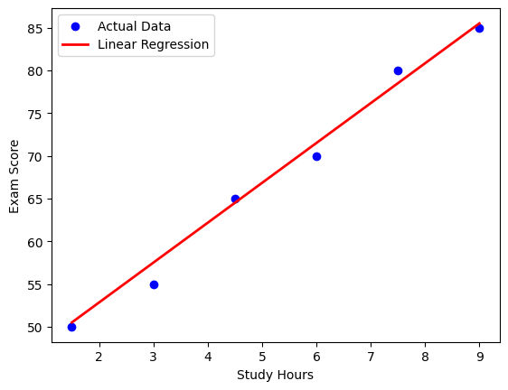

##  Predicting Student Scores Based on Study Hours


### Objective   
The goal is to predict a student's exam score based on the number of hours they studied using **Linear Regression**. We'll explore how to implement a simple linear regression model to determine the relationship between study time and academic performance.   
 
--- 
 
### Dataset   
We'll create a simple synthetic dataset for this tutorial. For a real-world example, you can explore the **Student Study Hours and Performance Dataset**, available on [Kaggle](https://www.kaggle.com/datasets/himanshunakrani/student-study-hours).
 
Example dataset:   
 
| Hours Studied | Exam Score | 
|--------------|------------| 
| 1.5          | 50         | 
| 3.0          | 55         | 
| 4.5          | 65         | 
| 6.0          | 70         | 
| 7.5          | 80         | 
| 9.0          | 85         | 
 
--- 
 
### Implementation Using Python and Scikit-Learn   

#### Step 1: Importing Libraries

```python 
import numpy as np 
import matplotlib.pyplot as plt 
from sklearn.model_selection import train_test_split 
from sklearn.linear_model import LinearRegression 
from sklearn.metrics import mean_absolute_error, mean_squared_error, r2_score
```

- `numpy` for mathematical operations and array manipulations
- `matplotlib.pyplot` for creating visualizations
- `train_test_split` from scikit-learn to divide our data into training and testing sets
- `LinearRegression` class that implements linear regression algorithm
- Metrics functions to evaluate our model's performance

#### Step 2: Creating/Loading the Dataset

```python
hours_studied = np.array([1.5, 3.0, 4.5, 6.0, 7.5, 9.0]).reshape(-1, 1)  # reshape for sklearn
exam_score = np.array([50, 55, 65, 70, 80, 85])
```

- `hours_studied`: Independent variable (input) representing time spent studying
- `exam_score`: Dependent variable (output) representing exam results
- The `.reshape(-1, 1)` ensures our input data is in the correct 2D format required by scikit-learn

#### Step 3: Splitting Data into Training and Testing Sets

```python
X_train, X_test, y_train, y_test = train_test_split(hours_studied, exam_score, test_size=0.2, random_state=42) 
```

- 80% for training the model
- 20% for testing its performance
- `random_state=42` ensures reproducibility by fixing the random seed

#### Step 4: Creating and Training the Model

```python
model = LinearRegression() 
model.fit(X_train, y_train) 
```

Here we:
- Initialize a LinearRegression model
- Train it using the training data with the `fit()` method
- During training, the model learns the optimal coefficients (slope and intercept) for our linear equation

#### Step 5: Making Predictions

```python
y_pred = model.predict(X_test) 
```

- `y_pred` contains predicted scores that we'll compare with actual scores

#### Step 6: Evaluating Model Performance 

```python
mae = mean_absolute_error(y_test, y_pred) 
mse = mean_squared_error(y_test, y_pred) 
rmse = np.sqrt(mse) 
r2 = r2_score(y_test, y_pred)
 
print(f"Coefficient (Slope): {model.coef_[0]:.2f}") 
print(f"Intercept: {model.intercept_:.2f}") 
print(f"MAE (Mean Absolute Error): {mae:.2f}") 
print(f"MSE (Mean Squared Error): {mse:.2f}") 
print(f"RMSE (Root Mean Squared Error): {rmse:.2f}")
print(f"R²: {r2:.4f}")
```

You should get results similar to:
```
Coefficient (Slope): 4.67
Intercept: 43.50
MAE (Mean Absolute Error): 1.50
MSE (Mean Squared Error): 3.25
RMSE (Root Mean Squared Error): 1.80
R²: 0.9857
```

Analyzing these results:
- **Coefficient (slope)**: 4.67 means for each additional hour of study, a student's score increases by about 4.67 points
- **Intercept**: 43.50 is the theoretical score when study hours = 0
- **MAE, MSE, RMSE**: These low error values indicate the model fits the data well
- **R²**: 0.9857 means approximately 98.6% of the variance in exam scores can be explained by study hours, indicating an excellent fit

#### Step 7: Visualizing Results

```python
plt.scatter(hours_studied, exam_score, color='blue', label="Actual Data") 
plt.plot(hours_studied, model.predict(hours_studied), color='red', linewidth=2, label="Linear Regression") 
plt.xlabel("Study Hours") 
plt.ylabel("Exam Score") 
plt.legend() 
plt.show() 
```

You should get a visualization similar to this:



The regression line closely fits the actual data points.

###  Using the Model for Predictions

```python
new_hours = np.array([[10.0]])
predicted_score = model.predict(new_hours)
print(f"Predicted score for 10 hours of studying: {predicted_score[0]:.2f}")
```

Output:
```
Predicted score for 10 hours of studying: 90.17
```

This shows that, according to our model, a student who studies for 10 hours would likely score around 90.17 on the exam. The prediction follows our linear equation: Score = 4.67 × Hours + 43.5.

This feature allows you to make predictions for any number of study hours!

## 👾 **Contributors**  
| [<br><sub>Ítalo Silva</sub>](https://github.com/ITA-LOW) |  [<br><sub>Mateus Kramer</sub>](https://github.com/mateuskramer) |  [<br><sub>Seidi Ducher</sub>](https://github.com/seidiDucher)
| :---: | :---: | :---: | 