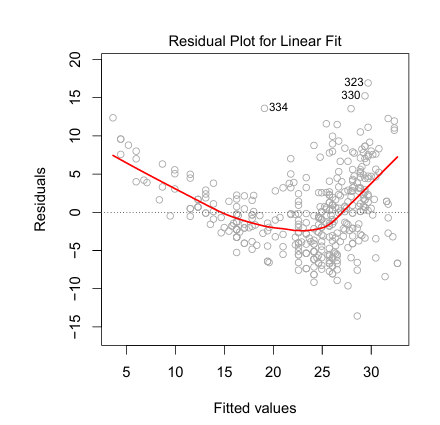

## Potential issues
When training a Linear Regression model with a specific dataset, many problems may arise. The most common ones are:

### 1. Non-linearity of the data

&nbsp;&nbsp;&nbsp;&nbsp; The linear regression model assumes that there is a strong relationship between the predictors and the response. If this relationship is very different from linear, it is concluded that the model cannot capture the true relationship, leading to inaccurate predictions and incorrect conclusions, significantly reducing its accuracy.

&nbsp;&nbsp;&nbsp;&nbsp; Residual plots are a great tool for identifying the nonlinearity of the model, as one can plot the residuals $e_i = y_i - \hat{y}_i$ versus the predictor $x_i$. In the case of many models, with multiple predictors, the predicted values $\hat{y}_i$ should be used.
   
   
   
&nbsp;&nbsp;&nbsp;&nbsp; The figure above shows a residual plot using a linear regression model. The red line represents a smooth fit of the residuals and aims to facilitate the identification of trends. It is noted to exhibit a U-shape, indicating a lack of standardization of the residuals, suggesting nonlinearity in the data.
   
### 2. Correlation of error terms

&nbsp;&nbsp;&nbsp;&nbsp; An important deduction to be made about linear regression models is that error terms $e_1, e_2, ..., e_n$ are not correlated. If correlation exists among errors, the standard errors estimated for regression coefficients will tend to underestimate the true standard errors. For example, an 80% confidence interval may have a much lower probability than 0.8 of containing the true parameter value. Furthermore, this may result in lower p-values, leading to undue confidence in the model and incorrect conclusions regarding whether a parameter is statistically significant.
   
### 3. Heteroscedasticity

&nbsp;&nbsp;&nbsp;&nbsp; An important assumption is that error terms have a constant variance $Var(e_i) = \sigma^2$, meaning they are uniformly distributed across all observations. When heteroscedasticity occurs, it means the variance is not constant. Thus, the dispersion of residuals may vary depending on the values of the predictor variables or other conditions in the model.

   
   
&nbsp;&nbsp;&nbsp;&nbsp; Left: Funnel shape indicates heteroscedasticity. 

&nbsp;&nbsp;&nbsp;&nbsp;Right: The response was transformed to a logarithmic scale, and now there is no evidence of heteroscedasticity.
   
### 4. Outliers

&nbsp;&nbsp;&nbsp;&nbsp; An outlier is a point that significantly deviates from the value predicted by the model.

   

&nbsp;&nbsp;&nbsp;&nbsp; In the figure above, the residual plot on the left clearly shows the outlier (20). However, it may be difficult to determine when a point should be considered an outlier or not. Even though mathematical definitions and criteria exist to identify outliers (such as values above 3 and standard deviations), the decision may depend on the application context, the nature of the data, and the model used.

> ### Observation
>
> The residual plot mentioned in the topics above is a tool used to assess the quality of the model fit. It plots the residuals (differences between observed and predicted values) against the fitted values. The presence of evident patterns, such as clusters or trends, indicates problems with the model.

### Reference

This project utilizes concepts and techniques described in the book "An Introduction to Statistical Learning" (James et al., 2013).

## 👾 **Contributors**  
| [ Alice Motin](https://github.com/AliceMotin) |  [ Caroline Lanzuolo](https://github.com/carol-lanzu) | [ Matheus Lima](https://github.com/matheus1103) | 
| :---: | :---: | :---: |
