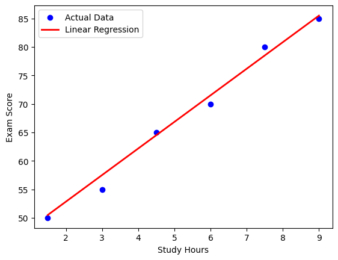

##  Previsão de Notas de Estudantes Baseada em Horas de Estudo


### Objetivo
O objetivo é prever a nota de um estudante em um exame com base no número de horas que ele estudou usando **Regressão Linear**. Vamos explorar como implementar um modelo simples de regressão linear para determinar a relação entre o tempo de estudo e o desempenho acadêmico.

---

### Conjunto de Dados
Vamos criar um conjunto de dados sintético simples para este tutorial. Para um exemplo do mundo real, você pode explorar o **Conjunto de Dados de Horas de Estudo e Desempenho de Estudantes**, disponível no [Kaggle](https://www.kaggle.com/datasets/himanshunakrani/student-study-hours).

Exemplo de conjunto de dados:

| Horas Estudadas | Nota do Exame |
|----------------|--------------|
| 1.5            | 50           |
| 3.0            | 55           |
| 4.5            | 65           |
| 6.0            | 70           |
| 7.5            | 80           |
| 9.0            | 85           |

---

### Implementação Usando Python e Scikit-Learn

#### Passo 1: Importando Bibliotecas

```python
import numpy as np
import matplotlib.pyplot as plt
from sklearn.model_selection import train_test_split
from sklearn.linear_model import LinearRegression
from sklearn.metrics import mean_absolute_error, mean_squared_error, r2_score
```

- `numpy` para operações matemáticas e manipulações de arrays
- `matplotlib.pyplot` para criar visualizações
- `train_test_split` do scikit-learn para dividir nossos dados em conjuntos de treinamento e teste
- Classe `LinearRegression` que implementa o algoritmo de regressão linear
- Funções de métricas para avaliar o desempenho do nosso modelo

#### Passo 2: Criando/Carregando o Conjunto de Dados

```python
hours_studied = np.array([1.5, 3.0, 4.5, 6.0, 7.5, 9.0]).reshape(-1, 1)  # reshape para sklearn
exam_score = np.array([50, 55, 65, 70, 80, 85])
```

- `hours_studied`: Variável independente (entrada) representando o tempo gasto estudando
- `exam_score`: Variável dependente (saída) representando os resultados do exame
- O `.reshape(-1, 1)` garante que nossos dados de entrada estejam no formato 2D exigido pelo scikit-learn

#### Passo 3: Dividindo os Dados em Conjuntos de Treinamento e Teste

```python
X_train, X_test, y_train, y_test = train_test_split(hours_studied, exam_score, test_size=0.2, random_state=42)
```

- 80% para treinar o modelo
- 20% para testar seu desempenho
- `random_state=42` garante a reprodutibilidade fixando a semente aleatória

#### Passo 4: Criando e Treinando o Modelo

```python
model = LinearRegression()
model.fit(X_train, y_train)
```

Aqui nós:
- Inicializamos um modelo de LinearRegression
- Treinamos ele usando os dados de treinamento com o método `fit()`
- Durante o treinamento, o modelo aprende os coeficientes ótimos (inclinação e intercepto) para nossa equação linear

#### Passo 5: Fazendo Previsões

```python
y_pred = model.predict(X_test)
```

- `y_pred` contém as notas previstas que vamos comparar com as notas reais

#### Passo 6: Avaliando o Desempenho do Modelo

```python
mae = mean_absolute_error(y_test, y_pred)
mse = mean_squared_error(y_test, y_pred)
rmse = np.sqrt(mse)
r2 = r2_score(y_test, y_pred)

print(f"Coeficiente Angular (Inclinação): {model.coef_[0]:.2f}")
print(f"Coeficiente Linear: {model.intercept_:.2f}")
print(f"MAE (Erro Absoluto Médio): {mae:.2f}")
print(f"MSE (Erro Quadrático Médio): {mse:.2f}")
print(f"RMSE (Raiz do Erro Quadrático Médio): {rmse:.2f}")
print(f"R²: {r2:.4f}")
```

Você deve obter resultados semelhantes a:
```
Coeficiente Angular (Inclinação): 4.67
Coeficiente Linear: 43.50
MAE (Erro Absoluto Médio): 1.50
MSE (Erro Quadrático Médio): 3.25
RMSE (Raiz do Erro Quadrático Médio): 1.80
R²: 0.9857
```

Ao analisar estes resultados:
- **Coeficiente Angular (Inclinação)**: 4.67 significa que para cada hora adicional de estudo, a nota de um estudante aumenta em cerca de 4.67 pontos
- **Coeficiente Linear**: 43.50 é a nota teórica quando as horas de estudo = 0
- **MAE, MSE, RMSE**: Estes valores baixos de erro indicam que o modelo se ajusta bem aos dados
- **R²**: 0.9857 significa que aproximadamente 98.6% da variância nas notas dos exames pode ser explicada pelas horas de estudo, indicando um excelente ajuste

#### Passo 7: Visualizando Resultados

```python
plt.scatter(hours_studied, exam_score, color='blue', label="Dados Reais")
plt.plot(hours_studied, model.predict(hours_studied), color='red', linewidth=2, label="Regressão Linear")
plt.xlabel("Horas de Estudo")
plt.ylabel("Nota do Exame")
plt.legend()
plt.show()
```

Você deve obter uma visualização semelhante a esta:



A linha de regressão se ajusta bem aos pontos de dados reais.

### Usando o Modelo para Previsões

```python
new_hours = np.array([[10.0]])
predicted_score = model.predict(new_hours)
print(f"Nota prevista para 10 horas de estudo: {predicted_score[0]:.2f}")
```

Saída:
```
Nota prevista para 10 horas de estudo: 90.17
```

Isso mostra que, de acordo com nosso modelo, um estudante que estuda por 10 horas provavelmente obteria cerca de 90.17 no exame. A previsão segue nossa equação linear: Nota = 4.67 × Horas + 43.5.

Este recurso permite que você faça previsões para qualquer número de horas de estudo!

## 👾 **Contribuidores**  
| [<br><sub>Ítalo Silva</sub>](https://github.com/ITA-LOW) |  [<br><sub>Mateus Kramer</sub>](https://github.com/mateuskramer) |  [<br><sub>Seidi Ducher</sub>](https://github.com/seidiDucher)
| :---: | :---: | :---: | 
