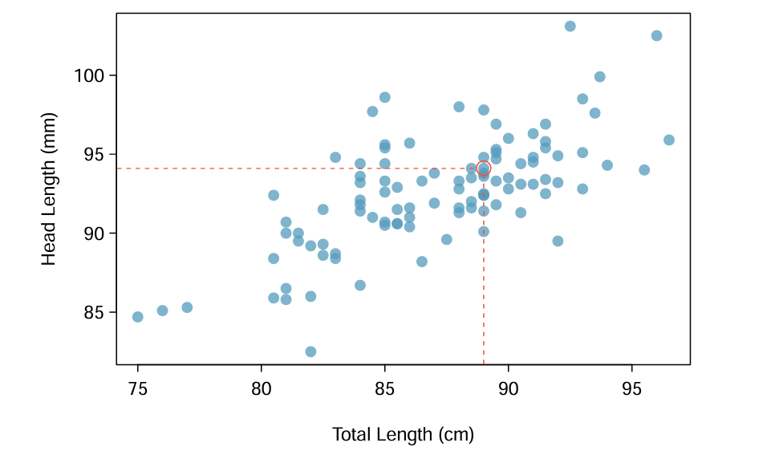

## **Problemas Típicos Resolvidos com Regressão Linear:**

A regressão linear é amplamente utilizada para modelar e prever relações lineares entre variáveis. Alguns problemas comuns incluem:

### 1. **Previsão de Despesas com Base na Renda:**
    
    Uma aplicação clássica da regressão linear é prever despesas pessoais com base na renda. Suponha que dados históricos indiquem que as despesas são, em média, metade da renda. Aplicando a regressão linear, é possível estimar as despesas futuras a partir de valores conhecidos de renda.
    
### 2. **Estimativa do Preço de Imóveis:**
    
    No mercado imobiliário, a regressão linear pode estimar o preço de venda de uma casa com base em características como tamanho (área construída), número de quartos e localização. Por exemplo, um modelo pode indicar que, para cada metro quadrado adicional, o preço aumenta em R$ 2.000,00.
    
### 3. **Análise de Vendas em Relação ao Preço:**
    
    Empresas frequentemente utilizam a regressão linear para entender como o preço de um produto afeta suas vendas. Por exemplo, ao analisar dados históricos de preços e volumes vendidos, é possível determinar a sensibilidade das vendas em relação a alterações de preço.
    

### Exemplo prático

O gambá-australiano Brushtail é um marsupial nativo da Austrália. Pesquisadores capturaram 104 exemplares e realizaram medições corporais antes de devolvê-los à natureza. Entre as medições, foram consideradas duas métricas: o comprimento total do animal (da cabeça à cauda) e o comprimento da cabeça.

O gráfico de dispersão abaixo apresenta a relação entre o comprimento da cabeça e o comprimento total dos gambás, onde cada ponto representa um animal. 

Embora a relação não seja perfeitamente linear, uma linha reta pode ajudar a explicar parcialmente a conexão entre essas variáveis, de forma que mostra por exemplo uma associação entre gambás com comprimento total acima da média tendem a apresentar também comprimentos de cabeça acima da média.

> Um gráfico de dispersão mostrando o comprimento da cabeça em relação ao comprimento total para 104 gambás-australianos. Um ponto representando um gambá com comprimento de cabeça de 94,1mm e comprimento total de 89cm está destacado.

## 👾 **Contribuidores**  
| [ Alice Motin](https://github.com/AliceMotin) |  [ Caroline Lanzuolo](https://github.com/carol-lanzu) | [ Matheus Lima](https://github.com/matheus1103) | 
| :---: | :---: | :---: |
