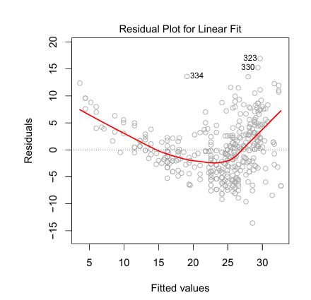
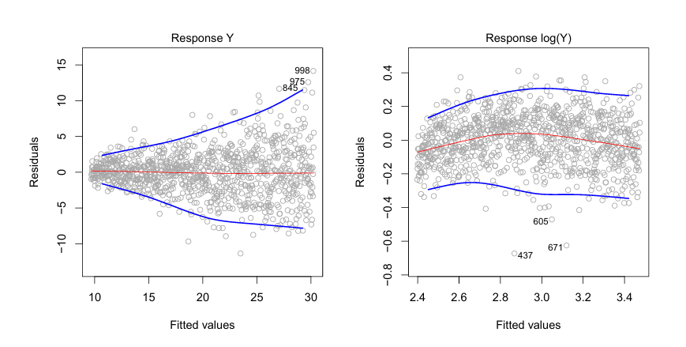
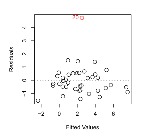

## Problemas Potenciais

Quando se treina um modelo de Regressão Linear com um dataset em particular, muitos problemas podem ocorrer. Os mais comuns são:

### 1.Não Linearidade dos dados

&nbsp;&nbsp;&nbsp;&nbsp; O modelo de regressão linear assume que há uma forte relação entre os preditores e a resposta. Se essa relação for muito diferente de linear, conclui-se que o modelo não pode capturar a verdadeira relação, o que leva a previsões imprecisas e conclusões equivocadas, reduzindo consideravelmente sua precisão.

&nbsp;&nbsp;&nbsp;&nbsp; Os gráficos de resíduos são uma ótima ferramenta para identificar a não linearidade do modelo, pois é possível plotar os resíduos $e_i = y_i - \hat{y}_i$ em relação ao preditor $x_i$. No caso de modelos com muitos preditores, deve-se utilizar os valores previstos $\hat{y}_i$.

&nbsp;&nbsp;&nbsp;&nbsp; A figura acima exibe um gráfico de resíduos gerado com um modelo de regressão linear. A linha vermelha representa um ajuste suave dos resíduos e tem como objetivo facilitar a identificação de tendências. Nota-se que ela exibe um formato em "U", indicando uma falta de padronização nos resíduos e sugerindo a presença de não linearidade nos dados.

### 2.Correlação dos termos de erro

&nbsp;&nbsp;&nbsp;&nbsp; Uma importante observação a ser feita sobre modelos de regressão linear é que os termos de erro $e_1, e_2, ..., e_n$ não devem ser correlacionados. Caso exista correlação entre os erros, os erros padrão estimados para os coeficientes de regressão tendem a subestimar os valores reais. Por exemplo, um intervalo de confiança de 80% pode ter uma probabilidade muito menor do que 0,8 de conter o valor verdadeiro do parâmetro. Além disso, isso pode resultar em p-valores mais baixos, gerando uma confiança indevida no modelo e conclusões equivocadas sobre se um parâmetro é estatisticamente significativo.

### 3.Heterocedasticidade

&nbsp;&nbsp;&nbsp;&nbsp; Uma suposição importante é que os termos de erro possuem variância constante $Var(e_i) = \sigma^2$, ou seja, que são distribuídos de forma uniforme ao longo de todas as observações. Quando ocorre heterocedasticidade, a variância não é constante. Nesse caso, a dispersão dos resíduos pode variar dependendo dos valores das variáveis preditoras ou de outras condições do modelo.

   
&nbsp;&nbsp;&nbsp;&nbsp; Esquerda: Um formato de funil indica heterocedasticidade.

&nbsp;&nbsp;&nbsp;&nbsp; Direita: Após transformar a resposta em logaritmo, não há mais evidências de heterocedasticidade.

### 4.Outliers (Pontos Atípicos)

&nbsp;&nbsp;&nbsp;&nbsp; Um outlier é um ponto que se desvia significativamente do valor previsto pelo modelo.

&nbsp;&nbsp;&nbsp;&nbsp; Na figura acima, o gráfico de resíduos do lado esquerdo mostra claramente um outlier (20). No entanto, pode ser difícil determinar quando um ponto deve ser considerado um outlier. Embora existam definições matemáticas e critérios para identificá-los (como valores superiores a 3 desvios padrão), a decisão pode depender do contexto da aplicação, da natureza dos dados e do modelo utilizado.

> ### Observação
>
> O gráfico de resíduos mencionado nos tópicos acima é uma ferramenta utilizada para avaliar a qualidade do ajuste do modelo. Ele traça os resíduos (diferenças entre os valores observados e previstos) em relação aos valores ajustados. A presença de padrões evidentes, como clusters ou tendências, indica problemas no modelo.

### Referência

Este projeto utiliza conceitos e técnicas descritos no livro "An Introduction to Statistical Learning" (James et al., 2013).

## 👾 **Contribuidores**  
| [ Alice Motin](https://github.com/AliceMotin) |  [ Caroline Lanzuolo](https://github.com/carol-lanzu) | [ Matheus Lima](https://github.com/matheus1103) | 
| :---: | :---: | :---: |
