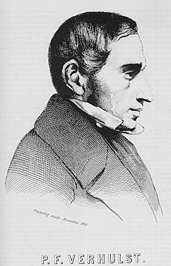
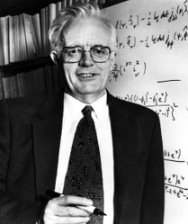

# English Version

Logistic regression, as a statistical technique aimed at modeling binary dependent variables, was formalized in the 20th century. However, its mathematical roots trace back to the 19th century, with the studies of **Pierre François Verhulst (a Belgian mathematician and doctor in number theory from the University of Ghent)**, who was responsible for developing the logistic function to model population growth under conditions of limited resources. Although this work had biological purposes rather than statistical ones, the functional structure he introduced would later serve as a basis for the development of probabilistic models aimed at categorical data analysis.

  

<em>Pierre François Verhulst</em>

However, the logistic function only began to be reinterpreted from a statistical perspective in the 1940s. The term "logit" was proposed by **Joseph Berkson** during this period as a logarithmic transformation of random reasoning, creating a simpler and more practical alternative to the probit model, which was widely used at the time. A significant breakthrough was achieved with the formulation of the logit, making statistical models more computationally accessible and more transparent in the interpretation of results.

  

<em>Joseph Berkson</em>

The formalization of logistic regression is primarily attributed to **David Cox (a British statistician)**, who in 1958 structured the logistic model as a robust statistical approach to handle binary outcomes. It was Cox who proposed the use of the logit as a link function within the framework of generalized regressions, establishing the foundations of the model we know today. Later, **Edward John Snell** collaborated with Cox on works that addressed practical applications and technical aspects of modeling, although his contribution was more complementary than theoretical.

  

<em>David Cox</em>

  

<em>Edward John Snell</em>

From the late 1960s and early 1970s, logistic regression began to establish itself as the preferred alternative to linear regression and discriminant analysis, especially in situations where the assumptions of these traditional models — such as normality and homoscedasticity (a condition where the variance of the errors in a regression model is constant across all levels of the independent variables) — were not met. This adoption was driven by the growing demand for more flexible methods and by advances in computational resources, which made routine use of estimation techniques like maximum likelihood possible.

During the 1980s, the spread of specialized statistical software such as SAS, SPSS, and BMDP further facilitated the use of logistic regression by applied researchers. In this context, the publication of **“Applied Logistic Regression” by David W. Hosmer Jr. and Stanley Lemeshow in 1989** played a central role by providing standardized protocols and clear examples of the model’s application across various fields, including medicine, epidemiology, social sciences, and education.

It is interesting to note that the growth of logistic regression was not driven by theoretical advances but rather by practical needs emerging across diverse scientific fields. Fundamentally, the method’s ability to handle different categories, accommodate many predictors simultaneously, and provide easily interpretable results were significant factors influencing its widespread adoption.

## References
Hosmer, D. W., Lemeshow, S., & Sturdivant, R. X. (2013). Applied Logistic Regression (3ª ed.). John Wiley & Sons.

Peng, C.-Y. J., Lee, K. L., & Ingersoll, G. M. (2002). An introduction to logistic regression analysis and reporting. The Journal of Educational Research

## Contributors
| [ Arthur Janing](https://github.com/Arthur-Janing) | 
| :---: | 

# Portuguese Version

## A Origem da Regressão Logística

A regressão logística, como técnica estatística voltada para a modelagem de variáveis dependentes binárias, foi formalizada no século XX. No entanto, as raízes matemáticas remontam ao século XIX, com os estudos de **Pierre François Verhulst ( um matemático belga e doutor em teoria dos números pela Universidade de Ghent)**, que foi responsável pelo desenvolvimento da função logística para modelar o crescimento populacional sob condições de recursos limitados. Embora esse trabalho tivesse fins biológicos, e não estatísticos, a estrutura funcional que ele introduziu serviria mais tarde como base para o desenvolvimento de modelos probabilísticos voltados à análise de dados categóricos.

  

<em>Pierre François Verhulst</em>

Entretanto, a função logística só começou a ser reinterpretada de uma perspectiva estatística na década de 1940. O termo "logit" foi proposto por **Joseph Berkson** durante esse período como uma transformação logarítmica do raciocínio aleatório, criando uma alternativa mais simples e prática ao modelo probit, amplamente utilizado na época. Um avanço significativo foi alcançado com a formulação do logit, que tornou os modelos estatísticos mais fáceis de acessar de uma perspectiva computacional e mais transparentes na interpretação dos resultados.

  

<em>Joseph Berkson</em>

A formalização da regressão logística é relacionada principalmente a **David Cox (estatístico britânico)**, que em 1958, estruturou o modelo logístico como uma abordagem estatística robusta para lidar com desfechos binários. Foi Cox quem propôs a utilização do logit como função de ligação dentro do arcabouço das regressões generalizadas, estabelecendo os fundamentos do modelo que hoje conhecemos. Mais tarde, **Edward John Snell** colaborou com Cox em trabalhos que abordaram aplicações práticas e aspectos técnicos da modelagem, embora sua participação tenha sido mais complementar do que teórica.

  

<em>David Cox</em>

  

<em>Edward John Snell</em>

A partir do final dos anos 1960 e início dos anos 1970, a regressão logística começou a se consolidar como alternativa preferencial à regressão linear e à análise discriminante, especialmente em situações onde as suposições desses modelos tradicionais — como normalidade e homoscedasticidade (situação em que a variância dos erros em um modelo de regressão é constante em todos os níveis das variáveis independentes) — não eram satisfeitas. Essa adoção foi estimulada pela crescente demanda por métodos mais flexíveis e pela evolução dos recursos computacionais, que tornaram possível o uso rotineiro de técnicas de estimação como a máxima verossimilhança.

Durante os anos 1980, a disseminação de softwares estatísticos especializados, como SAS, SPSS e BMDP, permitiu a utilização ainda mais acessível de regressão logística por profissionais de estudos aplicados. Nesse contexto, o lançamento da obra **“Applied Logistic Regression”, por David W. Hosmer Jr. e Stanley Lemeshow, em 1989**, desempenhou um papel central ao fornecer protocolos padronizados e exemplos claros de aplicação do modelo em diferentes áreas, incluindo medicina, epidemiologia, ciências sociais e educação.

É interessante notar que o crescimento da regressão logística não foi impulsionado por avanços teóricos, mas sim por necessidades práticas emergentes em diversos campos científicos. Fundamentalmente, a capacidade do método de lidar com diferentes categorias, ajustar muitos preditores simultaneamente e fornecer resultados facilmente interpretáveis são fatores que influenciaram significativamente sua adoção.

## Referências
Hosmer, D. W., Lemeshow, S., & Sturdivant, R. X. (2013). Applied Logistic Regression (3ª ed.). John Wiley & Sons.

Peng, C.-Y. J., Lee, K. L., & Ingersoll, G. M. (2002). An introduction to logistic regression analysis and reporting. The Journal of Educational Research

## Contribuidores
| [ Arthur Janing](https://github.com/Arthur-Janing) | 
| :---: | 

