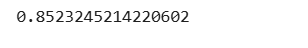
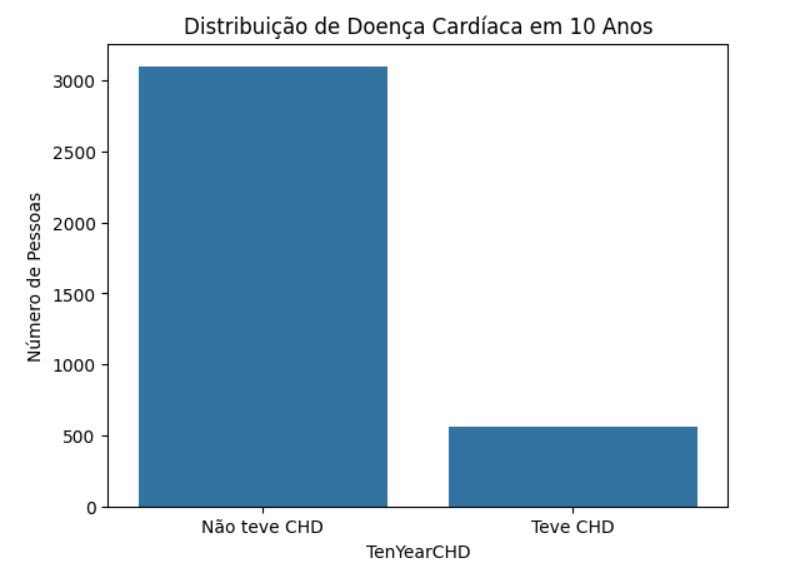
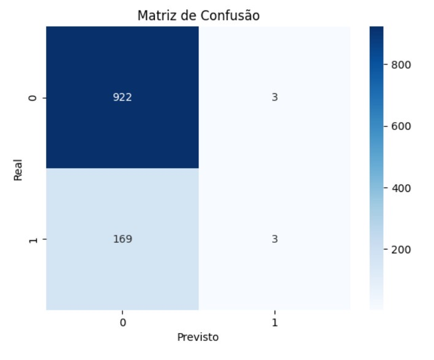

## O que é regressão logística?  
&nbsp;&nbsp;&nbsp;&nbsp; A regressão logística é um dos algoritmos mais usados devido à sua simplicidade e versatilidade, sendo amplamente aplicada para resolver problemas de classificação.

&nbsp;&nbsp;&nbsp;&nbsp; Trata-se de um tipo de modelo estatístico que estima a probabilidade de um evento ocorrer. Como o modelo analisa uma probabilidade, a saída é um número entre zero e um.  

## Regressão Logística para prever doenças cardíacas  
### Objetivo  
A coluna ‘TenYearCHD’ no conjunto de dados Framingham é a variável alvo do estudo, ou seja, aquilo que o modelo de aprendizado de máquina busca prever com base em fatores de risco como idade, pressão arterial, colesterol, tabagismo, diabetes, entre outros. Trata-se de uma tarefa de classificação binária: prever se uma pessoa desenvolverá CHD dentro de 10 anos.

## Importando Bibliotecas

```python
import pandas as pd
from sklearn.model_selection import train_test_split
from sklearn.linear_model import LogisticRegression
import seaborn as sns
import matplotlib.pyplot as plt
from sklearn.metrics import confusion_matrix
```
- `pandas` - análise e manipulação de dados.

- `train_test_split` - divide os dados em conjuntos de treino e teste.

- `LogisticRegression` -  classe para o modelo de Regressão Logística.

- `seaborn` -  biblioteca para visualização de dados baseada no matplotlib.

- `matplotlib.pyplot` - biblioteca principal para plotagens.
- `confusion_matrix` - avalia o desempenho de modelos de classificação.

### Criando/Carregando o Dataset

```python 
ds = pd.read_csv("/content/framingham.csv")
ds.head()
```
### Fazendo Previsões

```python 
modelo.score(X_teste, y_teste)
```


### Calculando a Acurácia

```python 
sns.countplot(data=ds, x='TenYearCHD')
plt.xticks([0, 1], ['Não teve CHD', 'Teve CHD'])
plt.title('Distribuição de Doença Cardíaca em 10 Anos')
plt.xlabel('TenYearCHD')
plt.ylabel('Número de Pessoas')
plt.show()
```


### Plotando o gráfico de contagem, mostrando quantas pessoas tiveram ou não doença cardíaca em 10 anos.
```python 
cm = confusion_matrix(y_teste, previsoes)
sns.heatmap(cm, annot=True, fmt='d', cmap='Blues')
plt.xlabel('Previsto')
plt.ylabel('Real')
plt.title('Matriz de Confusão')
plt.show()
```


### Plotando o gráfico da matriz de confusão, mostrando o número de previsões corretas e incorretas.

### Referências
- <[Logistic Regression](https://www.web.stanford.edu/~jurafsky/slp3/5.pdf)>. Acesso em 02 de maio de 2025 
- <[What is logistic regression?](https://www.ibm.com/think/topics/logistic-regression)>. Acesso em 02 de maio de 2025 

### Contribuidores
| [<br><sub>Alice Motin</sub>](https://github.com/AliceMotin) |  [<br><sub>Caroline Lanzuolo</sub>](https://github.com/carol-lanzu) | 
| :---: | :---: |