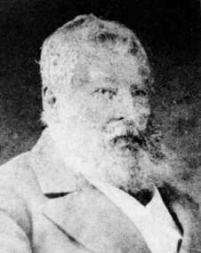

## A Origem da Regressão Logística

A regressão logística, como técnica estatística voltada para a modelagem de variáveis dependentes binárias, foi formalizada no século XX. No entanto, as raízes matemáticas remontam ao século XIX, com os estudos de **Pierre François Verhulst ( um matemático belga e doutor em teoria dos números pela Universidade de Ghent)**, que foi responsável pelo desenvolvimento da função logística para modelar o crescimento populacional sob condições de recursos limitados. Embora esse trabalho tivesse fins biológicos, e não estatísticos, a estrutura funcional que ele introduziu serviria mais tarde como base para o desenvolvimento de modelos probabilísticos voltados à análise de dados categóricos.

  

<em>Pierre François Verhulst</em>

Entretanto, a função logística só começou a ser reinterpretada de uma perspectiva estatística na década de 1940. O termo "logit" foi proposto por **Joseph Berkson** durante esse período como uma transformação logarítmica do raciocínio aleatório, criando uma alternativa mais simples e prática ao modelo probit, amplamente utilizado na época. Um avanço significativo foi alcançado com a formulação do logit, que tornou os modelos estatísticos mais fáceis de acessar de uma perspectiva computacional e mais transparentes na interpretação dos resultados.

  

<em>Joseph Berkson</em>

A formalização da regressão logística é relacionada principalmente a **David Cox (estatístico britânico)**, que em 1958, estruturou o modelo logístico como uma abordagem estatística robusta para lidar com desfechos binários. Foi Cox quem propôs a utilização do logit como função de ligação dentro do arcabouço das regressões generalizadas, estabelecendo os fundamentos do modelo que hoje conhecemos. Mais tarde, **Edward John Snell** colaborou com Cox em trabalhos que abordaram aplicações práticas e aspectos técnicos da modelagem, embora sua participação tenha sido mais complementar do que teórica.

  

<em>David Cox</em>

  

<em>Edward John Snell</em>

A partir do final dos anos 1960 e início dos anos 1970, a regressão logística começou a se consolidar como alternativa preferencial à regressão linear e à análise discriminante, especialmente em situações onde as suposições desses modelos tradicionais — como normalidade e homoscedasticidade (situação em que a variância dos erros em um modelo de regressão é constante em todos os níveis das variáveis independentes) — não eram satisfeitas. Essa adoção foi estimulada pela crescente demanda por métodos mais flexíveis e pela evolução dos recursos computacionais, que tornaram possível o uso rotineiro de técnicas de estimação como a máxima verossimilhança.

Durante os anos 1980, a disseminação de softwares estatísticos especializados, como SAS, SPSS e BMDP, permitiu a utilização ainda mais acessível de regressão logística por profissionais de estudos aplicados. Nesse contexto, o lançamento da obra **“Applied Logistic Regression”, por David W. Hosmer Jr. e Stanley Lemeshow, em 1989**, desempenhou um papel central ao fornecer protocolos padronizados e exemplos claros de aplicação do modelo em diferentes áreas, incluindo medicina, epidemiologia, ciências sociais e educação.

É interessante notar que o crescimento da regressão logística não foi impulsionado por avanços teóricos, mas sim por necessidades práticas emergentes em diversos campos científicos. Fundamentalmente, a capacidade do método de lidar com diferentes categorias, ajustar muitos preditores simultaneamente e fornecer resultados facilmente interpretáveis são fatores que influenciaram significativamente sua adoção.

## Referências
Hosmer, D. W., Lemeshow, S., & Sturdivant, R. X. (2013). Applied Logistic Regression (3ª ed.). John Wiley & Sons.

Peng, C.-Y. J., Lee, K. L., & Ingersoll, G. M. (2002). An introduction to logistic regression analysis and reporting. The Journal of Educational Research

## Contribuidores
| [ Arthur Janing](https://github.com/Arthur-Janing) | 
| :---: | 

