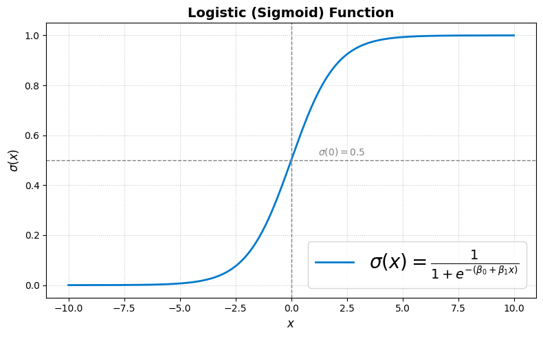
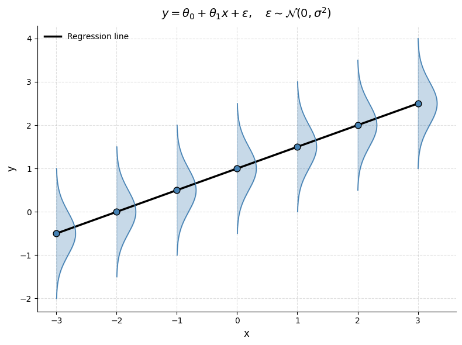

# Regressão Logística em Resumo 🚀

  

- **Objetivo**  
  Estimar a probabilidade de um resultado binário $y\in {0,1}$ passando um escore linear pela função **sigmoide** (logística).

- **Como Funciona**
  
  Calcular

  $$P(y=1 \mid x) = \sigma({\theta}^T x) = \frac{1}{1 + e^{-(\beta_0 + \beta_1 x)}}$$
  
  depois classificar utilizando o limiar em 0.5.
---
## **Índice**

1. [Glossário de Termos-Chave](#glossário-de-termos-chave)  
2. [O que é Regressão Logística?](#o-que-é-regressão-logística)  
3. [Estimativa de Máxima Verossimilhança](#estimativa-de-máxima-verossimilhança)  
4. [Função de Custo Convexa](#função-de-custo-convexa)  
5. [Fronteira de Decisão & Interpretação](#fronteira-de-decisão--interpretação)  
6. [Regularização)](#regularização) 
7. [Referências Finais](#referências-finais)
8. [Contribuidores](#contribuidores)

---
## Glossário de Termos-Chave

- **Função Sigmoide (Logística)**  
  Uma curva suave em forma de S definida como $\sigma(z) = \frac{1}{1 + e^{-z}}$, que mapeia qualquer número real para o intervalo (0,1). Representa a saída probabilística do modelo de regressão logística. Fácil, não é?

- **Hipótese**  
  Denotada $h_{\boldsymbol\theta}(x)$, é a probabilidade prevista pelo modelo de que o resultado $y=1$ dado a entrada $x$. Na regressão logística, é igual a $\sigma(\boldsymbol\theta^T x)$.

- **Odds (Chance Relativa)**  
  A razão $\frac{P(y=1)}{P(y=0)}$, que expressa quão mais provável é o resultado positivo em comparação ao negativo.

- **Log-Odds (Logito)**  
  O logaritmo natural das odds. Na regressão logística, o logito é modelado como uma função linear da entrada:
    
  $$\log\frac{P(y=1\mid x)}{P(y=0\mid x)} = \boldsymbol\theta^T x$$

  O logito mostra como o logaritmo das chances de um evento muda para cada alteração unitária em uma variável, fornecendo uma medida linear de efeito; por exemplo, se o coeficiente de logito de um modelo para “horas estudadas” é 0.4, então cada hora extra aumenta o logito de aprovação em 0.4; de forma equivalente, as odds de aprovação são multiplicadas por $\exp{0.4} = 1.49$ (um aumento de $49\%$).

- **Estimativa de Máxima Verossimilhança (MLE)**  
  Um método estatístico usado para estimar os parâmetros $\boldsymbol\theta$ de um modelo maximizando a função de verossimilhança, ou seja, a probabilidade de observar os dados fornecidos. Na regressão logística, o MLE ajusta os coeficientes $\theta$ para maximizar as probabilidades previstas das classes corretas, por exemplo, ajustando um modelo para prever se um e-mail é spam maximizando a verossimilhança das etiquetas corretas dadas as palavras de entrada.

- **Gradiente**  
  Um vetor de derivadas parciais de uma função em relação aos seus parâmetros. Indica a direção de maior aumento e é usado para otimizar o modelo via subida ou descida do gradiente.

- **Função de Custo (Log-Loss)**  
  A log-verossimilhança negativa média sobre o conjunto de dados. Mede a diferença entre probabilidades previstas e resultados reais. Na regressão logística, é convexa, garantindo um único mínimo global. Essa convexidade significa que algoritmos de otimização como descida do gradiente não ficam presos em mínimos locais ruins — eles são garantidos de encontrar a melhor solução possível dentro do espaço de parâmetros.
  
  $$J(\boldsymbol\theta) = -\frac{1}{m} \sum_{i=1}^m \left[ y^{(i)} \log\left(h_{\boldsymbol\theta}(\mathbf{x}^{(i)})\right) + \left(1 - y^{(i)}\right) \log\left(1 - h_{\boldsymbol\theta}(\mathbf{x}^{(i)})\right) \right]$$

  onde
  - $m$ é o número de exemplos de treino
  - $y^i \in 0,1$ é o rótulo verdadeiro
  - $h_{\theta}(x^i)$ é a probabilidade prevista de que $y=1$
  - $\theta$ são os parâmetros do modelo  
  O custo aumenta abruptamente quando o modelo está confiante e errado, e é minimizado quando as probabilidades previstas coincidem com os resultados reais.

- **Convexidade**  
  Uma propriedade das funções em que qualquer mínimo local também é um mínimo global. Funções de custo convexas tornam a otimização confiável e estável.

- **Fronteira de Decisão**  
  A superfície onde a probabilidade prevista é exatamente 0.5. Na regressão logística, essa fronteira é linear e definida por $\boldsymbol\theta^T x = 0$.

- **Regularização (L1 / L2)**  
  Técnicas usadas para evitar overfitting adicionando uma penalidade à função de custo:  
  - L1 (Lasso): adiciona $\sum |\theta_j|$  
  - L2 (Ridge): adiciona $\sum \theta_j^2$  

- **Deviance (Desvio)**  
  Uma medida de quão bem o modelo se ajusta aos dados, definida como o dobro da diferença entre a log-verossimilhança de um modelo saturado (ajuste perfeito) e o modelo atual.

  $$D = 2 \left( \ell_{\text{saturated}} - \ell_{\text{model}} \right)$$
  
  onde
  - $\ell_{\text{saturated}}$​ é a log-verossimilhança do modelo saturado
  - $\ell_{\text{model}}$ é a log-verossimilhança do modelo ajustado atual

- **Pseudo- $R^2$**  
  Análogo à métrica $R^2$ da regressão linear. Variantes comuns incluem Cox–Snell e McFadden, usadas para avaliar o poder explicativo de modelos logísticos.

  McFadden

    $$R^2_{\mathrm{McF}} = 1 - \frac{\ell_{\mathrm{full}}}{\ell_{0}}$$
    - $\ell_{0}$ log-verossimilhança do modelo nulo (apenas intercepto)
    - $\ell_{\mathrm{full}}$ log-verossimilhança do modelo ajustado

  O pseudo- $R^2$ de McFadden mede a melhora proporcional na log-verossimilhança do modelo ajustado em relação ao modelo nulo. Valores mais próximos de 1 indicam melhor ajuste, embora valores típicos sejam muito menores que o $R^2$ linear.

- **Regressão Logística Multiclasse**  
  Extensões da regressão logística para lidar com mais de duas classes, seja ajustando múltiplos classificadores binários (um-contra-o-resto) ou usando o modelo logístico multinomial.

- **Função Softmax**  
  Uma generalização da função sigmoide para classificação multiclasse. Transforma um vetor de escores reais em uma distribuição de probabilidade sobre múltiplas classes:
  
  $\mathrm{softmax}(z_k) = \frac{e^{z_k}}{\sum_{j=1}^K e^{z_j}}$
---
> [!WARNING]
> Não se empolgue demais, foi só o primeiro aperto de mão.
---

## O que é Regressão Logística?

A regressão logística é um **algoritmo de classificação** usado para prever a probabilidade de um resultado binário (por exemplo, sucesso/fracasso, spam/não spam, doença/não doença) com base em uma ou mais variáveis de entrada.
---

### A Função Logística:
$$\sigma(z) = \frac{1}{1 + e^{-z}}$$

Onde:
- $\(z = \boldsymbol\theta^T \mathbf{x}\)$ é uma combinação linear das variáveis de entrada e dos parâmetros do modelo.
- A função $\(\sigma(z)\)$ mapeia qualquer número real para um valor entre 0 e 1, representando uma probabilidade.

---

### Interpretação:

- Se $\(\sigma(z) \approx 1\)$, o modelo prevê fortemente a classe 1.
- Se $\(\sigma(z) \approx 0\)$, o modelo prevê fortemente a classe 0.
- Se $\(\sigma(z) \approx 0.5\)$, o modelo está incerto.

---

### Logística vs. Linear

| Característica   | Regressão Linear                   | Regressão Logística                          |
|------------------|------------------------------------|----------------------------------------------|
| Intervalo da Saída | \((-\infty, \infty)\)            | \((0, 1)\)                                   |
| Usado Para       | Predição de resultados contínuos   | Classificação binária                        |
| Regra de Decisão | Limiar sobre o valor previsto      | Limiar sobre a probabilidade \(P(y=1)\)      |
| Função de Custo  | Erro Quadrático Médio (MSE)        | Log-Loss (Entropia Cruzada)                  |

---

## Estimativa de Máxima Verossimilhança

A regressão logística é tipicamente treinada via **estimativa de máxima verossimilhança (MLE)**, que busca o vetor de parâmetros $\( \boldsymbol\theta \)$ que **maximiza a probabilidade** de observar os dados.

> [!WARNING]
> Se os parâmetros $\theta$ ($\beta_0$ e $\beta_1$) pudessem ser estimados pelo método OLS, por que deveríamos usar o método MLE? 

---
### Primeiro: MLE para regressão linear comum (erro Gaussiano)

Imagine que você tenha uma regressão linear padrão:  

$$y = \theta_0 + \theta_1 x + \epsilon,\quad \epsilon \sim \mathcal{N}(0, \sigma^2)$$ 

O que isso significa? Para cada valor de $\(x\)$, o $\(y\)$ observado é uma variável aleatória normalmente distribuída em torno de $\(\theta_0 + \theta_1 x\)$.

  

Assim, a função de verossimilhança (a probabilidade de observar os dados dados os parâmetros) é:  

$$L(\theta) \;=\; \prod_{i=1}^m \frac{1}{\sqrt{2\pi\sigma^2}}
\exp\Biggl(-\frac{\bigl(y^{(i)} - \theta^T x^{(i)}\bigr)^2}{2\sigma^2}\Biggr)$$

Tomando o log (porque maximizar a log-verossimilhança é mais fácil que maximizar o produto) obtemos:  

$$\log L(\theta) = -\frac{m}{2}\,\log\bigl(2\pi\sigma^2\bigr) - \frac{1}{2\sigma^2}\sum_{i=1}^m\bigl(y^{(i)} - \theta^T x^{(i)}\bigr)^2$$

Note que:
- $\(-\tfrac{m}{2}\log(2\pi\sigma^2)\)$ é constante em $\(\theta\)$,
- o único termo dependente de $\(\theta\)$ é $\(-\tfrac{1}{2\sigma^2}\sum (y^{(i)} - \theta^T x^{(i)})^2\)$.

Maximizar isso em relação a \(\theta\) é, portanto, equivalente a minimizar  

$$\sum_{i=1}^m \bigl(y^{(i)} - \theta^T x^{(i)}\bigr)^2$$

#### **Resultado:** MLE sob erro Gaussiano é equivalente ao Mínimos Quadrados Ordinários (OLS).  
O $\(\theta\)$ que maximiza a verossimilhança é o mesmo que minimiza a soma dos resíduos quadrados.

---
### Segundo: O que muda na regressão logística?

Na regressão logística, as suposições diferem:

1. **Resultados binários.**  
   Agora $\(y \in \{0,1\}\)$, não contínuo.

2. **Distribuição de Bernoulli.**  
   Em vez de ruído Gaussiano, assume-se  

   $$p = \sigma(\theta^T x),\quad \sigma(z)=\frac{1}{1+e^{-z}},$$
     
   de modo que  

   $$P(y=1 \mid x) = \sigma(\theta^T x),\quad
   P(y=0 \mid x) = 1 - \sigma(\theta^T x).$$

4. **Função de verossimilhança.**  

   $$L(\theta)
   = \prod_{i=1}^m \Bigl[\sigma(\theta^T x^{(i)})\Bigr]^{y^{(i)}}
     \Bigl[1 - \sigma(\theta^T x^{(i)})\Bigr]^{1 - y^{(i)}}.$$

5. **Log-verossimilhança.**  
   
   $$\log L(\theta) = \sum_{i=1}^m \bigl[y^{(i)}\log(\sigma(\theta^T x^{(i)})) + (1 - y^{(i)})\log\bigl(1 - \sigma(\theta^T x^{(i)}))\bigr].$$

Essa função **não é quadrática** em $\(\theta\)$, e a sigmoide $\(\sigma(\theta^T x)\)$ é uma função **não linear**.

#### **Resultado:**  
- Não existe **solução em forma fechada** como $\(\theta = (X^TX)^{-1}X^Ty\)$.  
- É preciso resolver $\(\theta\)$ **iterativamente** (ex.: gradiente descendente, método de Newton).

---

### Resumo

|                                | Regressão Linear   | Regressão Logística   |
|--------------------------------|---------------------------------|-------------------------------------|
| **Função de verossimilhança**  | Gaussiana                       | Bernoulli                           |
| **Forma da equação**           | Quadrática (parabólica)          | Não linear (sigmoidal)              |
| **Método de solução**          | Forma fechada (MQO)              | Otimização iterativa                |
| **MQO = MVE?**                 | Sim                              | Não                                 |

---

### Função de Verossimilhança

Dado um conjunto de dados com $\( m \)$ amostras independentes $\( \{(\mathbf{x}^{(i)}, y^{(i)})\}_{i=1}^m \)$, a verossimilhança é o produto das probabilidades:

$$L(\boldsymbol\theta) = \prod_{i=1}^m \left[h_{\boldsymbol\theta}(\mathbf{x}^{(i)})\right]^{y^{(i)}} \left[1 - h_{\boldsymbol\theta}(\mathbf{x}^{(i)})\right]^{1 - y^{(i)}}$$

Essa formulação combina a probabilidade de $\( y=1 \)$ e $\( y=0 \)$ em uma única expressão usando expoentes.

---

### Função de Log-Verossimilhança

Como o produto pode ser numericamente instável, trabalha-se com a **log-verossimilhança**:

$$\ell(\boldsymbol\theta) = \sum_{i=1}^m \left[ y^{(i)} \ln h_{\boldsymbol\theta}(\mathbf{x}^{(i)}) + (1 - y^{(i)}) \ln(1 - h_{\boldsymbol\theta}(\mathbf{x}^{(i)})) \right]$$

Maximizar essa log-verossimilhança é equivalente a encontrar os parâmetros que melhor se ajustam ao modelo logístico.

---

### Gradiente para Otimização

Para otimizar $\( \ell(\boldsymbol\theta) \)$, calcula-se o gradiente:

$$\nabla_{\boldsymbol\theta}\,\ell(\boldsymbol\theta) = \sum_{i=1}^m \left( y^{(i)} - h_{\boldsymbol\theta}(\mathbf{x}^{(i)}) \right) \mathbf{x}^{(i)}$$

Essa expressão é usada no **gradiente ascendente**, em que cada atualização caminha na direção do gradiente:

$$\boldsymbol\theta := \boldsymbol\theta + \alpha \nabla_{\boldsymbol\theta}\,\ell(\boldsymbol\theta)$$

Alternativamente, se minimizarmos a **log-verossimilhança negativa**, usamos o gradiente **descendente**.

---

### Interpretação

- A log-verossimilhança captura o ajuste do modelo aos rótulos observados.  
- Cada amostra contribui com um termo ponderado por sua probabilidade no modelo.  
- O gradiente reflete o **erro** entre predição e rótulo.

> [!TIP]
> O MVE garante que escolhemos os parâmetros que melhor explicam os dados sob as suposições do modelo logístico.

---

## Função de Custo Convexa

Na regressão logística, a função de custo (também chamada de **log-loss** ou **entropia cruzada**) é convexa. Isso significa que existe um único mínimo global, o que garante que técnicas de otimização como gradiente descendente convergem para a solução ótima.

A função de custo log-loss para regressão logística é definida como:

$$J(\boldsymbol\theta) = - \frac{1}{m} \sum_{i=1}^m \left[ y^{(i)} \ln h_{\boldsymbol\theta}(\mathbf{x}^{(i)}) + (1 - y^{(i)}) \ln(1 - h_{\boldsymbol\theta}(\mathbf{x}^{(i)})) \right]$$

Como a função é convexa, o gradiente descendente pode encontrar de forma confiável os melhores parâmetros $\(\boldsymbol\theta\)$ que minimizam a função de custo.

---

## Fronteira de Decisão & Interpretação

A **fronteira de decisão** na regressão logística é a superfície onde o modelo tem probabilidade igual de prever classe 0 ou classe 1. Em outras palavras, é onde a probabilidade prevista é 0,5. Matematicamente, isso ocorre quando:

$$\sigma(\boldsymbol\theta^T \mathbf{x}) = 0.5$$

Resolvendo para $\( \mathbf{x} \)$, encontramos que a fronteira de decisão ocorre quando:

$$\boldsymbol\theta^T \mathbf{x} = 0$$

Isso significa que a fronteira de decisão é uma função linear das variáveis de entrada. Para um conjunto de dados 2D, a fronteira é uma linha reta, e em dimensões maiores, um hiperplano.

### Interpretação:
- **Coeficientes**: A magnitude de cada coeficiente $\(\theta_j\)$ representa o quanto a variável $\(x_j\)$ influencia a predição do modelo. Uma magnitude maior indica maior impacto.  
- **Razão de Chances (Odds Ratio)**: A razão de chances para uma variável é dada por $\(\exp(\theta_j)\)$, que indica como as chances do desfecho mudam quando a variável aumenta em uma unidade.

---

## Regularização

Para evitar overfitting, aplica-se frequentemente **regularização** em modelos de regressão logística. A regularização penaliza coeficientes grandes, forçando o modelo a usar apenas as variáveis mais relevantes.

- **Regularização L1 (Lasso)**: Adiciona uma penalidade igual ao valor absoluto dos coeficientes:

  $$J(\boldsymbol\theta) = - \frac{1}{m} \sum_{i=1}^m \left[ y^{(i)} \ln h_{\boldsymbol\theta}(\mathbf{x}^{(i)}) + (1 - y^{(i)}) \ln(1 - h_{\boldsymbol\theta}(\mathbf{x}^{(i)})) \right] + \lambda \sum_{j=1}^n |\theta_j|$$

  A regularização L1 incentiva a **esparsidade**, ou seja, alguns coeficientes podem se tornar exatamente zero, realizando seleção de variáveis.

- **Regularização L2 (Ridge)**: Adiciona uma penalidade igual ao quadrado dos coeficientes:
  
  $$J(\boldsymbol\theta) = - \frac{1}{m} \sum_{i=1}^m \left[ y^{(i)} \ln h_{\boldsymbol\theta}(\mathbf{x}^{(i)}) + (1 - y^{(i)}) \ln(1 - h_{\boldsymbol\theta}(\mathbf{x}^{(i)})) \right] + \lambda \sum_{j=1}^n \theta_j^2$$

  A regularização L2 desencoraja coeficientes grandes, mas não necessariamente os zera, permitindo que todas as variáveis sejam incluídas no modelo.

---

## Referências Finais

- Brunner, E. (2011). *Logistic regression and related methods: Analysis of categorical data*. Springer.

- Cox, D. R. (1958). *The regression analysis of binary sequences*. Journal of the Royal Statistical Society: Series B (Methodological), 20(2), 215-242.

- Kunovich, S. (2015). *Statistical methods for binary classification*. Wiley.

- Agresti, A. (2018). *Statistical methods for the social sciences*. Pearson.

- Hosmer, D. W., & Lemeshow, S. (2000). *Applied logistic regression* (2nd ed.). Wiley-Interscience.

- McFadden, D. (1974). *Conditional logit analysis of qualitative choice behavior*. In P. Zarembka (Ed.), *Frontiers in econometrics* (pp. 105-142). Academic Press.

- Nelder, J. A., & Wedderburn, R. W. M. (1972). *Generalized linear models*. Journal of the Royal Statistical Society: Series A (General), 135(3), 370-384.

---

## Resumo 
### A regressão logística é um *modelo fundamental no aprendizado supervisionado*. É matematicamente elegante, interpretável e funciona bem como classificador de linha de base. Também é a *base de muitos modelos avançados* como redes neurais.

---

## **Contribuidores**  
| [ Ítalo Silva](https://github.com/ITA-LOW) | 
| :---: |
