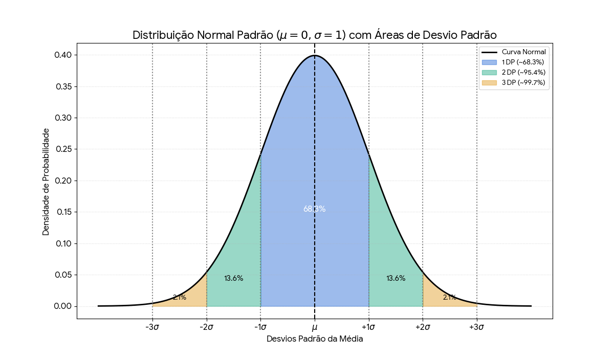
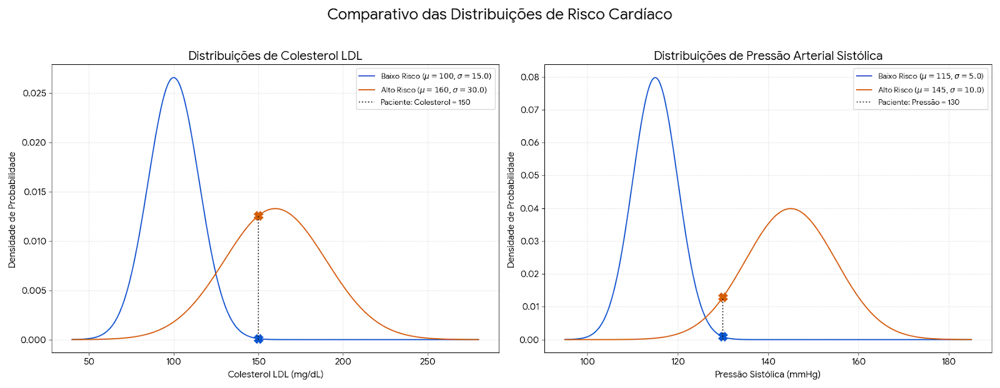

## Gaussian Model (Gaussian Naive Bayes)

Until now, we have worked exclusively with **discrete variables**—that is, attributes that take on specific, countable values. In the case of the Multinomial and Bernoulli models, we dealt with word counts or binary presences (0 or 1).

However, many real-world problems involve data that is not countable, but rather measured, such as height, temperature, or price. This is where **Gaussian Naive Bayes** comes in.

> [!NOTE]
> **Essential Difference: Discrete vs. Continuous Variables [3]**
>
> - **Discrete Variables**: Assume specific, countable values. Examples: number of words, presence/absence of features, number of clicks.
> - **Continuous Variables**: Can assume any value within an interval. Examples: height, weight, temperature, price, speed.
>
> This distinction is fundamental, as the way of calculating the "chance" of a value occurring changes completely between the two types.

### When to Use the Gaussian Model

**Gaussian Naive Bayes** is the ideal classifier variant when your attributes are **continuous variables**. It assumes that, for each class, the values of an attribute follow a normal (also known as Gaussian) distribution [3].

Typical examples of use include [2]:

- **Medical diagnosis**: Classifying patients based on height, weight, blood pressure, or cholesterol levels.
- **Financial sector**: Predicting credit risk based on income, age, or loan amount.
- **Sensors and IoT**: Identifying anomalies based on temperature, humidity, or speed measurements.

### Fundamental Concepts: Mean and Variance

Before we dive into the model, we need to review two statistical concepts that are the basis of the normal distribution:

#### Mean ($\mu$)
The **mean** is the center of gravity of the data, representing the central or "typical" value of a set [1].

$$\mu = \frac{1}{n} \sum_{i=1}^{n} x_i$$

#### Variance ($\sigma^2$)
**Variance** measures the spread of the data around the mean. A high variance indicates that the data are very spread out; a low variance means they are concentrated near the mean. The **standard deviation** ($\sigma$) is the square root of the variance [1].

$$\sigma^2 = \frac{1}{n-1} \sum_{i=1}^{n} (x_i - \mu)^2$$

>[!NOTE]
>**Sample Variance in Machine Learning [1]**
>
>In ML, we always work with samples (not complete populations), so we use the sample variance with division by (n-1), known as Bessel's correction. This avoids bias in small sets and provides a more accurate estimate of the real population variance.

### Normal (Gaussian) Distribution

The normal distribution is perhaps the most famous in statistics, recognized for its symmetrical **bell curve** shape. It describes many natural phenomena and processes where values tend to cluster around a central mean. Most values are close to the mean, and values farther away (both higher and lower) become progressively rarer [1].

To calculate the curve, we use the **probability density function** (PDF). This function gives us the height of the curve at any point $x$ [4]:

$$f(x|\mu, \sigma^2) = \frac{1}{\sqrt{2\pi\sigma^2}} e^{-\frac{(x-\mu)^2}{2\sigma^2}}$$

The image shows the **standard normal distribution** (μ = 0, σ = 1) with its characteristic symmetric bell shape. The colored areas illustrate the **68-95-99.7 rule**:

- **68.3%** of the data are within 1 standard deviation of the mean (blue area)
- **95.4%** are within 2 standard deviations (blue + green)
- **99.7%** are within 3 standard deviations (blue + green + orange)

The dotted vertical lines mark the standard deviation intervals (-3σ to +3σ), demonstrating how the probability decreases as we move away from the center of the distribution.

> [!IMPORTANT]
> **Likelihood is the Height of the Curve [2]!**
>
> Here is a crucial concept shift compared to the Bernoulli and Multinomial models.
>
> - In **discrete** models, the likelihood $P(\text{word}|\text{class})$ was a real and direct probability.
> - In **continuous** models, the probability of an *exact* value occurring is zero ($P(X=x) = 0$).
>
> So, what do we use? We use the **likelihood**, which for the Gaussian distribution is the value of the density function $f(x)$ at the point of interest.
>
> Think of it as the **height of the curve** at the exact point of your data. A greater height means that the data is more "compatible" or "plausible" with that class distribution. Naive Bayes uses this height as a score to compare which class better explains the observed data.

### Gaussian Naive Bayes Classifier

The classification process with Gaussian Naive Bayes follows the same logic as always, but with a different likelihood calculation.

1.  **Training**: For each class $C$ and each continuous attribute $X_i$:
    * Calculate the mean of that attribute for all examples of class $C$: $\mu_{i,C}$
    * Calculate the variance of that attribute for all examples of class $C$: $\sigma_{i,C}^2$

2.  **Classification**: For a new data point with attributes $(x_1, x_2, ..., x_n)$, we calculate a score for each class using the Naive Bayes formula (usually on a logarithmic scale to avoid underflow) [4]:

$$\hat{C} = \arg\max_C \left[ \log P(C) + \sum_{i=1}^{n} \log f(x_i | \mu_{i,C}, \sigma_{i,C}^2) \right]$$

Where $f(x_i | ...)$ is the likelihood given by the normal distribution's density function we saw above.

### Practical Example: Cardiac Risk Classification

#### 1. The Problem

Let's classify patients into `Low Risk` or `High Risk` for cardiac complications based on two routine exams:

* `LDL Cholesterol (mg/dL)`
* `Systolic Blood Pressure (mmHg)`

#### 2. Class Profiles (Training)

Based on historical data, the model learned the following profiles (parameters) for each class:

**`Low Risk` Class**
* **LDL Cholesterol**: A healthy profile, with a mean $\mu = 100 \text{ mg/dL}$ and standard deviation $\sigma = 15$.
* **Blood Pressure**: A healthy and, crucially, **very consistent** profile. The mean is $\mu = 115 \text{ mmHg}$ with a standard deviation $\sigma = 5$.

**`High Risk` Class**
* **LDL Cholesterol**: An elevated mean of $\mu = 160 \text{ mg/dL}$ and standard deviation $\sigma = 30$.
* **Blood Pressure**: An elevated mean of $\mu = 145 \text{ mmHg}$ and standard deviation $\sigma = 10$.

#### 3. Patient for Analysis

A new patient arrives with the following results:

* **LDL Cholesterol**: 150 mg/dL
* **Blood Pressure**: 130 mmHg

#### 4. Graphical Analysis and Likelihood Calculation

Below are the graphs of the four distributions, with an "X" marking where our patient's data fall.

Let's analyze the numbers behind the graphs, calculating the likelihood (the height of the curve at the patient's point) for each case.

#### Detailed Calculations

Let's apply the probability density function (PDF) to find the likelihood (the height of the curve) for each attribute in each class. The formula we will use in all cases is:

$$f(x|\mu, \sigma^2) = \frac{1}{\sqrt{2\pi\sigma^2}} e^{-\frac{(x-\mu)^2}{2\sigma^2}}$$

**1. Likelihood of Cholesterol for the `Low Risk` class**

* Patient's data: $x = 150$
* Class parameters: $\mu = 100$, $\sigma = 15$

$$f(150 | \mu=100, \sigma^2=15^2) = \frac{1}{\sqrt{2\pi \cdot 15^2}} e^{-\frac{(150-100)^2}{2 \cdot 15^2}} \approx 0.000103$$

**2. Likelihood of Pressure for the `Low Risk` class**

* Patient's data: $x = 130$
* Class parameters: $\mu = 115$, $\sigma = 5$

$$f(130 | \mu=115, \sigma^2=5^2) = \frac{1}{\sqrt{2\pi \cdot 5^2}} e^{-\frac{(130-115)^2}{2 \cdot 5^2}} \approx 0.000886$$

**3. Likelihood of Cholesterol for the `High Risk` class**

* Patient's data: $x = 150$
* Class parameters: $\mu = 160$, $\sigma = 30$

$$f(150 | \mu=160, \sigma^2=30^2) = \frac{1}{\sqrt{2\pi \cdot 30^2}} e^{-\frac{(150-160)^2}{2 \cdot 30^2}} \approx 0.012579$$

**4. Likelihood of Pressure for the `High Risk` class**

* Patient's data: $x = 130$
* Class parameters: $\mu = 145$, $\sigma = 10$

$$f(130 | \mu=145, \sigma^2=10^2) = \frac{1}{\sqrt{2\pi \cdot 10^2}} e^{-\frac{(130-145)^2}{2 \cdot 10^2}} \approx 0.012952$$

**Summary of Likelihoods:**

> * **For the `Low Risk` class**:
>     * $f(\text{cholesterol}=150 | \text{Low Risk}) \approx 0.000103$
>     * $f(\text{pressure}=130 | \text{Low Risk}) \approx 0.000886$
>
> * **For the `High Risk` class**:
>     * $f(\text{cholesterol}=150 | \text{High Risk}) \approx 0.012579$
>     * $f(\text{pressure}=130 | \text{High Risk}) \approx 0.012952$

#### 5. Calculation of Scores and Final Decision

Now, we combine the likelihoods with the prior probability of each class to get a final score. The class with the highest score will be our prediction.

Assuming we have no prior information favoring one class, we use equal priors: $P(\text{Low Risk}) = P(\text{High Risk}) = 0.5$.

#### Score (Prior × Likelihood)

The formula for the score of each class is:

$$ \text{Score}(C) = P(C) \times f(\text{cholesterol}|C) \times f(\text{pressure}|C) $$

**For the `Low Risk` class**:
$$ \text{Score}(\text{Low Risk}) = 0.5 \times 0.000103 \times 0.000886 $$
$$ \text{Score}(\text{Low Risk}) \approx 0.0000000456 \text{ (or } 4.56 \times 10^{-8}\text{)} $$

**For the `High Risk` class**:
$$ \text{Score}(\text{High Risk}) = 0.5 \times 0.012579 \times 0.012952 $$
$$ \text{Score}(\text{High Risk}) \approx 0.00008146 \text{ (or } 8.146 \times 10^{-5}\text{)} $$

Since $0.00008146$ is much larger than $0.0000000456$, the model would choose the `High Risk` class.

#### Score on a Logarithmic Scale (Practical Calculation)

Note how the scores resulted in extremely small numbers. To avoid numerical precision problems (underflow) in problems with many attributes, the standard practice is to use the sum of logarithms, which preserves the order of the results and is computationally more stable.

The formula becomes:

$$ \text{Log-Score}(C) = \log P(C) + \log f(\text{cholesterol}|C) + \log f(\text{pressure}|C) $$

* **Score (Low Risk)**:
$\log(0.5) + \log(0.000103) + \log(0.000886) \approx -0.693 - 9.18 - 7.03 \approx \mathbf{-16.90}$

* **Score (High Risk)**:
$\log(0.5) + \log(0.012579) + \log(0.012952) \approx -0.693 - 4.37 - 4.35 \approx \mathbf{-9.42}$

#### 6. Conclusion

The score for **High Risk (-9.42)** is significantly larger (less negative) than that of Low Risk (-16.90), confirming our decision. The model classifies the patient as being **High Risk**.

## References

[1] Bishop, C. M. (2006). *Pattern recognition and machine learning*. Springer.

[2] Izbicki, R., & Santos, T. M. (2020). *Aprendizado de máquina: uma abordagem estatística*. (1st ed.). Rafael Izbicki.

[3] Hastie, T., Tibshirani, R., & Friedman, J. (2009). *The Elements of Statistical Learning*. Springer.

[4] Murphy, K. P. (2012). *Machine Learning: A Probabilistic Perspective*. MIT Press.

## 👾 **Contributors**  
 [ Mateus Kramer](https://github.com/mateuskramer) | 
| :---: | 