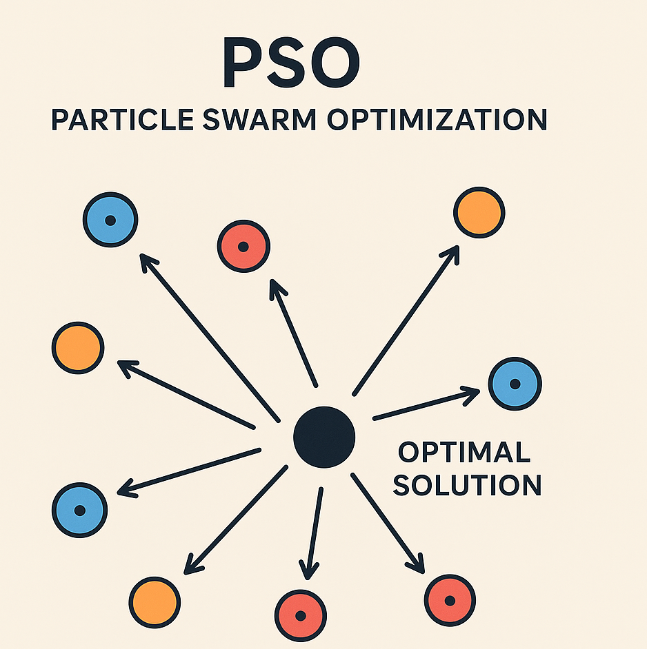

# PSO-MPPT com Reset Dinâmico (DMR)

<p align="center">
  
</p>

Este repositório apresenta a implementação e estudo de uma técnica de **Maximum Power Point Tracking (MPPT)** baseada no **Particle Swarm Optimization (PSO)** com o mecanismo de **Dynamic Monitoring Reset (DMR)**.  
O objetivo é maximizar a eficiência de sistemas fotovoltaicos, especialmente sob **condições de sombreamento parcial**, evitando que o algoritmo fique preso em máximos locais.

O projeto deriva do artigo submetido à **EvoStar 2025**:  
> *A PSO-based MPPT with Dynamic Monitoring Reset for PV Systems*  
> Igor de Matos da Rosa, Alison R. Panisson, Lenon Schmitz (UFSC, 2025)  
> doi: 10.1007/978-3-031-90065-5_16

---

## Conteúdo
- [O que é MPPT e PSO?](#o-que-é-mppt-e-pso)
- [Dynamic Monitoring Reset (DMR)](#dynamic-monitoring-reset-dmr)
- [Implementação](#implementação)
- [Pré-Requisitos e Instalações Necessárias](#pré-requisitos-e-instalações-necessárias)
- [Resultados de Simulação](#resultados-de-simulação)
- [Contribuidores](#contribuidores)
- [Estrutura do Repositório](#estrutura-do-repositório)
- [Licença 📝](#licença-)

---

## O que é MPPT e PSO?

### MPPT – Maximum Power Point Tracking

Sistemas fotovoltaicos precisam operar em seu ponto de máxima potência (**MPP**) para extrair o máximo de energia.
Técnicas clássicas como **Perturba e Observa (P\&O)** e **Condutância Incremental (INC)** funcionam bem em condições uniformes, mas falham em **sombreamento parcial**, pois tendem a se prender em máximos locais (**LMPP**) ao invés do **Global Maximum Power Point (GMPP)**.

### PSO – Particle Swarm Optimization

O **PSO** é um algoritmo de inteligência de enxame inspirado no movimento coletivo de pássaros e cardumes.
Cada partícula representa uma solução (ponto de operação no conversor), movendo-se no espaço de busca em direção ao melhor valor encontrado individualmente (**Pbest**) e globalmente (**Gbest**).
Essa característica o torna robusto para encontrar o GMPP mesmo em cenários com múltiplos picos.

<p align="left">
  
</p>

---

## Dynamic Monitoring Reset (DMR)

O **DMR** foi proposto para resolver o problema de **estagnação** do PSO:

* Quando o algoritmo converge para um ponto que não é mais o ótimo global (devido a mudanças de irradiância ou sombreamento), o DMR detecta essa variação.
* Caso a potência caia fora de uma **zona de tolerância configurável**, o DMR **reseta** a população de partículas e reinicia a busca pelo GMPP.

> \[!TIP]
> O DMR atua **independentemente do PSO**, apenas sinalizando o momento de reinicializar. Isso evita resets desnecessários e mantém o sistema estável.

---

## Implementação

O sistema foi implementado no **PLECS**, com o controle embarcado em **C Script** no bloco de PWM do conversor Boost.

* **Modelo fotovoltaico:** JKM550M-72H (baseado no modelo de diodo único).
* **Conversor:** Boost DC-DC conectado a um barramento de 400 V.
* **Controle:** algoritmo PSO com parâmetros ajustáveis (`ω = 0.2`, `c1 = 0.6`, `c2 = 0.6`).
* **Reset DMR:** tolerância de 2% sobre a potência do GMPP.

<p align="center">
  
</p>

Arquivos principais:

* [`Busca_MPPT.c`](./code/Busca_MPPT.c) → código do PSO-MPPT com DMR
* [`Busca_MPPT.plecs`](./code/Busca_MPPT.plecs) → circuito simulado
* [`Busca_MPPT.md`](./code/Busca_MPPT.md) → como utilizar o codigo para o PLECS
* [`Uso_básico_PLECS.md`](./code/Uso_b%C3%A1sico_PLECS.md) → exemplo introdutório
* [`Datasheet_JKM550M-72HL4-V.pdf`](./content/Datasheet_JKM550M-72HL4-V.pdf) → especificações do módulo

---

## Pré-Requisitos e Instalações Necessárias

### Pré-requisitos 💻

* **PLECS** (versão >= 4.5.2 recomendada)

### Instalação 🚀

Windows:
Acesse o [site oficial](https://plexim.com/download) e baixe a versão mais recente.
Para editar, é necessário a licença.

Após instalar o compilador, abra o projeto `Busca_MPPT.plecs` no **PLECS**. O arquivo `Busca_MPPT.c` contém o código do bloco de controle.
Defina os inputs e outputs corretamente.

#### Como definir os **Inputs** e **Outputs**

O bloco **C-Script** do PLECS possui diferentes áreas de código. As mais importantes para este projeto são:

* **Code Declarations** → onde são declaradas variáveis, vetores e estruturas que permanecem entre os ciclos da simulação.
* **Update Function Code** → executado a cada passo de simulação, é aqui que o algoritmo realmente roda.

---

##### Definição de Inputs

Os **inputs** são sinais vindos do circuito (ex.: tensão, corrente).
Eles são lidos com a função:

```c
variavel = InputSignal(n, 0);
```

* `n` → número da porta de entrada no bloco C-Script (começa em 0).
* `0` → indica que é o **valor atual** do sinal (sempre usar zero).

**Exemplo:**

```c
Vpv = InputSignal(0, 0);   // Porta 0 → tensão do painel
Ipv = InputSignal(1, 0);   // Porta 1 → corrente do painel
```

---

##### Definição de Outputs

Os **outputs** são os sinais enviados do algoritmo para o circuito.
São definidos com:

```c
OutputSignal(n, 0) = variavel;
```

* `n` → número da porta de saída no bloco C-Script.
* `0` → índice (sempre usar zero).

**Exemplo:**

```c
OutputSignal(0, 0) = D;   // Porta 0 → razão cíclica para o PWM
```

---

##### Code Declarations

Trecho usado para declarar variáveis e estruturas que precisam ser **mantidas entre ciclos**.
Ideal para armazenar:

* Vetores de partículas do PSO
* Parâmetros do algoritmo
* Contadores e flags de reset

---

##### Update Function Code

Trecho executado **a cada passo de simulação**.
É aqui que o algoritmo:

1. Lê os **inputs** (tensão/corrente).
2. Atualiza o cálculo do **PSO**.
3. Verifica condição de **reset do DMR**.
4. Escreve a saída (**duty cycle**).

---

## Resultados de Simulação

Em comparação entre **PSO-DMR** (que utiliza IA) e métodos clássicos (**P\&O, INC**):

| Método      | Potência Média (W) | Convergência (s) | Desempenho em Sombreamento |
| ----------- | ------------------ | ---------------- | -------------------------- |
| P\&O        | \~498              | 0.011            | Fica preso em LMPP         |
| INC         | \~498              | 0.015            | Fica preso em LMPP         |
| **PSO-DMR** | **633**            | 0.139            | Encontra GMPP com sucesso  |

> \[!IMPORTANT]
> O PSO-DMR apresentou **ganhos acima de 20%** em cenários de sombreamento parcial quando comparado com INC e P\&O.

---

## Contribuidores

| [<br><sub>Igor da Rosa</sub>](https://github.com/Ig0r-Rosa) |
| :---------------------------------------------------------------------------------------------------------------------------: |

---

## Estrutura do Repositório

```text
RepoAI/
└── PSO_MPPT_DMR/
    ├── content/
    │   ├── Datasheet_JKM550M-72HL4-V.pdf
    │   ├── PSO.png
    │   ├── PSO_representacao.png
    │   ├── busca-paineis.png
    │   ├── busca-result-reset.png
    │   ├── plecs-logo.jpg
    │   ├── plecs-new-project.png
    │   ├── plecs-scope.png
    │   ├── schematic_PLECS.jpg
    │   └── schematic_PLECS.pdf
    ├── code/
    │   ├── Busca_MPPT.md
    │   ├── Busca_MPPT.c
    │   ├── Busca_MPPT.plecs
    │   └── Uso_básico_PLECS.md
    ├── README.md <-- Este arquivo.
    └── LICENSE
```

---

## Licença 📝

Este projeto está sob a licença **CC-BY 4.0**.


