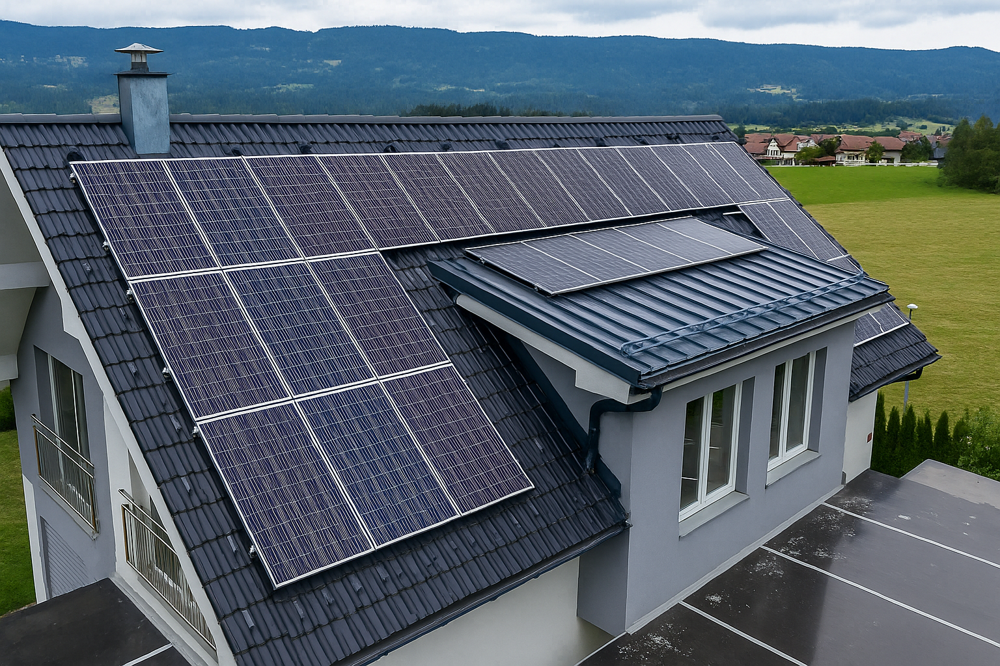
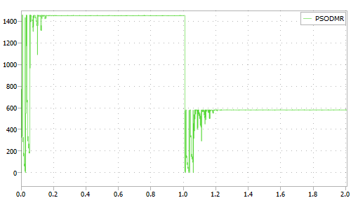

# Execução e teste do PSO-DMR para MPPT ♻️💡🔋

<p align="center">
  
</p>  

Este documento explica como realizar um teste com o algoritmo **PSO-MPPT com Dynamic Monitoring Reset (DMR)** no **PLECS**.

Você terá um exemplo de simulação mostrando o **reset dinâmico** e a convergência do PSO para o **GMPP**.

---

## Conteúdo

* [Configuração dos Parâmetros do PSO](#configuração-dos-parâmetros-do-pso)
* [Rodando o Exemplo de Reset Dinâmico](#rodando-o-exemplo-de-reset-dinâmico)
* [Resultados Esperados](#resultados-esperados)
* [Estrutura do Repositório](#estrutura-do-repositório)

---

## Configuração dos Parâmetros do PSO

No início do código (`Busca_MPPT.c`), encontram-se as constantes que controlam o comportamento do algoritmo **PSO-DMR**.

```c
float  W  =       0.20;    // Inércia (memória da velocidade anterior)
float C1  =       0.60;    // Peso cognitivo (atração ao melhor individual - Pbest)
float C2  =       0.60;    // Peso social (atração ao melhor global - Gbest)
#define NUM_PARTICULAS  10 // Número de partículas da população
float margem =    0.02;    // Tolerância do DMR (2% da potência do GMPP)
```

📌 **Descrição dos parâmetros:**

* **W (inércia):** controla o quanto cada partícula mantém sua direção atual. Valores menores aceleram a convergência, mas podem reduzir a exploração.
* **C1 (cognitivo):** peso da experiência individual da partícula. Aumentar esse valor dá mais autonomia a cada partícula.
* **C2 (social):** peso da informação global. Aumentar esse valor faz com que todas as partículas sigam rapidamente o Gbest.
* **NUM_PARTICULAS (população):** número de partículas explorando o espaço de busca. Mais partículas aumentam a robustez, mas também o custo computacional.
* **margem:** define a sensibilidade do DMR para disparar o reset. Valores baixos aumentam a frequência de resets, enquanto valores maiores reduzem a chance de reexploração.

> \[!TIP]
> Para cenários de sombreamento parcial, recomenda-se **valores balanceados** entre `C1` e `C2` e uma **tolerância entre 1% e 3%** para o DMR.

---

## Rodando o Exemplo de Reset Dinâmico

O arquivo `Busca_MPPT.plecs` já contém um **cenário configurado com sombreamento parcial dinâmico**.

1. Clique em **Run** para iniciar a simulação.
2. Monitore no **Scope** e no **XY Plot**:

   * **Potência (Ppv) x tempo** – mostra a evolução do algoritmo e os resets.
   * **Curva P–V (potência x tensão)** – mostra o rastreamento do ponto de máxima potência.
   * **Reset do DMR** – ocorre automaticamente quando a irradiância muda, forçando o PSO a reiniciar a busca.

<p align="center">
  
</p>  

Na figura acima, temos um exemplo do resultado do arquivo `.plecs`:

* Até **1s**, o sistema opera no GMPP inicial, todos os módulos em 1000 W/m².
* Em **t = 1s**, ocorre uma **mudança de irradiância** (sombreamento simulado via bloco *Script de entrada*).
* O **DMR detecta a queda de potência** fora da zona de tolerância e **reseta a população**.
* O **PSO reinicia a busca** e converge novamente para o **novo GMPP**.

> \[!IMPORTANT]
> Esse mecanismo garante que o sistema **não fique preso em máximos locais (LMPP)** e continue operando de forma eficiente mesmo em condições variáveis de irradiância.

---

## Resultados Esperados

O comportamento típico do **PSO-DMR** é:

1. Inicialmente, o PSO converge para um máximo global (**GMPP**).
2. Quando ocorre uma mudança de irradiância, a potência cai fora da zona de tolerância.
3. O **DMR dispara um reset**, reiniciando a população de partículas.
4. O PSO converge para o **GMPP** corretamente.

> \[!TIP]
> Esse reset dinâmico garante que o sistema **não fique preso em picos locais**, aumentando a eficiência em condições de sombreamento parcial.

---

## Estrutura do Repositório

```text
RepoAI/
└── PSO_MPPT_DMR/
    ├── content/
    │   ├── Datasheet_JKM550M-72HL4-V.pdf
    │   ├── PSO.png
    │   ├── PSO_representacao.png
    │   ├── busca-paineis.png
    │   ├── busca-result-reset.png
    │   ├── plecs-logo.jpg
    │   ├── plecs-new-project.png
    │   ├── plecs-scope.png
    │   ├── schematic_PLECS.jpg
    │   └── schematic_PLECS.pdf
    ├── code/
    │   ├── Busca_MPPT.md <-- Você está aqui!
    │   ├── Busca_MPPT.c
    │   ├── Busca_MPPT.plecs
    │   └── Uso_básico_PLECS.md
    ├── README.md
    └── LICENSE
```


