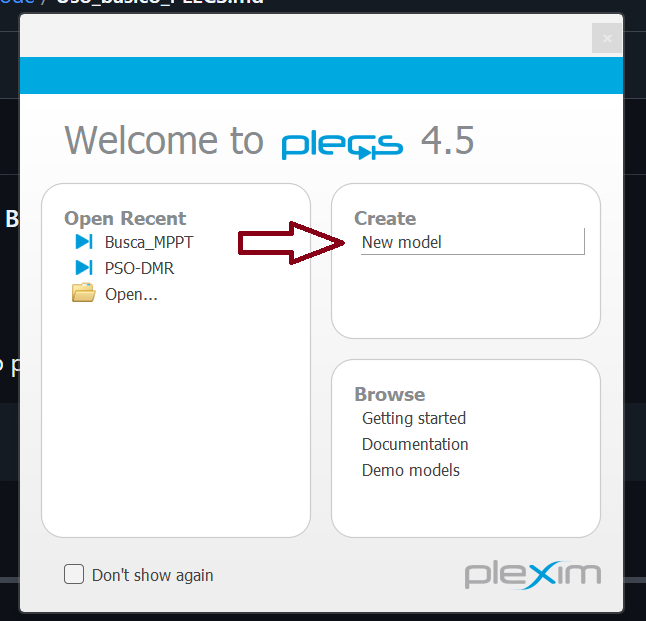

# Uso Básico do PLECS ⚡

<p align="center">
  
</p>

Este documento apresenta um **guia rápido e introdutório** para o uso do **PLECS**, com foco na execução de simulações de circuitos eletrônicos de potência.
O objetivo é ajudar novos usuários a **abrirem, configurarem e rodarem projetos** de forma prática.

---

## Conteúdo

* [O que é o PLECS?](#o-que-é-o-plecs)
* [Abrindo um Novo Projeto](#abrindo-um-novo-projeto)
* [Executando Simulações](#executando-simulações)
* [Explorando Resultados](#explorando-resultados)
* [Edição do Circuito](#edição-do-circuito)
* [Atalhos Úteis](#atalhos-úteis)
* [Estrutura do Repositório](#estrutura-do-repositório)

---

## O que é o PLECS?

O **PLECS (Piecewise Linear Electrical Circuit Simulation)** é um software voltado para a simulação de **circuitos eletrônicos de potência** e **sistemas de energia**.
Ele é amplamente usado em pesquisas que envolvem **conversores DC-DC, inversores, controle em tempo real e energias renováveis**.

> \[!TIP]
> Diferente do Simulink, o PLECS é mais **leve e focado** em eletrônica de potência para "tempo real".

---

## Abrindo um Novo Projeto

1. Abra o **PLECS Standalone**.
2. Vá em **Create → New model**.

<p align="left">
  
</p>

📌 No repositório deste projeto, o arquivo principal é:

```text
code/Busca_MPPT.plecs
```

Para abrir o projeto desse repositório:
1. Vá em **File → Open**.
2. Selecione o arquivo .plecs.

---

## Executando Simulações

1. Clique no ícone **Play (Run)** ou pressione `Ctrl + T`.
2. O simulador vai rodar até você interromper.
3. É possível **pausar ou parar** a simulação a qualquer momento.

---

## Explorando Resultados

O **PLECS Scope** é usado para visualizar os sinais:

* Tensões
* Correntes
* Potência
* Estados internos do sistema

Após rodar a simulação, clique duas vezes no **Scope** do circuito para abrir os gráficos.

<p align="center">
  
</p>

---

## Edição do Circuito

O PLECS permite **adicionar, remover e configurar** componentes arrastando-os da "Library Browser".

Principais blocos usados:

* **Fontes** (voltagem, corrente, irradiância)
* **Chaves** (MOSFET, IGBT, diodo)
* **Passivos** (resistor, capacitor, indutor)
* **Medições** (corrente, tensão, potência)
* **Controle** (C Script, PI, etc.)

---

## Atalhos Úteis

| Ação                       | Atalho                               |
| -------------------------- | ------------------------------------ |
| Rodar/Parar simulação      | `Ctrl + T`                           |
| Pausar simulação           | `Space`                              |
| Ajustar propriedades bloco | `Duplo clique`                       |
| Abrir Library              | `Ctrl + L`                           |
| Zoom in/out no circuito    | `Ctrl + Scroll`                      |

---

## Estrutura do Repositório

```text
RepoAI/
└── PSO_MPPT_DMR/
    ├── content/
    │   ├── Datasheet_JKM550M-72HL4-V.pdf
    │   ├── PSO.png
    │   ├── PSO_representacao.png
    │   ├── busca-paineis.png
    │   ├── busca-result-reset.png
    │   ├── plecs-logo.jpg
    │   ├── plecs-new-project.png
    │   ├── plecs-scope.png
    │   ├── schematic_PLECS.jpg
    │   └── schematic_PLECS.pdf
    ├── code/
    │   ├── Busca_MPPT.md
    │   ├── Busca_MPPT.c
    │   ├── Busca_MPPT.plecs
    │   └── Uso_básico_PLECS.md <-- Você está aqui!
    ├── README.md <-- Este arquivo.
    └── LICENSE
```


