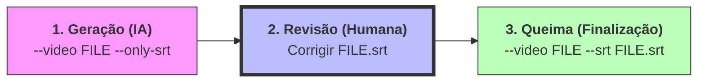
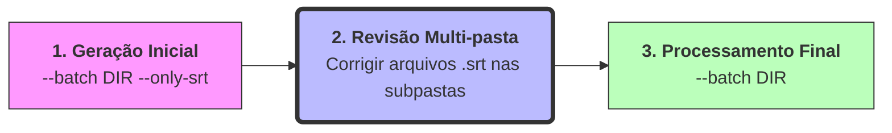

# Subtitler Pro 🎥

Ferramenta local para transcrição de áudio e queima de legendas em vídeos usando Inteligência Artificial (OpenAI Whisper) e FFmpeg.

## 🚀 Funcionalidades

- **Transcrição Automática**: Usa o modelo `faster-whisper` com timestamps por palavra.
- **Segmentação Inteligente**: Divide legendas em trechos curtos para leitura dinâmica.
- **Estilização Profissional**: Formato ASS com fonte Nunito, contornos e sombras.
- **Hardcoding (Burn-in)**: Queima as legendas diretamente no vídeo via FFmpeg.
- **Processamento em Lote**: Automação para pastas de cursos inteiros.

---

## 🛠️ Instalação e Requisitos

1. **FFmpeg**: `sudo apt install ffmpeg`
2. **Ambiente**:
   ```bash
   python3 -m venv .venv && source .venv/bin/activate
   pip install -r requirements.txt
   ```

---

## 📖 Modo: Vídeo Único

Processa um único vídeo.

### Etapas:
1. **Geração**: `python subtitler.py --video video.mp4 --only-srt`
2. **Revisão**: Corrija o arquivo `.srt` gerado manualmente. A IA pode confundir algumas palavras.
3. **Queima**: `python subtitler.py --video video.mp4 --srt video.srt`

### Fluxograma:



---

## 📖 Modo: Processamento em Lote

Ideal para processar vários vídeos de uma só vez, mantendo a possibilidade de revisão.

### Etapas:
1. **Geração**: `python subtitler.py --batch aulas/ --only-srt`
2. **Revisão**: Edite os arquivos `.srt` em cada subpasta conforme necessário.
3. **Queima**: `python subtitler.py --batch aulas/` (O script detectará os arquivos editados automaticamente).

### Fluxograma:


---

## 💻 Outros Comandos

### Processamento Direto (Sem revisão)
Para queimar a legenda imediatamente após a transcrição:
```bash
python subtitler.py --video aulas/aula14/aula14.mp4
```

### Opções de Modelo
Você pode escolher o tamanho do modelo Whisper para maior precisão (mais lento) ou velocidade (menos preciso):
`--model base` (padrão), `small`, `medium` ou `large-v3`.

---

## 📂 Estrutura do Projeto

- `subtitler.py`: Script principal unificado.
- `requirements.txt`: Lista de dependências.

## 🔮 Futuras Implementações

Este projeto está em constante evolução! Algumas ideias de melhorias futuras incluem:

- **Modelos Avançados**: Integração com modelos mais robustos para maior precisão na transcrição.
- **Interface Gráfica (GUI)**: Uma aplicação desktop para facilitar o uso por quem prefere não usar linha de comando.
- **Interface Web**: Uma versão web para processamento simplificado via navegador.
- **Estilização Dinâmica**: Mais opções de fontes, cores e posicionamento de legendas.

---

## 🤝 Contribua

Sinta-se à vontade para abrir **Issues** ou enviar **Pull Requests**. Toda contribuição é bem-vinda para tornar o `Subtitler Pro` ainda melhor!

## 👥 Contribuidores

| [<br><sub>Ítalo Silva</sub>](https://github.com/ITA-LOW) |
| :---: |