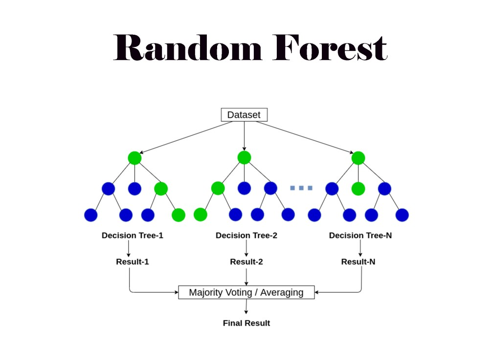
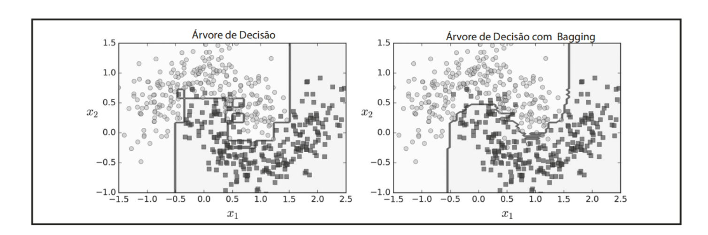

# English version

# Introduction to Random Forest

## What is the Random Forest algorithm?

Random Forest is one of the most powerful and popular machine learning algorithms, widely used in classification and regression tasks. It stands out for its robustness, good accuracy, and ability to handle complex data.

If you aggregate the predictions of a set of predictors (such as classifiers or regressors), you will often get better predictions than with the best individual predictor. A set of predictors is called an ensemble, so this technique is called Ensemble Learning, and an Ensemble Learning algorithm is called an Ensemble method.

Random Forest is an ensemble learning technique based on decision trees, usually trained by the bagging (or sometimes pasting) method. The main idea is to build multiple independent decision trees and combine their predictions to obtain a more robust decision.

  

## Origin and historical context (Leo Breiman, 2001)

The Random Forest algorithm was proposed by **Leo Breiman** in 2001. Breiman, a renowned statistician, had already made significant contributions to the field of machine learning, including the development of the **CART (Classification and Regression Trees)** algorithm, which is the basis for decision trees.

Before Random Forest, decision tree algorithms, although intuitive and easy to interpret, suffered from a fundamental problem: **overfitting**. A single decision tree, when trained deeply, tends to overfit the training data, capturing noise and specifics that do not generalize well to new data. Random Forest emerged as an elegant solution to mitigate this problem.

## Why is it called a "random forest"?

The Random Forest algorithm introduces an extra **randomness** when developing trees; Instead of finding the best feature when splitting a node, it searches for it among a **random subset** of those features, resulting in a highly diverse tree, which (again) trades off high bias for low variance, generally producing a better overall model. This reduces variance and generally results in a more robust model.

> [!NOTE]
>The name comes from the analogy with a "forest" of trees, where:
>Each decision tree is built from a **random sample of the data** (with replacement — bootstrap).
>At each node in the tree, a **random draw of a subset of features** is made to decide the best split.

## Motivation

### Problems with single models

Single decision trees have great learning power, but are **prone to overfitting**, that is, they learn noise from the training data.

### Need for more robust and generalizable models

Random Forest emerges as a solution because:

* By **combining many independent trees** (*ensemble*), the model **reduces the variance** of the system.
* Each tree can make mistakes, but **these errors tend to cancel each other out** in the aggregation.

  

>Figure: A single Decision Tree versus a bagging ensemble of 500 trees

## References

[1] GÉRON, A. Mãos à Obra: Aprendizado de Máquina com Scikit-Learn & TensorFlow. Alta Books, 2019.

## 👾 Contributors
|  [ Seidi Ducher](https://github.com/seidiDucher)  
| :---: |
---

# Portuguese version

# Introdução ao Random Forest

## O que é o algoritmo Random Forest?

O Random Forest (Floresta Aleatória) é um dos algoritmos de aprendizado de máquina mais poderosos e populares, amplamente utilizado em tarefas de classificação e regressão. Ele se destaca por sua robustez, boa precisão e capacidade de lidar com dados complexos.

Se você agregar as previsões de um conjunto de previsores (como classificadores ou regressores), muitas vezes obterá melhores previsões do que com o melhor previsor individual. Um conjunto de previsores é chamado de *ensemble*, assim, esta técnica é chamada *Ensemble Learning*, e um algoritmo de *Ensemble Learning* é chamado de *Ensemble method*.

O Random Forest é uma técnica de aprendizado por conjunto (*ensemble learning*) baseada em árvores de decisão, geralmente treinado pelo método *bagging* (ou algumas vezes *pasting*). A ideia principal é construir múltiplas árvores de decisão independentes e combinar suas previsões para obter uma decisão mais robusta.

  

## Origem e contexto histórico (Leo Breiman, 2001)

O algoritmo Random Forest foi proposto por **Leo Breiman** em 2001. Breiman, um estatístico renomado, já havia feito contribuições significativas para a área de aprendizado de máquina, incluindo o desenvolvimento do algoritmo **CART (Classification and Regression Trees)**, que é a base das árvores de decisão.

Antes do Random Forest, os algoritmos de árvores de decisão, embora intuitivos e fáceis de interpretar, sofriam de um problema fundamental: o **overfitting** (sobreajuste). Uma única árvore de decisão, quando treinada profundamente, tende a se ajustar excessivamente aos dados de treinamento, capturando ruídos e especificidades que não se generalizam bem para novos dados. O Random Forest surgiu como uma solução elegante para mitigar esse problema.

## Por que é chamado de "floresta aleatória"?

O algoritmo Floresta Aleatória introduz uma **aleatoriedade extra** ao desenvolver árvores; em vez de buscar a melhor característica ao dividir um nó, ele a busca entre um **subconjunto aleatório** dessas características, resultando em uma grande diversidade diversidade da árvore, que (mais uma vez) troca um alto viés por uma baixa variância, geralmente produzindo um melhor modelo no geral . Isso reduz a variância e geralmente resulta em um modelo mais robusto.

> [!NOTE]
>O nome vem da analogia com uma "floresta" de árvores, onde:
>Cada árvore de decisão é construída a partir de uma **amostra aleatória dos dados** (com reposição — bootstrap).
>Em cada nó da árvore, é feito um **sorteio aleatório de um subconjunto de atributos** para decidir a melhor divisão (split).

## Motivação

### Problemas com modelos únicos

As árvores de decisão únicas têm um grande poder de aprendizagem, mas são **propensas ao overfitting**, ou seja, aprendem ruídos dos dados de treinamento.

### Necessidade de modelos mais robustos e generalizáveis

A Random Forest surge como solução porque:

* Ao **combinar muitas árvores independentes** (*ensemble*), o modelo **reduz a variância** do sistema.
* Cada árvore pode cometer erros, mas **esses erros tendem a se anular** na agregação.

  

>Figura: Uma Árvore de Decisão única versus um bagging ensemble de 500 árvores

## Referências

[1] GÉRON, A. Mãos à Obra: Aprendizado de Máquina com Scikit-Learn & TensorFlow. Alta Books, 2019.

## 👾 Colaboradores
|  [ Seidi Ducher](https://github.com/seidiDucher)  
| :---: |