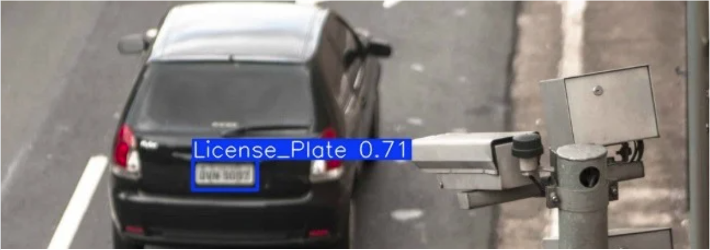
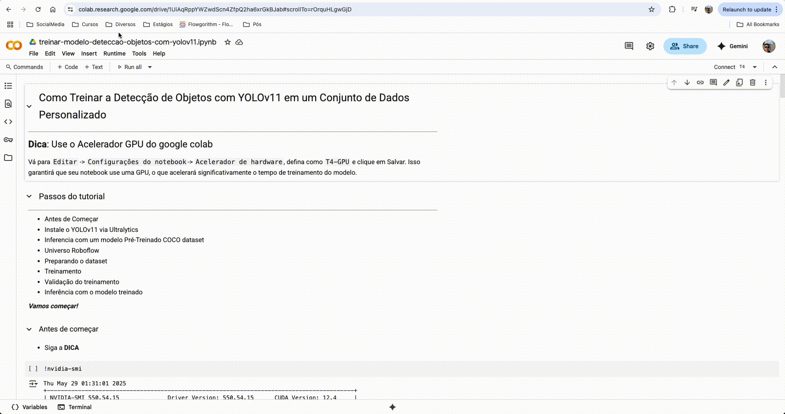

<p align="center">
  
</p>

# 🔍 Treinando um Modelo de Visão Computacional com YOLOv11

Este projeto demonstra como treinar um modelo de detecção de objetos usando a arquitetura YOLOv11 em um ambiente Google Colab, com foco em aplicações práticas de visão computacional.


## 📌 Visão Geral

A visão computacional é uma área da Inteligência Artificial(AI) que permite que computadores analisem, interpretem e compreendam imagens e vídeos. As aplicações de visão computacional usam AI e Machine Learning(ML) para processar esses dados com precisão para identificar objetos com precisão, realizar classificação, recomendação e detecção. Neste tutorial, exploro a detecção de objetos com a poderosa arquitetura YOLO (You Only Look Once), utilizando sua versão mais recente — YOLOv11.


## 🧠 Sobre o YOLO e o YOLOv11

### ⚡ YOLO - You Only Look Once
 
YOLO é um estado da arte de detecção de objetos em tempo real, conhecida por sua velocidade e precisão. Ao contrário de métodos tradicionais, o YOLO realiza a detecção em uma única etapa, o que o torna altamente eficiente. Em outras palavras, o modelo analisa a imagem apenas uma vez e, a partir dessa “única passagem”, é capaz de identificar os objetos presentes, diferente de modelos anteriores, que exigiam múltiplas passagens para processar uma imagem.

### 🚀 YOLOv11

YOLOv11 é uma versão mais recente da arquitetura YOLO, trazendo melhorias em desempenho, arquitetura neural e suporte a novos recursos. Ideal para aplicações em que precisão e tempo de inferência são críticos.


 


## 📂 Sobre o Dataset

- **Nome**: License Plate Recognition Computer Vision Project
- **Origem**: [Link](https://universe.roboflow.com/roboflow-universe-projects/license-plate-recognition-rxg4e)
- **Divisão**: Treinamento, validação, teste


## Pré-requisitos 💻 

Antes de iniciar este tutorial, garanta que você possui:

✅ **Conta Google ativa**  
Necessário para utilizar o **Google Colab** gratuitamente, permitindo executar notebooks sem precisar configurar ambiente local.

✅ **Conta gratuita no [Roboflow](https://roboflow.com) (opcional, recomendado)**  
Facilita o gerenciamento, anotação e exportação de datasets no formato **YOLOv11**, acelerando o preparo de dados para o treinamento.

✅ Lembre de aivar a GPU no Colab!

<details>
<summary>Vídeo de exemplo.</summary>



</details>

## Estrutura do Repositório

```text
RepoAI/
└── yolov11_tutorial
    ├── images/
    │   ├── testes/  -> imagens usadas para teste
    ├── video/
    ├── code/
    |   └── codigo.ipynb 
    └──  README.md
```


### 🚀 Etapas

```mermaid
flowchart TD;
    A[ Início] --> B{Escolha do Dataset};

    B-->|Usar dataset pronto - Roboflow| C[📦 Dataset Pronto];
    B-->|Criar dataset do zero| D[📸 Coleta e Anotação de Imagens];

    C-->E[⚙️ Pré-processamento e Augmentação];
    D-->E;

    E-->F[🛠️ YOLOv11 Setup];
    F-->G[🚀 Treinamento YOLOv11];
    G-->H[📊 Validação e Métricas];
    H-->I[🔍 Inferência em Novas Imagens];
    I-->J[🖼️ Resultados e Visualizações];

```




## 😀 Universo Roboflow 

Durante o vídeo, mostro passo a passo como utilizar um [dataset]( https://universe.roboflow.com/roboflow-universe-projects/license-plate-recognition-rxg4e/dataset/11) público na plataforma – no nosso caso, um dataset voltado para detecção de placas de carros. 

<video width="750" controls>
  <source src="video/roboflow.mp4" type="video/mp4">
</video>


## 🔄 Fases do Processo
 Durante o desenvolvimento de um modelo de detecção de objetos, passamos por três fases principais:

### 🎯 Treinamento
Nesta fase, o modelo é exposto ao conjunto de dados de **treinamento**, onde aprende a reconhecer padrões, formas e contextos dos objetos de interesse (neste caso, placas de veículos). A rede ajusta seus pesos internos com base nos erros que comete, tentando melhorar a cada época.

### ✅ Validação
Enquanto o modelo treina, ele é periodicamente avaliado com um conjunto separado de imagens (conjunto de **validação**). Essa fase ajuda a monitorar o desempenho e verificar se o modelo está aprendendo de forma eficaz ou se está começando a memorizar os dados (**overfitting**).

### 🔍 Inferência
Após o treinamento, a **inferência** é o momento de usar o modelo treinado para fazer previsões em novas imagens. Aqui testamos o desempenho real do modelo, muitas vezes utilizando um terceiro subconjunto do dataset (conjunto de **teste**). O objetivo é verificar se o modelo consegue detectar objetos corretamente em imagens que nunca viu.

</details>


## 🖼️ Exemplo de Resultados

Abaixo, alguns exemplos de detecção realizada pelo modelo treinado:

                   


## 📚 Referências

- [YOLO Paper](https://arxiv.org/abs/1506.02640)
- [Dataset utilizado](https://universe.roboflow.com/roboflow-universe-projects/license-plate-recognition-rxg4e)
- [Documentação YOLO](https://docs.ultralytics.com)


## Contribuidores

 | [<br><sub>Vinicius Rosa</sub>](https://github.com/ViniciusRosa1)  |
| :---: 


## Licença 📝

"Este projeto está sob a licença CC-BY 4.0."